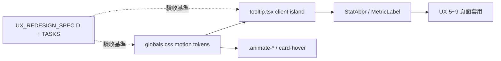

# Requirements

### Overview & Goals

開一張**通用層新卡 UX-4.5「互動準則與動效系統＋共用提示元件」**，緊接 UX-4、排在頁面層 UX-5~9 之前執行。目的：在各頁換裝前，先把**動畫**與**互動機制（尤其資訊提示 Tooltip/Popover）**收斂成單一事實來源，避免 UX-5~9 各頁各自發明互動/動效導致再次漂移。

本卡直接把 spec §A 原則 7（動效節制而有目的）、原則 8（感知效能）、原則 1（進階數據縮寫需名詞解釋、數字不裸列）落地為**可套用的 tokens 與元件**，而非只停在文字原則。

### Scope

**In Scope**
- 在 `UX_REDESIGN_SPEC.md` §B 通用層新增 UX-4.5 拆卡列，並補一個「§D 互動與動效準則」內容章節（時長/緩動/觸發/無障礙的可驗收標準）。
- 在 `TASKS.md` 看板新增 UX-4.5 卡列，標注依賴序（UX-4 → **UX-4.5** → UX-5~9）。
- 落地 **motion design tokens** 到 `web/src/app/globals.css`（duration/easing CSS 變數 + 既有 `@keyframes`/`.animate-*` 收斂對齊）。
- 交付共用 **Tooltip/Popover 提示元件**（client island），支援 hover/focus/tap 觸發、定位、進出延遲、`prefers-reduced-motion`、鍵盤與 `aria-describedby` 無障礙。
- 提供一個**進階數據縮寫名詞解釋**的落地示例（把 Tooltip 接到既有指標縮寫，如 wRC+/FIP/xwOBA 等表頭），作為 UX-5~9 的範式。

**Out of Scope**
- UX-5~9 各頁的實際換裝（本卡只交準則＋元件＋1 個示例，不整頁改造）。
- toast/全域通知、展開折疊互動元件（若需要，另循 UX-3 元件卡或後續卡；本輪使用者只圈定「提示 Tooltip/Popover」機制）。
- recharts 圖表內建 Tooltip 的重寫（沿用現況，只在準則層對齊色票/時長）。
- UX-10 三頁互動模式重設計（維持暫緩）。

### User Stories
- 作為使用者，把游標移到（行動端點按）進階數據縮寫時，我能看到一句話名詞解釋，不必離開頁面查詢。
- 作為使用者，頁面入場與狀態變化的動畫一致且節制，開啟系統「減少動態」時不會有干擾動畫。
- 作為 UX-5~9 執行者，我有現成的 Tooltip 元件與 motion tokens 可直接套，不需為每頁重造互動/動效。
- 作為查核者，我能用量測（computed style、觸發行為、a11y 屬性）而非目視，逐條驗收互動與動效是否達標。

### Functional Requirements
- **Tooltip/Popover 元件**：hover/focus 顯示、行動端 tap 顯示、Esc/點擊外部關閉；預設定位自動避讓視窗邊界；進場/出場延遲可設定；內容支援純文字與短 JSX。
- **無障礙**：觸發元素有可聚焦性與 `aria-describedby`（tooltip）或 `aria-expanded`/`aria-controls`（popover）；純裝飾提示不搶焦點；符合原則 6 觸控目標 ≥44px。
- **動效準則落地**：標準互動 0.3s、圖表入場 0.8s、統一 easing token；全部受 `prefers-reduced-motion` 約束；不得有無限循環裝飾動畫。
- **名詞解釋示例**：至少一組進階數據縮寫接上 Tooltip，作為可複製範式。

### Non-Functional Requirements
- 遵守原則 6：375px 無橫向溢出；Tooltip 面板不得造成頁級 `scrollWidth > viewport`。
- 深淺雙色系皆正確（沿用 `data-theme` token，不新增第四層灰、不硬編色）。
- `npm run build:check` 綠、console 零錯誤。

# Technical Design

### Current Implementation

- **動效現況散裝**：`globals.css` 只有 `@keyframes barGrow`（L174）與新加的 `@keyframes fadeIn`/`.animate-fade-in`（L207-213）；時長靠各檔手寫 class（如 `transition-colors`、`duration-200`、`.card-hover-team` L165-171 硬寫 `0.3s`）。原則 7 規定的「標準 0.3s / 圖表 0.8s」目前**沒有 token**，是分散的魔術數字。
- **reduced-motion** 已由 `globals.css` L152-162 全域 `*` 規則覆蓋（UX-4 已確認過關），本卡沿用不重造。
- **提示互動缺共用元件**：全站沒有 Tooltip/Popover 元件；`ui.tsx` 現有原子件（`LetterBadge`/`Pill`/`Card`/`StatTile`/`TeamLogo` 等）無提示機制。零星互動散在 `hover:` class 與 recharts 內建 `Tooltip`（如 `la-ev-scatter.tsx`、`standings-trend.tsx`、`trend.tsx`）。進階數據縮寫目前**裸列無解釋**（違反原則 1「數字不裸列 / 每區塊回答一個問題」精神）。
- **client island 慣例**（spec §B UX-3）：互動元件要能嵌 server 頁，禁止為加互動把整頁翻 `"use client"`；`nav-links.tsx` 是既有的 client island 範例（含焦點管理/Esc/焦點陷阱），Tooltip/Popover 應沿用同模式。

### Key Decisions

1. **卡片定位＝UX-4.5（通用層最後一張）**：依賴序 UX-4 → UX-4.5 → UX-5~9；不佔用頁面層編號，語意表達「緊接骨架、頁面層前置」。
2. **交付範圍＝準則＋共用元件＋motion tokens**：不只寫文件，直接把 Tooltip/Popover 與 duration/easing tokens 落地，UX-5~9 直接套用（呼應使用者選項）。
3. **互動機制聚焦＝提示 Tooltip/Popover**：本卡只做資訊提示/名詞解釋一類（使用者圈定）；toast、展開折疊等不在本卡。
4. **Tooltip 實作走自製輕量 client island**，不引入新依賴：與 `nav-links.tsx` 的焦點/Esc 管理模式一致，避免 bundle 膨脹與 SSR 問題；定位用 `position: fixed` + 邊界避讓計算。
5. **motion tokens 進 `globals.css` `:root`**：新增 `--dur-fast`/`--dur-base`/`--dur-slow`/`--ease-standard` 等變數，既有 `.animate-*`/`.card-hover-team` 改讀 token，統一數值來源。

### Proposed Changes

**文件層**
- `docs/UX_REDESIGN_SPEC.md`：§B 通用層表格新增 UX-4.5 列；新增「§D 互動與動效準則」章節（motion token 對照表、Tooltip/Popover 觸發與 a11y 規範、名詞解釋清單、量測式驗收標準）。
- `docs/TASKS.md`：看板新增 UX-4.5 卡列與依賴序更新。

**Tokens 層**
- `web/src/app/globals.css`：`:root` 新增 motion tokens；既有 `barGrow`/`fadeIn`/`.card-hover-team` 對齊 token；補 Tooltip 進出場 `@keyframes`/utility（受 reduced-motion 約束）。

**元件層**
- 新增 `web/src/components/tooltip.tsx`（client island）：`<Tooltip content trigger?>` 與（如需）`<InfoPopover>`；含定位、延遲、Esc/外部點擊關閉、`aria-describedby`。
- 可選：在 `ui.tsx` 增一個 `StatAbbr`/`MetricLabel` 小封裝，將「縮寫 + Tooltip 名詞解釋」標準化，供表頭複用。

**示例落地**
- 選一處既有進階數據表頭（如 `leaderboard.tsx` 或球員頁指標區）接上 Tooltip，作為 UX-5~9 範式，不整頁改造。

### Data Models / Contracts

```tsx
// web/src/components/tooltip.tsx (client island)
type TooltipProps = {
  content: React.ReactNode;          // 一句話解釋或短 JSX
  children: React.ReactElement;      // 觸發元素（需可聚焦）
  placement?: "top" | "bottom";      // 預設 top，自動避讓邊界
  delayIn?: number;                  // 預設讀 --dur-base
};
// 行為：hover/focus 顯示、tap 顯示（行動端）、Esc/外部點擊關閉、aria-describedby
```

```css
/* globals.css :root 新增（示意） */
--dur-fast: 0.15s; --dur-base: 0.3s; --dur-slow: 0.8s;
--ease-standard: cubic-bezier(0.4, 0, 0.2, 1);
```

### File Structure
- 修改：`docs/UX_REDESIGN_SPEC.md`、`docs/TASKS.md`、`web/src/app/globals.css`、`web/src/components/ui.tsx`（可選封裝）、一處示例頁/元件。
- 新增：`web/src/components/tooltip.tsx`。

### Architecture Diagram



### Risks
- **Tooltip 定位在 375px 溢出**：面板需邊界避讓 + `max-width`，並實測頁級 `scrollWidth ≤ viewport`（原則 6 鐵則）。
- **行動端 hover 不存在**：必須實作 tap 觸發與外部點擊關閉，否則行動端無法看提示。
- **token 收斂改動面**：改 `.card-hover-team` 等既有動畫讀 token 時需回歸驗證深淺雙色系與 reduced-motion。
- **範圍蔓延**：容易被誘導做成展開/toast/整頁改造；本卡嚴格限「提示 + 動效 tokens + 1 示例」，其餘留後續卡。

# Testing

### Validation Approach

沿用 spec §A 標準：**量測而非目視** + 375px/1280px 雙檔 + 深淺雙色系 + console 零錯誤 + `npm run build:check` 綠。查核者不讀程式碼即可驗互動行為與 a11y 屬性。

### Key Scenarios
- 桌機 hover 進階數據縮寫 → 顯示名詞解釋 Tooltip；移開 → 消失。
- 鍵盤 Tab 聚焦觸發元素 → Tooltip 顯示且觸發元素有 `aria-describedby`。
- 行動端（375px）tap 觸發 → 顯示；tap 外部/Esc → 關閉。
- 頁面入場/狀態變化動畫使用 motion token 時長（computed style 驗 `--dur-base`/`--dur-slow`）。

### Edge Cases
- Tooltip 靠近視窗右/下緣時自動避讓，不造成 `scrollWidth > viewport`（375px 量測）。
- 開啟系統「減少動態」→ Tooltip 進出場與 `.animate-*` 動畫近乎關閉（沿用 L152 規則）。
- 深/淺雙色系下 Tooltip 底色/邊框走 token，無硬編色、對比 ≥4.5:1。
- 觸發元素為裝飾性時不搶焦點、不重複朗讀。

### Test Changes
- 無既有測試框架強制；以人審 + 量測截圖為主（符合 spec 盲測程序）。示例頁接 Tooltip 後回歸該頁排版無塌陷（CLS）。

# Delivery Steps

###   Step 1: 在 spec 與看板開卡（UX-4.5）
看板與 spec 出現 UX-4.5 卡與可驗收的互動/動效準則章節。

- 在 `docs/TASKS.md` 新增 UX-4.5「互動準則與動效系統＋共用提示元件」卡列，狀態、需求人、依賴序（UX-4 → UX-4.5 → UX-5~9）補齊。
- 在 `docs/UX_REDESIGN_SPEC.md` §B 通用層表格新增 UX-4.5 列（範圍/驗收重點）。
- 新增「§D 互動與動效準則」章節：motion token 對照表、Tooltip/Popover 觸發與無障礙規範、進階數據縮寫名詞解釋清單、量測式驗收標準（375/1280、reduced-motion、a11y 屬性）。

###   Step 2: 落地 motion design tokens 到 globals.css
全站動畫時長/緩動有單一 token 來源，既有動畫改讀 token。

- 在 `web/src/app/globals.css` `:root` 新增 `--dur-fast`/`--dur-base`/`--dur-slow`/`--ease-standard` 等 motion tokens（對齊原則 7：0.3s / 0.8s）。
- 將既有 `.animate-bar-grow`（`barGrow`）、`.animate-fade-in`（`fadeIn`）、`.card-hover-team` 的硬編時長/緩動改讀 token。
- 確認全部動畫仍受 `prefers-reduced-motion`（L152-162）約束，深淺雙色系無回歸。

###   Step 3: 實作共用 Tooltip/Popover 提示元件
交付一個可嵌 server 頁的 client island 提示元件，供 UX-5~9 套用。

- 新增 `web/src/components/tooltip.tsx`（`"use client"`），API：`content`/`children`/`placement`/`delayIn`。
- 觸發：桌機 hover+focus、行動端 tap；關閉：Esc、點擊外部、blur。
- 定位：`position: fixed` + 視窗邊界自動避讓 + `max-width`，確保 375px 不溢出。
- 無障礙：觸發元素可聚焦、`aria-describedby`（tooltip）或 `aria-expanded`/`aria-controls`（popover）；沿用 `nav-links.tsx` 的焦點/Esc 管理慣例。
- 進出場動畫讀 motion token 並受 reduced-motion 約束。

###   Step 4: 名詞解釋範式與示例落地
至少一組進階數據縮寫接上 Tooltip，作為 UX-5~9 可複製範式。

- 在 `web/src/components/ui.tsx` 增 `StatAbbr`/`MetricLabel` 小封裝，將「縮寫 + Tooltip 名詞解釋」標準化供表頭複用。
- 於一處既有進階數據表頭（如 `leaderboard.tsx` 或球員頁指標區）接上 Tooltip 名詞解釋，不整頁改造。
- 驗收：桌機 hover/鍵盤 focus、行動端 375px tap 皆能顯示解釋且無橫向溢出；`npm run build:check` 綠、console 零錯誤、深淺雙色系正確。