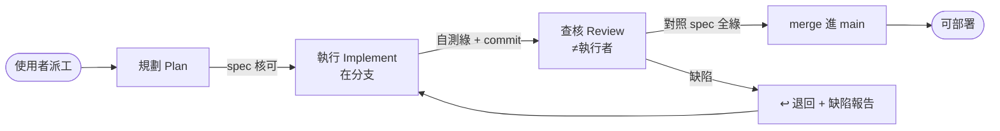

# AI 協作工作流與職責歸屬準則 (AI Collaboration Workflow)

> **目的**：多 AI／多模型協作下，讓每個功能可追溯、可審核、可歸因——**誰提需求、誰規劃、哪個模型執行、哪個模型查核**，並確保「執行」與「查核」獨立。
> **分工**：CLAUDE.md 決定「用哪一**級**模型」（Fable/Opus/Sonnet/Haiku 路由）；[`AI_RUNBOOK.md`](AI_RUNBOOK.md) 是「怎麼做」的操作事實；**本檔決定「哪個**階段**由誰負責、如何交接、如何留痕、如何合併與部署」**。
> **看板**：進行中的任務卡見 [`TASKS.md`](TASKS.md)。

---

## 1. 角色與派工

| 角色 | 由誰 | 說明 |
|---|---|---|
| **需求／派工** | **使用者（人工）** | AI **不自動派工**；由使用者指派某張卡給某個執行者 |
| **規劃 [Plan]** | 使用者 或 規劃 AI | 產出 spec／清單（含驗收標準） |
| **執行 [Implement]** | 各 AI（Cursor/Gemini/Claude Code…） | 由使用者派；在**分支**上寫碼 |
| **查核 [Review] + PM** | **預設 Claude Code** | 審核 + 進度看板守門 + merge 閘門。可委外（§4） |

> **Claude Code 的雙重身分**：可當**執行者**也可當**審核者**，但見 §2 的分離鐵律——**不可對同一張卡又實作又審核**。

---

## 2. 三階段 + 「實作／審核分離」鐵律



**鐵律（不可違反）**：
1. **同一張卡的「執行」與「查核」＝兩張不同任務、不同經手者、不可同時進行**。
2. Claude Code 實作的卡 → **審核必委由使用者或另一 AI**（§4），Claude Code **不得自審自己實作的卡**。
3. Claude Code 審核他人實作的卡時，**不得順手改碼**（改了就變自審）——只能退回（§5）。

---

## 3. 分支制 + 部署閘門

- **每張卡開分支**：`ai/<模型或工具>/<卡ID>`（例：`ai/gemini/ui-4`、`ai/claude-code/ui-5`）。
- 執行者只在自己分支寫；**其他 AI 若在別的 clone／雲端，須 `git push origin` 分支**，PM 才 fetch 得到審。
- 審核通過 → 由**審核者（Claude Code/PM）** merge 進 `main`。
- **部署鐵律 🚀**：**只有 `main`（已審核合併）能部署**。**分支一律不得部署**。（cpbl 部署＝push main → bump submodule → CI，見 [`AI_RUNBOOK.md`](AI_RUNBOOK.md) §3 / memory `data-sync-local-to-prod`）
- **硬性強制（建議）**：GitHub **branch protection** 開 `require pull request review before merging`，讓「未審不得進 main」由平台強制，而非只靠紀律。

---

## 4. 獨立性（兩維）+ 委外審核 + 紅線

獨立性有**兩個維度**，同模型不同工具只保住其中一個：

| 維度 | 抓什麼錯 | 同模型不同工具（如 Cursor-Claude 寫、ClaudeCode-Claude 審） |
|---|---|---|
| **context/session 獨立** | 疏忽、spec 偏移、作者自我合理化 | ✅ 仍成立（新 session 無對方推理記憶） |
| **模型架構獨立** | 模型**系統性盲點**（同權重＝同偏誤） | ❌ 不成立（同一顆腦，換工具不換盲點） |

**規則**：
1. **一般卡**：context 獨立即可 → 同家族不同 session/工具審**可接受**。
2. **紅線卡**（統計/ML 正確性、賽果/救援/RE/守備/球種重建…）：審核**必換模型家族或人審**（Gemini/GPT 或使用者），且**必跑實測**（非只看 diff）。同家族審（含 Opus 審 Sonnet）**不算數**。
3. **委外審核**：可把審核派給其他 AI（跨家族）避免盲點——`Reviewed-by` 記**實際模型@工具**。
4. **使用者是最終獨立背板**：最高風險項一律使用者 sign-off。

---

## 5. 審查失敗流程 (Rejection Flow)

1. 審核發現缺陷 → 卡狀態轉 **↩退回**，產出**缺陷報告**（哪條驗收沒過 + 重現步驟）。
2. 缺陷報告回**原執行者**；執行者在**同一分支**修正 → 標 `re-submit` → **重審**。
3. 審核者**不得代改**（維持獨立）。
4. **升級條件**：同一張卡連續 **≥3 次退回** → 升級處理（換更高階模型、換執行者、或退回重新規劃 spec）。
5. 每次退回／重審**都留 log**（§6 卡片 log）。

---

## 6. 留痕 (Logging) — 三層，git 為單一事實來源

### 6.1 Git commit trailers（durable、grep-able）
```
Requested-by:   <需求提供方：使用者 | 業務/來源>
Planned-by:     <使用者 | AI 名/模型>
Implemented-by: <模型@工具>
Reviewed-by:    <模型@工具>
```
- 「模型@工具」寫具體：`Claude-Opus-4.8@ClaudeCode`、`Gemini-2.x@AIStudio`、`使用者`。
- merge commit 額外記分支名。
- 查詢：`git log --grep="Reviewed-by: Gemini"`、`git log -1 --format='%(trailers)'`。

### 6.2 TASKS.md 卡片 log
每張卡一段時間線：`日期 | 階段 | 經手（模型@工具 / 需求方） | 通過/退回`。

### 6.3 Ledger 總表
[`TASKS.md`](TASKS.md) 頂部一張表，一卡一列，一眼看全局。**文件與 git 衝突以 git 為準。**

---

## 7. 任務卡格式

```
### <卡ID> <功能名>  〔🔴紅線 / ⚪一般〕
- 需求提供方：<>　規劃：<>　分支：ai/<>/<卡ID>
- 執行：<模型@工具>　查核：<模型@工具>（須 ≠ 執行）
- 狀態：<狀態>　Commit/PR：<sha/#>
- Log：
  - MM-DD 規劃 by <>
  - MM-DD 執行 by <模型@工具>（分支 push）
  - MM-DD 查核 by <模型@工具> → ✅/↩(原因)
```

**狀態機**：`📥Backlog → ⏳待執行 → 🔨執行中 → 🔍待查核 → ✅通過→merge → 🏁完成` ／ 任一審核 `↩退回 → 回🔨執行中`

---

## 8. 與主站同步

本機制為**通用治理**，非 cpbl 專屬。已同步至主站 **PersonalWebsite**（`docs/AI_WORKFLOW.md`）作為 canonical；cpbl 為其 submodule，**規則一致**，僅「部署細節」各依自身 repo（cpbl＝submodule bump、主站＝其 deploy flow）。兩邊各自維護自己的 `TASKS.md`。規則有更新時**兩邊同步**。
