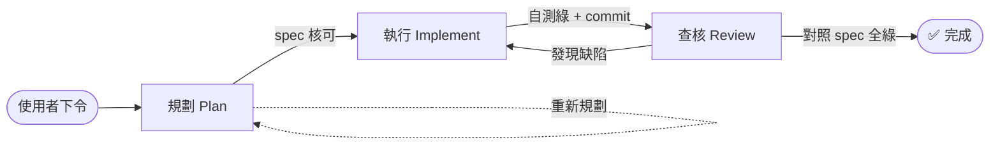

# AI 協作工作流與職責歸屬準則 (AI Collaboration Workflow)

> **目的**：多 AI／多模型協作下，讓每個功能可追溯——**誰規劃 [Plan]、哪個模型執行 [Implement]、哪個模型查核驗收 [Review]**。出錯能歸因、驗收有獨立性。
> **與現有文件的分工**：CLAUDE.md 決定「用哪一**級**模型」（Fable/Opus/Sonnet/Haiku 路由階梯）；[`AI_RUNBOOK.md`](AI_RUNBOOK.md) 是「怎麼做」的操作事實；**本檔決定「哪個**階段**由誰負責、如何交接與留痕」**。三者衝突時以現實 + Runbook 為準並回頭修正。

---

## 1. 三階段與角色

| 階段 | 產出 | 由誰 | 進入下一階段的門檻 |
|---|---|---|---|
| **規劃 [Plan]** | spec／提案／查核清單（含驗收標準） | 使用者直接下令 **或** 規劃 AI | 使用者核可 spec |
| **執行 [Implement]** | 程式碼 + 自測（lint/typecheck/build 綠） | 執行模型（照 CLAUDE.md 路由） | 自測通過、commit 留痕 |
| **查核驗收 [Review]** | 稽核報告 + **行為實測** + 通過/退回 | 查核模型（**須 ≠ 執行者**） | 對照 spec 全綠 → ✅通過 |



---

## 2. 職責歸屬紀錄 (Provenance) — 雙層，**git 為單一事實來源**

### 2.1 Git commit trailers（durable、grep-able）
每個功能的 commit 於既有 `Co-Authored-By` 之外，**加三行 trailer**：

```
Planned-by:     <使用者 | AI 名/模型>
Implemented-by: <AI 名/模型>
Reviewed-by:    <AI 名/模型>
```

- 回溯：`git log --grep="Reviewed-by: Fable"`、`git log --grep="Implemented-by:"` 即可查誰做了什麼。
- 「AI 名/模型」寫**具體識別**：如 `Claude-Opus-4.8`、`Claude-Sonnet-5`、`Gemini-2.x`、`GPT-x`；使用者親手做寫 `使用者`。

### 2.2 文件 ledger（human-readable 總覽）
- **每個 checklist／spec 項目頂部**放一個「職責歸屬」metadata 區塊（範本見 §4）。
- **本檔 §5** 維護一張總表，一功能一列——一眼看全局。
- 文件與 git 衝突時 **以 git trailer 為準**（文件可能忘更新）。

---

## 3. 模型指派準則（綁 CLAUDE.md 階梯）

| 階段 | 指派原則 |
|---|---|
| **規劃** | 難題／架構／紅線 → Opus / Fable；標準 spec → Sonnet |
| **執行** | 照 CLAUDE.md 路由：純機械 Haiku ／ 照 pattern Sonnet ／ 硬題 Opus ／ 統計 ML 紅線 Fable |
| **查核** | **≠ 執行模型**，且**同級或更高**；踩統計/ML 紅線 → 查核**必用 Fable 或 Opus** |

### 獨立性紅線（不可違反）
1. **執行與查核不得同一模型同一 session**（禁止「自己查自己」）。跨 AI（如執行 Claude、查核 Gemini）獨立性更強。
2. **紅線級**（統計/ML 正確性、賽果/救援/RE/守備重建、球種分類…）查核**必用 Fable 或 Opus，且必跑實測**（非只看 diff）——比照 CLAUDE.md「錯了難察覺」判準。
3. 查核**不通過 → 退回執行階段**記一次「↩退回」，**查核者不得順手改**（改了就變自己查自己，喪失獨立性）。
4. 查核**必含行為驗證**（跑起來、截圖、對照官方值），不只讀程式碼。

---

## 4. 狀態機 + 項目 metadata 範本

**狀態**：`📝規劃中 → ⏳待執行 → 🔨執行中 → 🔍待查核 → ✅通過 / ↩退回 → 🏁完成`

每個功能／清單項目頂部貼：

```
> **職責歸屬 (Provenance)**
> - 規劃 [Plan]：<AI/使用者>
> - 執行 [Impl]：<模型>
> - 查核 [Review]：<模型>（須 ≠ 執行）
> - 狀態：<狀態>
> - Commit/PR：<sha / #>
```

---

## 5. 功能歸屬總表 (Ledger)

> 一功能一列。「建議」欄為依 §3 準則的預設指派，使用者可覆寫。實際執行後把模型名補實、狀態更新。

| # | 功能 | 規劃 [Plan] | 執行 [Impl]（建議） | 查核 [Review]（建議） | 狀態 | Commit |
|---|---|---|---|---|---|---|
| UI-1 | 深色模式 Dark Mode | 規劃 AI（外部） | Sonnet | **Opus**（跨圖表色清查易錯） | ⏳待執行 | — |
| UI-2 | 運動風質感（字體/毛玻璃/hover 光暈） | 規劃 AI（外部） | Sonnet | Opus（視覺驗收） | ⏳待執行 | — |
| UI-3 | 微互動（勝率條/滑桿/View Transition） | 規劃 AI（外部） | Sonnet | Sonnet | ⏳待執行 | — |
| UI-4 | 響應式（sticky 首欄/月曆轉列表） | 規劃 AI（外部） | Sonnet | **Opus**（須真機 375px 實測） | ⏳待執行 | — |
| UI-5 | 球員對比頁 + 好球帶 tooltip | 規劃 AI（外部） | **Opus**（新路由+API 缺口+自繪 SVG） | Opus | ↩退回（spec 有硬錯，見 checklist） | — |
| — | 上述 5 項 spec 稽核 | 使用者下令 | — | **Claude-Opus-4.8** | 🏁完成 | 見 checklist §稽核修正紀錄 |

---

## 6. 交接規則（Handoff）

- **規劃 → 執行**：spec 必含「預計修改檔案」「實作步驟」「查核標準」三段（現有 checklist 格式即合格）。spec 前提有誤先退回規劃，**執行者禁止腦補補齊**（比照 CLAUDE.md）。
- **執行 → 查核**：執行者交付時附「自測結果 + commit sha」；查核者拿 spec 的『查核標準』逐條對。
- **跨 AI 交接**：因不同 AI 無共享 context，spec／commit message 必須**自包含**（別預設對方看得到你的對話）。
