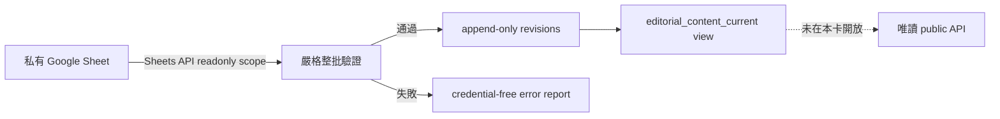

# 編輯資料管道操作契約

> 適用卡片：`DATA-EDITORIAL1`。本管道只負責 Google Sheet → 驗證 → PostgreSQL；
> 公開 API 仍為唯讀，本卡不建立應援文化、主題日或季節性橫幅 UI。
>
> **狀態：暫停／封存（2026-07-19）**。實作與 migration 已合併至 `main`，但未部署、未建立
> production 資料、也不得執行 ingest。待其他產品項目完成後，必須重新開卡並重做 production
> sign-off、備份與 migration lane 檢查，才可依本文件恢復。

## 1. 資料流與安全邊界



- Google Sheet 不可設為「知道連結即可檢視」或公開發布；只把 Sheet 的 Viewer 權限授予專用服務帳戶 [service account]。
- 程式只要求 `spreadsheets.readonly` OAuth scope，固定呼叫官方 `spreadsheets.values.get` endpoint，不接受任意來源 URL。
- 服務帳戶 JSON 必須由 secret store 以唯讀檔案掛載，透過 `GOOGLE_APPLICATION_CREDENTIALS` 傳入；不得放進 repo、Docker image、log、命令輸出或報告。
- `updated_by` 是編輯責任歸屬欄，不是密碼學身分證明；Google 帳號層級的真實編輯紀錄仍以 Sheet version history／Workspace audit log 為準。v1 不虛構 row-level Google editor identity。
- Sheet 刪列不等於撤回。內容只會被新 revision 的 `status=withdrawn` 撤回，因此所有撤回都有時間、更新者與原因。

官方依據：Google Sheets [`values.get`](https://developers.google.com/workspace/sheets/api/reference/rest/v4/spreadsheets.values/get)、[OAuth scopes](https://developers.google.com/identity/protocols/oauth2/scopes#sheets)、[service account keys](https://cloud.google.com/iam/docs/keys-create-delete)。

## 2. Sheet 契約

工作表第一列必須完全依下列順序；日期與時間欄請設為 **Plain text**，避免 Sheet locale 把值格式化成 `7/19/2026`。

| 欄位 | 必填／格式 | 語意 |
|---|---|---|
| `content_id` | 小寫 slug，3–100 字元 | 穩定 ID；改標題不可換 ID |
| `content_type` | `cheering_culture`／`theme_day`／`seasonal_banner` | 首批三類內容 |
| `status` | `active`／`withdrawn` | 顯式啟用或撤回 |
| `team_code` | 0–20 字元 | `cheering_culture` 必填；其他類型可空白 |
| `title` | 1–120 字元 | 顯示標題 |
| `summary` | 1–300 字元 | 可獨立理解的摘要 |
| `body_markdown` | 最多 20,000 字元 | 詳細內容；未來輸出仍須 sanitize |
| `source_url` | 無帳密的 HTTPS URL | 可追溯的第一方或可信來源 |
| `source_label` | 1–120 字元 | 來源名稱 |
| `valid_from` | `YYYY-MM-DD` | 有效期起日（含） |
| `valid_until` | `YYYY-MM-DD` | 有效期迄日（含），不得早於起日 |
| `updated_by` | 1–120 字元 | 編輯責任歸屬，建議填組織 email |
| `source_updated_at` | 含時區 ISO 8601 | row revision；每次語意變更必須增加 |
| `withdrawal_reason` | withdrawn 時 1–300 字元 | active 必須空白 |

額外欄位、非空額外 cell、重複 `content_id`、HTTP source、無時區 timestamp 或任一壞列都會讓整批 fail closed。報告只包含 row number、field、error code 與固定訊息，不包含原始 cell、token 或遠端 response body。

## 3. 冪等與版本規則

| Sheet row vs DB 最新 revision | 結果 |
|---|---|
| DB 無此 `content_id` | 寫入新 revision |
| timestamp 與 content hash 都相同 | `unchanged`，不重複寫入 |
| timestamp 相同、內容不同 | 整批 `version_conflict` |
| timestamp 比 DB 舊 | 整批 `stale_version` |
| timestamp 較新 | 寫入新 revision；current view 自動切到新版 |

單次 ingest 在 transaction 內取得 PostgreSQL advisory lock；錯誤批次只寫 `editorial_ingest_runs(status='rejected')` 與去敏錯誤，不寫任何 content revision。`editorial_content_current` 保留最新 revision，包括 withdrawn／過期內容；未來唯讀 consumer 必須明確加上 `status='active'` 與有效期條件，不能把 view 名稱誤解為「可直接公開」。

## 4. Staging rehearsal

開發／查核一律使用 CARD_ID 隔離 database，不可寫共用 `cpbl`：

```bash
docker exec cpbl-analytics-db-1 createdb -U cpbl cpbl_data_editorial1

export DATABASE_URL='<CARD_ID-isolated local database URL>'
uv run python -c 'from cpbl.db import migrate; print(migrate())'
uv run python -c 'from cpbl.db import migrate; print(migrate())'  # rerun
uv run cpbl-ingest-editorial \
  --csv tests/fixtures/editorial_content.csv \
  --validate-only
uv run cpbl-ingest-editorial --csv tests/fixtures/editorial_content.csv
uv run cpbl-ingest-editorial --csv tests/fixtures/editorial_content.csv
```

第二次 ingest 必須為 `accepted_rows=0`、`unchanged_rows=2`。對帳：

```sql
SELECT status, count(*)
FROM cpbl.editorial_content_current
GROUP BY status ORDER BY status;

SELECT status, accepted_rows, unchanged_rows, rejected_rows, error_report
FROM cpbl.editorial_ingest_runs
ORDER BY completed_at DESC
LIMIT 10;
```

清理 staging namespace：

```bash
docker exec cpbl-analytics-db-1 dropdb -U cpbl cpbl_data_editorial1
```

## 5. 私有 Google Sheet 執行

```bash
export EDITORIAL_SPREADSHEET_ID='<sheet-id>'
export EDITORIAL_SHEET_RANGE='Editorial!A:N'
export GOOGLE_APPLICATION_CREDENTIALS='/run/secrets/cpbl-editorial-reader.json'

uv run cpbl-ingest-editorial --validate-only --report /tmp/editorial-validation.json
uv run cpbl-ingest-editorial --report /tmp/editorial-ingest.json
```

先 validate-only、人工檢查報告，再執行寫入。production migration／ingest 僅能在已審核 main SHA、production `cpbl` 備份完成且 migration lane 已取得後，由受保護 runner 執行；本機 AI session、API request 與公開 Web 不得持有 production 寫入憑證。

## 6. Rollback 與停止條件

優先修正方式是新增較新的正確 revision；錯誤內容需立即下架時，新增 `withdrawn` revision，而不是刪 audit history。

只有 staging cleanup 或經人工 sign-off 的 incident rollback 才能刪除某一 run。刪除 revision 後 current view 會回到前一版，故執行前必須先備份並在同一 transaction 對帳受影響 ID：

```sql
BEGIN;
SELECT content_id, source_updated_at, status
FROM cpbl.editorial_content_revisions
WHERE ingest_run_id = :'run_id'
FOR UPDATE;

DELETE FROM cpbl.editorial_content_revisions WHERE ingest_run_id = :'run_id';
DELETE FROM cpbl.editorial_ingest_runs WHERE run_id = :'run_id';
COMMIT;
```

以下任一情況停止，不得帶病寫入：credential／scope 錯誤、header drift、任一 rejected row、stale/version conflict、migration rerun 失敗、備份未驗證、對帳筆數不符，或來源不具可追溯 HTTPS URL。
