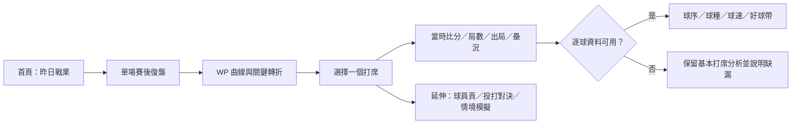

# 賽事脈絡與逐打席復盤產品規格

> 狀態：提案基線 v1.3，待 Design Gate 核可  
> 日期：2026-07-16  
> 對應 Initiative：[`INIT-GAME-RECAP`](tasks/INIT-GAME-RECAP.md)  
> Design Brief：[`GAME_RECAP_DESIGN_BRIEF.md`](design/GAME_RECAP_DESIGN_BRIEF.md)

## 1. 產品定位

本產品不是即時轉播服務。資料由維護者在隔日人工執行批次刷新 [daily batch refresh]：

- 比分、基本成績、逐局與逐打席資料通常在比賽結束後可取得。
- 官方進階數據與逐球 TrackMan 資料可能隔天才到齊，且受球場設備覆蓋限制。
- 前端不得使用 `LIVE`、即時、正在同步比賽等無法履行的承諾。

產品價值是「隔日重建比賽當下」：球迷先快速理解昨日結果與今日賽程，再進入單場復盤，沿著比賽勝率 [win probability, WP] 曲線理解哪些打席改變了勝負，以及當時的比分、局數、出局數、壘況、投打對決與逐球內容。

## 2. 目標使用者與痛點

| 使用者 | 主要情境 | 現行痛點 | 目標結果 |
|---|---|---|---|
| 每日追賽球迷 | 隔天快速補完昨日比賽 | 資訊很多，但不容易先找到比賽轉折 | 5 秒內看懂結果與最大轉折，2 次互動內進入關鍵打席 |
| 進階數據迷 | 復盤某一打席或投打策略 | 勝率、事件、好球帶與逐球資料分散 | 從 WP 節點直接檢視當時狀態、逐球與數據限制 |
| 維護者 | 隔日人工刷新及同步生產 | 不同來源到齊時間不同，使用者無法判斷缺資料或尚未更新 | 前端與 API 可說明各資料層的更新日、可用性與缺漏原因 |

## 3. 已知證據與限制

### 3.1 使用者確認

- 系統目前無法提供即時轉播，只能由維護者隔日刷新。
- 基本資料在比賽結束後更新；官網進階數據通常隔天更新。
- 即使不是即時服務，仍需要比賽過程 WP 曲線與逐打席資料，幫助球迷理解賽事當下狀況。
- 每日追賽球迷與進階數據迷都是核心受眾。

### 3.2 現有實作

| 能力 | 現況 | 本規格處置 |
|---|---|---|
| 逐局／逐打席 | `game_scoreboard`、`game_livelog` 已存在 | 沿用，先做覆蓋率與狀態重建稽核 |
| 逐球資料 | `pitch_tracking` 已存在，但球場覆蓋不完整 | 沿用；缺資料必須誠實退化 |
| WP 模型 | `models/winprob.py` 已有 run distribution＋動態規劃 [dynamic programming] | 不重寫；先做時間外驗證、適用賽制與契約稽核 |
| WP API | `/api/v1/games/{game_sno}/winprob` 已存在 | 補 canonical 打席前後狀態、WPA、來源與模型資訊 |
| 賽事頁 | 已有勝率曲線、關鍵時刻、逐打席與好球帶 | 重整產品語意、互動、完賽狀態與資料新鮮度，不從零製作 |
| 賽前預測 | ML-SIM1 已完成跨模型家族複查、合併與 production 驗證，Ledger 已對帳（merge `a28170b`）；PregameCard 由已交付並部署的 `UX-OUTCOME-HOME`／`UX-GAME-HOME1`（2026-07-18）呈現 | 沿用既有模型，不在本 Initiative 重訓 |

### 3.3 已知資料風險

- 現行前端以「投手 ID × 打者 ID × 局數」比對逐球資料；同一局重複對戰時可能合併兩個打席，不能視為可靠打席鍵。
- 後端 `build_run_dist()` 以半局內 `(batting_order, hitter)` 去重，WP API 以 `(inning, half, batting_order, hitter)` 去重；前端 `buildMoments()` 再以連續相同 hitter 尋找打席終點。三層近似分組可能在打線輪轉、換人或事件缺漏時產生不同打席邊界。
- `home_score + away_score > 0` 無法獨立表達 0–0、延賽、取消、資料尚未刷新等狀態。
- WP 端點固定載入一軍 `2018–2025` 分布，但路由允許其他 `kind_code`；未驗證賽制不得借用一軍口徑而不揭露。
- 現行前端由相鄰 WP 點計算轉折；若事件分組、排序或終點不完整，會產生錯誤的打席影響值。

## 4. 產品原則

1. **結論先行、逐層深入**：最終比分與最大轉折優先，完整逐球按需展開。
2. **重建當下，不假裝即時**：顯示「賽後復盤」「資料更新至」，不顯示即時轉播語意。
3. **資料到哪、功能到哪**：基本資料完成即可提供可靠的基本打席；WP、逐球與進階內容各依自己的 availability 呈現，不互相假設或阻塞整頁。
4. **伺服器提供 canonical 語意**：打席分組、狀態、WP 前後值與 WPA 不在多個前端重算。
5. **統計誠實**：WP 是中性隊伍＋主場基準的局面勝率，不等同賽前隊伍實力模型；勝率貢獻 [win probability added, WPA] 不等同球員真實能力。
6. **Solopreneur-first**：不新增 websocket、訊息佇列或即時資料基礎設施；衍生資料在隔日 refresh/build 階段計算或由低成本唯讀 API 提供。

## 5. 核心使用流程



## 6. 資訊架構

### 6.1 每日入口

首頁或賽程頁依序呈現：

1. 昨日戰果與可進入復盤的場次。
2. 昨日最大轉折或代表性比賽，不以演算法誇大「精彩」。
3. 今日賽程與賽前資訊。
4. 各來源資料更新狀態。

每日入口由已交付並部署的 `UX-GAME-HOME1`（最近比賽日入口）與 `UX-OUTCOME-HOME`（PregameCard）提供，兩卡的首頁資源序列化已於 2026-07-18 完成合併與 production 驗證。本 Initiative 後續若再改動首頁區塊，仍須由 Coordinator 序列化、不得平行修改 `web/src/app/page.tsx`。

### 6.2 單場賽後復盤

由上至下：

1. 最終比分、完賽狀態、日期、球場與資料更新時間。
2. 一句賽事摘要與 Top 3 關鍵轉折。
3. WP 曲線；支援點擊、鍵盤與行動版替代清單。
4. 逐局／逐打席時間軸。
5. 選定打席的當時狀態、投打對決與 WPA。
6. 逐球、好球帶與 TrackMan；資料不足時顯示明確退化狀態。
7. Box score、球員延伸分析與模型教育說明。

### 6.3 打席詳情

一般層必備：

- 局數、上下半局、比分、出局數、壘況。
- 打者、投手、打席結果與事件描述。
- 打席前 WP、打席後 WP、WPA 與受益隊伍。

進階層依可用性呈現：

- 每球球數、判定、球種、球速、進壘位置。
- 擊球初速、仰角與方向。
- TrackMan 覆蓋與官方進階資料更新狀態。
- 真實結果與 ML-SIM1 打席結果分布的延伸比較；此項是後續整合，不阻塞首版。

## 7. 資料狀態與新鮮度契約

不得只用 `0–0` 或單一 composite status 推導所有能力。API 必須提供正交欄位，UI 再依欄位組合呈現：

| 欄位 | owner | 最小值域 | 用途 |
|---|---|---|---|
| `official_game_status` | STATUS1 | `scheduled`、`final`、`postponed`、`cancelled`、`unknown` | 描述官網賽事生命週期，不表示本站資料完整 |
| `play_by_play_availability` | STATUS1 | `available`、`pending_refresh`、`source_missing`、`source_error`、`not_applicable` | 描述 raw scoreboard／livelog 來源是否可用 |
| `advanced_freshness` | STATUS1 | timestamp/date＋`available`、`pending`、`unknown`、`source_error` | 說明官方進階來源到齊狀態，不判定單一打席 mapping |
| `tracking_availability` | PA1 | `available`、`advanced_pending`、`no_equipment`、`source_missing`、`mapping_failed`、`source_error` | 由 canonical PA 與逐球 mapping 決定打席層逐球能力 |
| `wp_availability` | WP-API1 | `available`、`model_not_built`、`unsupported_season`、`unsupported_kind`、`state_unreliable`、`source_error` | 由驗證結論與 WP artifact 決定；不得由完賽或 livelog 狀態保證 |

產品可將正交欄位摘要成「基本復盤完成」「進階資料待更新」等文案，但 API 與核心 UI 邏輯不得只保存摘要狀態。`postgame_pending_refresh` 只有在 `GAME-RECAP-DATA1` 證明官方狀態／時間欄位足夠可靠時才可推導；否則顯示 `unknown`，不以日期猜測。

資料新鮮度至少分為：

- `game_data_through`：比分／逐打席資料涵蓋日期。
- `advanced_data_through`：官方進階數據涵蓋日期；無法可靠得知時為 `null`＋`unknown`。
- `refreshed_at`：本站最近一次成功刷新時間。
- `wp_model_span`／`wp_built_at`：WP 模型資料期間與建置時間。

`refresh_log` 目前只表示整次 refresh，不能直接證明單場、單來源已完成。`GAME-RECAP-STATUS1` 必須依 DATA1 結論決定是否需要逐來源紀錄、schema expand 或保守的 unknown 狀態。STATUS1 不聚合或重新推導 PA1／WP-API1 的 availability；UI 以 `pa_id` 與 game key 組合三份正交契約。

### 7.1 載入、錯誤與未知狀態

- 初次載入：保留比分摘要與內容骨架，避免整頁跳動；逐球延遲載入不阻塞基本復盤。
- game API 失敗：顯示可重試錯誤，不把錯誤當成無資料或未開打。
- WP API／artifact 失敗：保留比分與打席，隱藏曲線並說明暫不可用。
- tracking API 失敗：保留基本打席，顯示 `source_error`，與 `no_equipment` 文案分開。
- 狀態或 freshness 無法判定：顯示 `unknown` 與最近成功 refresh，不猜測官方狀態。

## 8. WP 與 WPA 契約

`GAME-RECAP-PA1` 是 canonical 打席與 `pa_id` 的唯一 owner；所有 WP、逐球與 UI 只消費該契約，不得各自重新分組。

### 8.1 PA1 base contract

每個 canonical 打席節點至少包含：

```text
pa_id, start_event_no, end_event_no
inning, half, outs_before, bases_before
away_score_before, home_score_before
away_score_after, home_score_after
hitter, pitcher, result, description
tracking_availability, ordered_pitches_or_link
```

PA1 不計算 WP，也不依賴模型驗證。

### 8.2 WP-API1 enrichment

WP-API1 只引用 PA1 的 `pa_id` 與 base state，增加：

```text
pa_id, home_wp_before, home_wp_after, wpa
beneficiary_team, wp_availability
model_span, model_kind, model_built_at
```

規則：

- `wpa = home_wp_after - home_wp_before`，主隊視角；API 同時回傳受益隊，避免前端自行判斷。
- 終場、再見、換局與和局狀態必須由伺服器 canonical 狀態機處理。
- 無法可靠重建的打席必須 fail closed：保留事件，但不回傳誤導性的 WP／WPA。
- 模型必須以走查／留出季 [walk-forward/holdout season] 驗證校準、Brier score 與邊界狀態；不得只用建模母體自我驗證。
- 非一軍、季後賽或規則不同的賽事，在沒有獨立驗證前須明確標示不支援或使用代理模型，不得靜默套用。

## 9. 互動與可及性

- 點擊曲線節點、關鍵轉折卡或逐打席列，皆選到同一 `pa_id`。
- 行動版不要求精準點擊小型圖表節點；提供可滑動或上下切換的打席卡。
- 曲線必須有文字替代、鍵盤焦點、清楚的選取狀態與不只依賴顏色的勝率方向標示。
- 互動目標至少 44×44 px；支援 `prefers-reduced-motion`，跳轉動畫不可阻礙定位。
- 375 px 寬度不得產生整頁水平捲動。

## 10. 效能與維運

- 不新增即時輪詢；頁面只在載入或使用者操作時發唯讀請求。
- canonical 打席與 WP/WPA 優先在每日 refresh/build 後批次物化；若首版保留 request-time 計算，必須有快取、延遲量測與失敗退化。
- API 回應避免重複傳輸整場大型 TrackMan payload；打席逐球可按選定 `pa_id` 延遲載入。
- 所有 build／refresh 皆需冪等、可重跑，且不增加 VPS 爬蟲需求。

## 11. 成功條件

- 需求方以固定 prototype 任務腳本計時走查，並至少邀請 1 位每日追賽球迷與 1 位進階數據使用者測試；一般球迷能在進入頁面後 5 秒內口述最終結果與最大轉折。若部署前無法取得代表性使用者，Design Gate 必須明記此研究限制，不得把作者自測當使用者證據。
- 從曲線或轉折卡到完整打席資料不超過 2 次互動。
- 任一頁面不出現無法履行的即時轉播承諾。
- 基本、進階、逐球與模型資料的新鮮度／可用性可被使用者辨識。
- 無任何打席因近似鍵而混入另一打席的逐球資料。
- WP/WPA 的模型範圍、限制與校準證據可被查核。
- 375 px 行動版與鍵盤操作通過 Design Brief 的走查案例。

## 12. 非目標

- 即時比分、即時通知、websocket 或現場轉播替代品。
- 在此 Initiative 實作 ML-SIM2 全場模擬器。
- 把 WPA 當成球員能力、MVP 或責任歸因指標。
- 在未驗證前承諾所有球場都有 TrackMan。
- 重做已存在的 WP 模型、賽事頁與逐球元件而不先稽核。

## 13. 待核可決策

1. canonical 打席／WP 是否物化成新表；由 `GAME-RECAP-DATA1` 先完成資料量、刷新成本與一致性評估。
2. 季後賽與二軍在首版採「不支援 WP」或「明示代理模型」；需 `GAME-RECAP-WP-VAL1` 統計審查後決定。
3. ML-SIM1 真實結果對照是否納入首版打席詳情，或延至獨立整合卡。

## 14. Design Gate 與基線變更

- Prototype：待 `UX-GAME-RECAP1` 執行前建立桌機與 375 px wireframe；預定位置記錄於 [`GAME_RECAP_DESIGN_BRIEF.md`](design/GAME_RECAP_DESIGN_BRIEF.md)，未完成前不得核可 Design Gate。
- 需求方核可：待 ruan6047 正式交付 v1.2 並完成 DOC-GAME-RECAP1 獨立查核。
- 2026-07-16 v1：初版規格與五張子卡。
- 2026-07-16 v1.1：作者端 preflight 重整 PA owner、拆 WP 驗證／API、正交化狀態契約、新增狀態 API 與首頁卡、補 Design Brief；非正式查核紀錄。
- 2026-07-16 v1.2：作者端 preflight 分散 availability owner，拆開 PA base contract 與 WP enrichment，清除基本資料完成即保證 WP 的殘留語意；非正式查核紀錄。
- 2026-07-19 v1.3：依 DOC-GAME-RECAP1 獨立查核（Claude Opus，request-changes）修正現況盤點時效性——ML-SIM1 已對帳、`UX-GAME-HOME1`／`UX-OUTCOME-HOME` 已交付部署、首頁序列化前置已消除（§3.2、§6.1）；核心資料／PA/WP/STATUS 與可及性設計不變。查核證據見 [`research/DOC-GAME-RECAP1_REVIEW.md`](research/DOC-GAME-RECAP1_REVIEW.md)。
