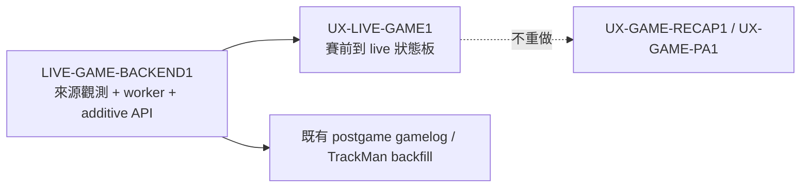

# Live Game Product Spec — 賽前情報到比賽中賽況

> spec 基線：v1.0（2026-07-26）
> 狀態：Discovery Gate 已確認；Design Gate 待需求方核可。
> 子卡：`LIVE-GAME-BACKEND1` → `UX-LIVE-GAME1`。

## 1. Discovery Brief

### 問題與目標使用者

- 目標使用者是開賽前查看下一場資訊、比賽中追蹤賽況的中職球迷。
- 現況只有每日批次同步，無法在「預告先發公布 → 先發名單公布 → 比賽進行中」的時間軸持續更新。
- 需求方於 2026-07-26 指定前後端分卡，並要求同步納入：通常於賽前一天公布的預告先發、通常於賽前約一小時公布的先發名單，以及比賽中的賽況資料。

### 成功條件

1. 同一場比賽由未公布、預告先發、先發名單、進行中到完賽，狀態只能依官方來源的實際觀測前進，不能靠時間推定資料已公布。
2. production 能自行取得 live feed，不依賴開發機在線，且不讓每位瀏覽器訪客直接打官方來源。
3. 資料未公布、來源錯誤、資料過期與官方未提供 TrackMan 必須是不同狀態。

### 非目標

- 不把 `SkipTrackman=false` 解讀為賽中 TrackMan 已可用。
- 不在本功能重做 WPA、勝率模型或賽後 canonical PA 探索器。
- 不繞過 HiNet／Cloudflare 限制，也不以被 VPS 封鎖的 `www.cpbl.com.tw` 作 production live 主來源。
- 不宣稱「T-24h／T-60m 一定公布」；時間只定義加強觀測窗口，不是官方 SLA。

## 2. 已確認證據（2026-07-26）

| 來源／時間 | 觀測 |
|---|---|
| stats `games/schedule` | 三場進行中比賽回 `GameStatus=START`；此 raw 狀態尚未納入既有 shadow known-status 集合 |
| stats `games/{gameId}` | `LiveLog` 在約 78 秒內由 109 增至 112；含比分、局數、球數、出局、投打者、逐局、Hitters、Pitchers |
| `www /box/getlive` | 同一時刻曾落後 stats 2 個事件，約 10 秒後追平 |
| 三場進行中比賽 | `LiveLog` 有 21–135 筆，但非空 `Trackman` 均為 0；`SkipTrackman=false` 不能當可用證據 |
| production VPS | stats 單場 API 回 200（約 174 ms）；`www.cpbl.com.tw/box` 回 404 |
| 未開打場次 | stats 單場物件已有 `Hitters`／`Pitchers` 欄位，但 2026-A-226～228 在 7/26 17:20 左右仍為空陣列 |

## 3. 資料生命週期與語意

| canonical phase | 官方觀測條件 | 可呈現資料 | 禁止推論 |
|---|---|---|---|
| `scheduled` | 官方有賽程，預告先發與 lineup 尚未觀測到 | 日期、時間、球場、對戰 | 已過 T-24h 就視為漏抓 |
| `probable_announced` | 至少一隊的官方預告先發欄位實際非空 | 每隊獨立的預告先發與觀測時間 | 未公布的一隊補成未知球員 |
| `lineup_announced` | 至少一隊的官方先發棒次／守位實際非空 | 每隊獨立的打序、守位、先發投手 | 9 人不完整時宣稱完整 lineup |
| `live` | 官方 raw `GameStatus=START` | 比分、局況、LiveLog、即時 box | 以比分非 0 判斷開賽／完賽 |
| `final` | 官方明確完賽狀態 | 最終比分、完整賽況、賽後進階資料 freshness | 比賽中 TrackMan 0 筆等於無設備 |
| `postponed/reserved/unknown` | 對應官方 raw vocabulary 或未知值 | 原始狀態、最後成功資料、freshness | 未知狀態自行映射成 final |

預告先發與先發名單須逐隊回報 `availability`：`not_announced | partial | announced | source_error | stale`，並帶 `source_observed_at`、`fetched_at`、`first_observed_at`。空陣列是「本次未觀測到資料」，不是球隊沒有先發名單。

## 4. Backend Contract

### 4.1 來源觀測 Gate

- 至少三場一軍例行賽，於 T-30h、T-90m、T-60m、T-30m、`START` 後分段觀測 stats schedule／single-game payload；記錄每隊 `Pitchers`、`Hitters` 與任何預告先發欄位首次出現時間及 exact key path。
- 若 stats 無法提供預告先發，另以本機主站來源做來源研究；不得因此讓 production worker 依賴 VPS 無法連線的 `www`。需要 local relay 時，須提出 freshness、失敗退化與單點故障取捨後再取得 Design Gate。
- API／parser 只能採用觀測過的欄位；來源 schema 改變需 fail closed 並保留 raw status evidence。

### 4.2 集中式更新

- production 只有一個具互斥鎖與 kill switch 的 worker；瀏覽器不直接呼叫官方站。
- `scheduled` 常態低頻，T-30h 起加密，T-90m 起再加密；`START` 建議 10–15 秒。實際頻率須有 jitter、backoff、全域 request budget，並以來源實測與禮貌性負載決定。
- 中央 cache 保存 canonical snapshot、source version、最後成功時間與 stale 狀態；來源失敗時可短暫提供 last-known-good，但必須標 stale。
- `final` 後停止 live polling，觸發一次既有賽後完整抓取／對帳；TrackMan 僅在來源實際出現後標 available。

### 4.3 Public API

- 優先以向後相容的 additive contract 擴充既有 `/api/v1/games/{game_sno}/status` 與 `/api/v1/games/{game_sno}/live`。
- 回應至少包含 canonical phase、官方 raw status、兩隊預告先發 availability、兩隊 lineup availability、scoreboard／livelog freshness、`refreshed_at`、`stale_after`、TrackMan availability。
- 未公布欄位回 `null`／空集合並附 availability，不以 0、空字串或猜測球員補值。

## 5. Frontend Contract

- `/games` 賽程卡與 `/games/[sno]` 單場頁共用同一 canonical phase，不各自推導狀態。
- 賽前依序呈現對戰資訊、預告先發、先發棒次／守位；兩隊可獨立 partial，未公布時顯示「尚未公布」而非錯誤。
- `live` 顯示比分、局況、壘況、球數、最近事件與更新時間；頁面可見時依 API 建議頻率 polling，背景分頁暫停或降頻。
- stale／source error 保留最後成功畫面並清楚標示更新中斷；不可讓舊比分看起來仍是即時。
- 賽中無 TrackMan 時不渲染空好球帶或「球場無設備」結論；完賽後來源補齊才切換到既有進階視圖。

## 6. Design Brief（待核可）

### 主要流程

1. 使用者從 `/games` 看到下一場與預告先發。
2. 賽前約一小時官方資料出現後，同一卡片與單場頁切換為完整／部分先發名單。
3. `START` 後單場頁原地切換 live 狀態板，不要求重整；完賽後停止 polling 並導向既有賽後內容。

### 狀態與可及性

- 正常、partial、not announced、stale、source error、postponed／reserved 均有明確文案。
- live 更新使用 `aria-live=polite` 只播報關鍵比分／局況變動，不逐球搶焦點。
- 375 px 不產生水平捲動；打序表可完整辨識棒次、守位與球員連結。

### 待需求方核可取捨

- v1 只更新既有 `/games` 與 `/games/[sno]`，不新增首頁 live 模組或推播通知。
- 預告先發與 lineup 採「官方資料出現才展示」；T-24h／T-60m 僅控制 worker 加密觀測。
- 賽中 v1 使用文字 LiveLog 與 box score；TrackMan 明確留到賽後。

## 7. 依賴與切片

- 後端卡可先固定 API contract 與 fixtures，前端才可 claim；兩卡不得在未固定 contract 前平行修改共用型別。
- 若來源 provenance 必須新增 DB schema，另切 additive expand 卡；不得把 migration 偷渡進 `LIVE-GAME-BACKEND1`。
