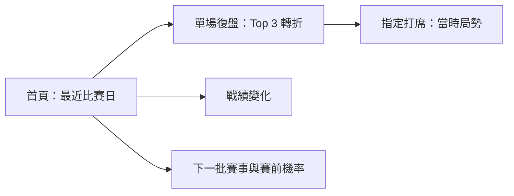
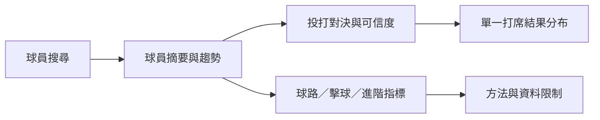
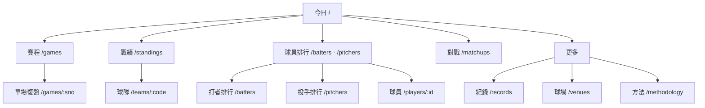

# CPBL Analytics 產品與 UI/UX 全站藍圖

> 狀態：需求方定案並完成查核，v0.2 已進入任務註冊
> 日期：2026-07-17
> 規劃者：GPT-5@Codex
> 共同設計：Fable-5
> 需求方：ruan6047
> 共同設計依據：[`PRODUCT_UX_BLUEPRINT_CO_DESIGN_PROMPT.md`](handoffs/PRODUCT_UX_BLUEPRINT_CO_DESIGN_PROMPT.md)

## 1. Executive Decision

CPBL Analytics 不應是「把所有抓到的數據展示出來」的資料網站，而應成為：

> 球迷在資料刷新後快速看懂最近比賽日、掌握下一批賽事，並能沿著賽事、球員與投打脈絡深入理解數據的非即時分析產品。

核心產品決策：

1. **一頁只回答一個主要問題**；資料只有在能改變理解或導向下一步時才出現。
2. **模型回到情境，不讓模型各自佔一頁**：賽前勝率屬於下一批賽事，場中 WP 屬於賽事復盤，打席模擬首版屬於投打對決，真實打席入口留待後續契約。
3. **舊 `/predict` 應被替換，不再優化**：自由選特徵與手調權重已被 ML-SIM1 的固定語意模型否決。
4. **恢復白天自動刷新，但不承諾即時**：以 launchd 白天排程為目標、手動刷新為 fallback；用 freshness、availability 與賽後重建建立信任。
5. **兩層資訊架構**：每日球迷先看結論；進階數據迷主動展開方法、樣本與細節。
6. **歷史能力零退化**：年份選擇器、紀錄室與月份月曆在改版後必須保留。

## 2. 目標使用者與核心旅程

### 2.1 每日追賽球迷

核心問題：

- 最近比賽日誰贏？比賽在哪裡被改變？
- 戰績因此如何變化？
- 下一批賽事誰對誰？哪一場值得關注？

### 2.2 進階數據迷

核心問題：

- 這位球員真正的強弱項是什麼？
- 這組投打對決有沒有可信的歷史訊號？
- 某個打席對比賽局勢造成多大影響？
- 指標的資料來源、樣本與模型限制是什麼？

## 3. 資訊減法規則

每個區塊進頁面前必須通過「三問 gate」：

1. 它回答這一頁的核心問題嗎？
2. 它會改變使用者對賽事／球員／球隊的理解嗎？
3. 它是否提供明確下一步，而不是只展示一個數字？

任一題為否，預設移除、移至進階展開或放入其他更合適的頁面。

### 3.1 頁面資訊預算

- 第一個 viewport：1 個主要結論、最多 3 個支持證據、1 個主要下一步。
- 預設表格：5–8 個欄位；其餘使用欄位選擇器或「進階」展開。
- 關鍵轉折：預設 Top 3；完整時間軸另行展開。
- 導覽：5 個主要入口＋1 個「更多」收納控制。
- 模型說明：結果旁提供一句限制，完整回測移至方法頁。
- 樣本與 coverage：與結論同區，不藏在頁尾。

### 3.2 禁止模式

- 因為資料庫有欄位就放上頁面。
- 首頁同時展示多套排行榜、戰績、預測與所有探索入口。
- 用大量卡片取代資訊架構。
- 把 accuracy、WPA、Stuff+ 或 matchup credibility 當作可互換的「厲害分數」。
- 把無設備、尚未更新、來源錯誤與真正的零值顯示成同一個空狀態。

## 4. 建議全站資訊架構

### 4.1 頂層導覽

| 導覽 | 路由／行為 | 核心任務 |
|---|---|---|
| 今日 | `/` | 最近比賽日發生什麼、下一批賽事看什麼 |
| 賽程 | `/games` | 依日期／球隊找到比賽並進入復盤 |
| 戰績 | `/standings` | 聯盟競爭位置與季後賽脈絡 |
| 球員 | `/batters` 或 `/pitchers` 排行入口 | 比較同角色球員並進入個人頁 |
| 對戰 | `/matchups` | 查詢投打對位與可信度 |
| 更多 | 展開選單 | 紀錄室 `/records`、球場 `/venues`、方法 `/methodology` |

Header 另提供全域球員搜尋，直接導向 `/players/[id]`；不建立 `/players` landing。`/methodology` 建立路由但不佔主要導覽，模型旁的說明 badge 必須可 deep-link 至對應段落。不建立 `/explore`。`/predict` 與 `/umpires` 不競爭主要導覽位置。球隊頁由戰績與比賽中的隊徽／隊名進入。

## 5. 每一頁的核心目標

### 5.1 `/` 今日：每日入口

**唯一核心問題**：最近比賽日發生什麼、下一批賽事看什麼？

首屏保留：

1. 最近一個有資料的比賽日結果；每場只顯示比分與進入復盤的入口。
2. 下一批已排定賽事；未開打賽事可顯示 ML-SIM1 固定賽前勝率。
3. 資料更新至何時。

第二層：

- 戰績變化摘要或目前領先者，不放完整戰績表。
- 季節性橫幅 slot：只放可追溯事實；例行賽期間可留空，季後賽啟用專頁模板。

應移除：

- 現行首頁一次抓取 AVG、H、HR、RBI、SB、ERA、W、HLD、SV、SO 十套榜單。
- 導向舊 `/predict` 的 CTA。
- 與「昨天／今天」無關的完整歷史或進階資料。

ML 使用：

- `outcome_simple`：每場只顯示一個點機率與 1 個主要訊號。區間不進首頁，退到賽事頁與 `/methodology`，且固定稱為「模型敏感度區間」。
- Game Recap WP：v1 首屏不顯示 WPA 轉折；`winprob` 過閘後，才以漸進增強欄位加入最近比賽日卡片，完整曲線仍進單場頁。

語意紅線：不把區塊寫死成「昨天／今天」，避免休兵日、延賽與刷新落後時產生錯誤敘事；統一使用「最近比賽日／下一批賽事」。

### 5.2 `/games` 賽程：找到一場比賽

**唯一核心問題**：我要找哪一天、哪一隊的比賽？

預設：

- 直接提供日期／月份月曆與篩選後賽事，不重建首頁的最近比賽日／下一批賽事 hub。
- 球隊、年度、一軍／二軍篩選。
- 每場清楚標示 official status、PBP availability 與資料日期。
- 年份選擇器與月份月曆是歷史查詢契約，不得因新首頁而移除或降級。

應移除：

- 在列表頁呈現 box、進階數據或完整模型解釋。
- 用 0–0 猜測尚未開打或更新中。

ML 使用：只在未開打卡片顯示簡化賽前勝率；不顯示特徵權重表。完整賽事頁可顯示區間，但必須標為「模型敏感度區間」並連至 `/methodology`，不得稱信賴區間。

### 5.3 `/games/[sno]` 單場復盤：理解勝負如何形成

**唯一核心問題**：這場比賽在哪些打席改變了？

資訊順序：

1. 最終比分、完賽狀態、資料 freshness。
2. Top 3 關鍵轉折。
3. 場中 WP 曲線與文字替代清單。
4. canonical 打席時間軸。
5. 選定打席的比分、局數、出局、壘況、投打、結果、WP 前後與 WPA。
6. 有資料時才顯示逐球、好球帶與 TrackMan。
7. Box score 與完整進階資料置後。

ML／模型使用：

- `winprob`：核心模型；必須先完成 GAME-RECAP-WP-VAL1／API1。
- `pa_sim`：不進復盤首版；真實打席入口須等 GAME-RECAP-PA1 契約完成後另開卡。
- 未開打時可顯示 `outcome_simple`；完賽後保留「賽前判斷」需避免結果論包裝。

禁止：假 LIVE、把 WPA 當球員能力、逐球誤配、把 PA 模擬宣稱成整場預測提升。

文案：可保留球迷用語的焦點 chips，必須標注為網路用語；正式摘要句、模型解釋與可及性文字不用這些稱呼。

### 5.4 `/standings` 戰績：理解球季競爭位置

**唯一核心問題**：各隊目前在球季競爭中的位置如何？

首層保留：

- 全年／上下半季戰績、勝差、近況、連勝敗。
- 季後賽結構與目前資格脈絡。
- 一張戰績走勢圖。

進階展開：主客場、月份、對戰各隊。

應移出：大量特殊戰績、單局紀錄與和 standings 無直接關係的歷史資料；移至球隊頁或紀錄室。

ML 使用：目前沒有值得加入的模型。沒有通過驗證的季後賽晉級機率就不要製作。

### 5.5 全域球員搜尋與球員排行入口

**唯一核心問題**：我要找誰，或誰值得看？

設計：

- Header 提供全域球員搜尋，選定結果直接進 `/players/[id]`。
- 導覽「球員」直接進打者／投手排行，不增加 `/players` landing。
- 打者與投手角色切換在排行介面內清楚可達。

ML 使用：無。搜尋與排行入口的任務是導航，不是模型展示。

### 5.6 `/batters` 與 `/pitchers` 排行：比較同角色球員

**唯一核心問題**：依我選擇的指標，誰表現最好？

設計：

- 第一層為指標選擇＋6–8 欄摘要表。
- 行動版顯示排名、球員、球隊、主指標與 1–2 個支持指標。
- 完整欄位由使用者主動展開或切換。
- 點球員直接進個人頁。

ML 使用：

- 不以投影值混入實績排名。
- Stuff+ 未通過 ML-PT3 gate 前不得成為投手排序指標。
- 球種分類只用於個別投手武器庫，不用於聯盟總榜製造單一分數。

### 5.7 `/players/[id]` 球員頁：理解這位球員

**唯一核心問題**：這位球員現在如何、靠什麼、趨勢如何？

資訊架構骨架：

1. `總覽`：身份、當季核心數據、相對聯盟位置、近期趨勢。
2. `打法／球路`：打者擊球與紀律；投手配球、位移、放球點。
3. `分項與對戰`：vs team、splits、ML-MATCHUP1 洞察。
4. `生涯`：逐年表、守備、獎項與歷史。

ML 使用：

- `matchup_insights`：放在「分項與對戰」，顯示候選、PA、baseline、credibility 與 coverage；明示描述性、非未來預測。
- `pitch_type_v2`：可用於投手球路標籤，但必須顯示「推定球種」；複合名與低信心不能被 UI 強制單一化。
- `pa_sim`：首版不在球員頁提供常駐入口；使用者需進 `/matchups` 選定具體投手×打者後，才可切到第二 tab。
- `Stuff+`：未來若過 gate，只放投手「打法／球路」而非 hero 大分數。
- 成績投影：不列入首版；若未來採用，只放「下季展望」進階區，不能混入當季實績。

應移除／收合：目前所有 season、tracking、quality、movement、batted mix、trend、SABR、fielding、detail 連續鋪滿的長頁；預設只展開與角色相關的前三層結論。

實作邊界：`UX-PLAYER-IA1` 拆為「IA 骨架卡」與「分頁內容遷移卡」。tabs、錨點或 hybrid 不在藍圖拍板，先以 prototype 比較導覽可見性、回到前文成本與行動版操作。

### 5.8 `/teams/[code]` 球隊頁：理解球隊現況與身份

**唯一核心問題**：這支球隊本季如何，最近發生什麼？

首層：本季戰績與走勢、最近／下一場、關鍵球員。

第二層：對戰各隊、主客場、攻守概覽。

第三層：隊史、沿革、歷代球員與特殊紀錄。

編輯內容候選：未來可加入「應援文化」區與主題日 badge，但只有 `DATA-EDITORIAL1` 建立可維護的編輯資料契約、且實際有資料後才開 UI 卡；不得先放空殼或把不可追溯文案寫死在前端。

ML 使用：

- TEAM-STYLE1 先做描述性研究；若穩定，可在攻守概覽加入「球風輪廓」，必須按年度／時期呈現。
- TEAM-STYLE 特徵只有在 walk-forward 增量勝過既有 outcome model 時，才可進賽前模型。
- 不新增未驗證的球隊 power ranking。

### 5.9 `/matchups` 投打對決：探索特定對位

**唯一核心問題**：這位球員對某隊／某人的歷史訊號有多可信？

使用既有 `matchups-redesign.md` 與 ML-MATCHUP1：

- 先搜尋主角，再選對隊／對人與資料範圍。
- 基礎實績與樣本是常態 hero；洞察卡是通過閘門後才增加的加值層，不能讓成功洞察成為版面成立的前提。
- 通過閘門時顯示核心結果、baseline 差與 credibility。
- 詳細計數、球種與擊球資料主動展開。

Fail-closed 是常態版面契約，四種狀態不得合併為泛用「資料不足」：

| 狀態 | 必要文案方向 |
|---|---|
| 覆蓋率不足 | 說明目前可觀察打席未達門檻；仍顯示基礎實績，不產生洞察結論 |
| 先驗無法估計 | 說明缺少可比較母體，無法建立收縮基準；不以聯盟平均硬補 |
| 候選未過 credibility 閘門 | 說明有資料但證據強度不足；不可改稱「輕微優勢」 |
| C–E 無 baseline | 說明該賽事類型沒有可用比較基準；只呈現原始樣本與範圍 |

ML 使用：

- `matchup_insights` 是核心描述性統計。
- `pa_sim` 首版只放在選定打者×投手後的第二個 tab「如果現在對決」，並依賴 UX-MATCHUP1；必須與歷史實績分開。

禁止：把 EB 候選說成必然相剋、把單一打席分布說成誰會贏整場、把 `pa_sim` 包裝成整場預測提升，或把模型敏感度區間稱為信賴區間。

### 5.10 `/records` 紀錄室：理解歷史位置

**唯一核心問題**：某項成就放在聯盟歷史中有多重要？

既有 UX-RECORD1 已完成，不重做。維持重要性導向入口、生涯、單季、冠軍與球隊歷史；長表使用章節導覽與 progressive disclosure。

歷史查詢零退化：所有既有年份與紀錄分類必須保留。紀錄室是否重新成為桌機主要導覽項目，留待導覽 prototype 走查，不影響行動版「更多」決策。

ML 使用：無。紀錄頁應以可追溯事實為主。

### 5.11 `/venues`、`/venues/[venue]` 球場：理解比賽環境

**唯一核心問題**：這座球場的環境如何影響比賽，歷史角色是什麼？

列表：現役／歷史、位置、使用期間、容量與進入詳情。

詳情優先順序：尺寸與歷史 → Park Factor → 逐年變化 → 球員差異案例。

應收合：大量球員 outlier 表放進進階區，不與 Park Factor 搶首屏。

ML 使用：無。Park Factor 是統計估計，不需套 ML 名稱。

### 5.12 `/umpires` 與裁判個人頁：縮限為資料說明

**唯一核心問題**：這場或這位主審有哪些可觀察的判決資料？

ML-UMP1／ML-UMP2 已證明方向性產品 NO-GO：

- 不得顯示「偏向哪隊」、送分、影響勝負或裁判好壞排行。
- 完全移除聯盟裁判排行；改名為「代理帶一致率」仍不足以脫離 NO-GO。
- 單場好球帶散點併入賽事詳情，作描述性視覺化。
- `/umpires` 只保留中性索引與進入個人紀錄的入口。
- 裁判個人頁只呈現出賽紀錄、coverage 與中性判決分布，不進主導覽。

ML 使用：UMP 模型不進公開 UI；count-aware run-value 只保留研究元件。

### 5.13 `/people/[kind]/[name]` 人物頁：支援性百科

**核心目標**：提供總教練／裁判的可追溯履歷與賽事入口。

這是 deep-link 頁，不進主導覽。總教練顯示任期與戰績；裁判遵守上一節 NO-GO 邊界。

### 5.14 `/methodology` 方法與模型透明度

**唯一核心問題**：這個數字怎麼來、可信到哪裡？

內容按產品使用中的模型分類：賽前勝率、場中 WP、打席結果分布、對戰 credibility、推定球種。每項只呈現：回答問題、資料期間、validation、baseline、限制、版本。

這裡承接舊 `/predict` 的模型回測與教育價值，但不提供自由特徵／權重操作。路由存在但不佔主要導覽；模型旁 badge 必須直接連到相對應段落。

## 6. ML 資產採用矩陣

| 資產 | 判定 | 放置位置 | 理由與紅線 |
|---|---|---|---|
| ML-SIM1 Mode A `outcome_simple` | **採用** | 首頁下一批賽事、未開打 game page | 已跨家族查核、production gate 通過；首頁只顯示點機率＋1 個主訊號，敏感度區間退詳情／方法頁 |
| ML-SIM1 Mode B `pa_sim` | **條件採用** | 首版僅 `/matchups` 第二 tab；真實打席另卡 | 價值是結果分布與情境拆解；weighted-WP 改善接近零，不宣稱整場預測提升，區間不稱信賴區間 |
| `winprob` | **採用但先補 gate** | game recap；首頁日後漸進增強 | 是賽事脈絡核心；須完成 canonical PA、時間外驗證與 availability contract，首頁 v1 不依賴 WPA |
| ML-MATCHUP1 `matchup_insights` | **採用** | `/matchups`、球員頁 | 已完成 T4 審查；屬描述性 EB 洞察，必須顯示樣本、coverage 與 credibility |
| `pitch_type_v2` | **條件採用** | 投手球路、逐球標籤 | 可改善細分命名，但官方弱標籤有伸卡爭議；顯示「推定」、保留複合名與 fallback |
| 打擊 LightGBM projection | **暫不公開** | 研究資產 | 公開頁已下架；目前無本次可查核的最新勝出證據，程式也未見硬 gate，不能只因模型存在而恢復 |
| 投手 projection LightGBM | **不採用** | — | 程式紀錄 Marcel 3/4 勝，LGBM 落選；若要做展望只能誠實使用 Marcel，不能包裝成 ML |
| `outcome_gbm`／舊自由特徵模型 | **只作 benchmark** | methodology | 作為比較組，不再驅動公開互動 UI |
| ML-UMP1／ML-UMP2 | **明確不用** | 研究文件 | WP no-ship，方向性產品兩輪 NO-GO；不能以換文案規避結論 |
| ML-PT3 Stuff+ | **延後到 2026 季末** | 未來投手球路區 | 需全季資料、時間切分並勝過 whiff% baseline；未過 gate 不出現 |
| TEAM-STYLE1 | **先研究後決定** | 未來球隊頁 | 先驗證描述穩定性；進 outcome 前還須增量回測勝出 |
| ML-SIM2 全場模擬 | **不啟動** | — | 陣容、牛棚與未來打席不確定性過大，維護成本高且輸入尚未成熟 |

## 7. 舊 `/predict` 替換策略

### 7.1 Replacement before removal

1. 先讓 `outcome_simple` 出現在首頁與未開打賽事頁。
2. 再讓 `pa_sim` 首版只出現在 `/matchups` 第二 tab；指定真實打席等 GAME-RECAP-PA1 後另卡。
3. 建立 `/methodology` 承接回測、版本與限制。
4. 確認沒有新 UI 呼叫舊 `/features`、`/evaluate`、帶 features 的 `/matchups`、`/simulate`。
5. 最後開 deprecation 卡：移除頂層「賽事預測」導覽，`/predict` 轉址至 `/methodology#pregame` 或首頁「下一批賽事」的明確入口；舊 API 依 consumer 稽核另行退場。

### 7.2 不保留的互動

- 自由勾選同義特徵。
- 手調模型權重。
- 任選兩隊後把結果稱為真實賽前預測。
- 只展示 accuracy 大數字而不展示 Brier、校準與 baseline。

## 8. 跨頁一致性規則

### 8.1 資料新鮮度

- 基本賽事、官方進階、逐球 tracking、模型 artifact 各有自己的日期與 availability。
- `unknown`、`pending`、`no_equipment`、`source_missing`、`source_error` 不得共用同一句文案。
- 每個模型結果同區顯示 trained-through／model span；不要求使用者到頁尾找限制。
- 營運目標是恢復 launchd 白天自動排程；手動 `scrape-daily.sh`／refresh 是故障 fallback，不是長期主要流程。
- 首頁 freshness 是安全網而非排程替代品：必須讓使用者辨識資料日期，也必須讓維護者能 fail fast 發現排程未跑、爬取失敗或同步未完成。

### 8.2 數據語言

- 首次出現專業術語提供白話解釋。
- `推算`、`官方`、`推定球種`、`歷史描述`、`模型機率` 使用固定 badge。
- PR、WPA、Park Factor、credibility 不使用相同顏色或共同「高＝好」語意。

### 8.3 行動版

- 觸控目標至少 44×44 px。
- 圖表都要有文字替代列表。
- 寬表格以核心欄位卡／列呈現，不把橫向捲動當唯一方案。
- 首屏先載入文字與比分；tracking、散點與大型圖表延遲載入。

### 8.4 效能與維運

- 首頁由 12 個 leaderboard/calendar 請求降為單一 daily summary API 或最多 3 組聚合請求。
- 不新增 websocket、訊息佇列或即時 polling。
- 大型 tracking payload 依 game／pa lazy load。
- 所有衍生模型在離線 refresh/build 計算，API 唯讀。

### 8.5 編輯資料邊界

- `DATA-EDITORIAL1` 候選採 Google Sheet → ingest → PostgreSQL 的單向編輯資料管道；公開 API 維持唯讀，不從 Web 介面直接寫入。
- 首批候選資料是球隊應援文化、主題日與首頁季節性橫幅；每筆需有來源、有效期間、更新者與可撤回狀態。
- 沒有資料契約與實際內容前不開 UI 卡；國際賽不在本產品範圍。
- 季後賽專頁模板只呈現可追溯的賽程、戰績、對戰與歷史事實，不掛未驗證模型。

## 9. Roadmap 與候選任務卡

> 需求方已於 2026-07-17 完成查核並授權註冊。表中具正式卡號者已寫入 control-plane；仍受資料／研究條件限制者維持候選，不提前開空殼卡。

### Phase 0：全站基線與資訊架構

| 候選卡 | 內容 | 相依 |
|---|---|---|
| `UX-NAV-IA1` | 方案 B 導覽、全域球員搜尋、「更多」與 methodology deep-link map | Blueprint Gate |
| `API-DAILY-SUMMARY1` | 最近比賽日、下一批賽事、freshness 的低維護聚合 API | GAME-RECAP STATUS contract |
| `OPS-REFRESH1` | 恢復 launchd 白天排程、last-status／refresh_log fail-fast 與手動 fallback runbook | Blueprint Gate；不得把 crawler 搬到 VPS |

Checkpoint：需求方能以 sitemap 完成「看最近比賽日／找球員／找對戰／查歷史」四條任務；排程失敗能被維護者辨識，且不需要使用者先回報資料過期。

### Phase 1：每日入口與舊預測替換

| 既有／候選卡 | 處置 |
|---|---|
| `UX-GAME-HOME1` | 首頁唯一 owner：最近比賽日、下一批賽事、freshness、季節性 slot 與聚合流程 |
| `UX-OUTCOME-HOME` | 降級為可嵌入元件卡：只交付 `PregameCard`、fixture 與文案紅線；不得擁有首頁版面或資料編排 |
| `UX-MODEL-METHOD1` | 新增模型透明度頁，承接 backtest 與限制 |
| `DEP-PREDICT-LEGACY1` | 新 UI 穩定後移除舊導覽／頁面 consumer；API 退場另審 |

Checkpoint：首頁不再抓十套排行；首頁每張賽前卡只有點機率＋1 個主訊號；v1 不依賴 WPA；舊 `/predict` 不再是主要使用流程。

### Phase 2：賽事復盤

沿用已註冊 `INIT-GAME-RECAP`：

`DATA1 → PA1 → WP-VAL1 → WP-API1 → UX-GAME-RECAP1 → UX-GAME-PA1`

`STATUS1` 與首頁入口並行，但 availability owner 維持 PRODUCT SPEC 的分散契約。

Checkpoint：5 秒理解結果與最大轉折；2 次互動進指定打席；無假即時與誤配逐球。

呈現基線：焦點 chips 可使用已標注的球迷網路用語，正式摘要句不用；`pa_sim` 真實打席入口不併入本階段既有 UI 卡，待 PA1 後另卡。

### Phase 3：球員與對戰

| 候選／既有卡 | 內容 |
|---|---|
| `UX-RANKINGS1` | 打者／投手排行核心欄位、mobile、column chooser |
| `UX-PLAYER-IA1` | 只建立球員頁總覽／打法／對戰／生涯 IA 骨架與 prototype 決策 |
| `UX-PLAYER-SECTIONS1` | 依核可骨架逐區遷移現有內容，移除全量長頁；依賴 UX-PLAYER-IA1 |
| `UX-MATCHUP1` | 查詢式對戰頁；fail-closed 四狀態是常態版面，洞察卡不是 hero |
| `UX-MATCHUP2` | 對戰元件整合球員頁；依賴 MATCHUP1 |
| `UX-PA-SIM-MATCHUP1` | 首版只將 PA 模擬放進 `/matchups` 第二 tab；依賴 UX-MATCHUP1 |
| `UX-PA-SIM-GAME1`（未註冊） | 真實打席入口；GAME-RECAP-PA1 完成後才可另行評估／開卡 |

Checkpoint：球員可在 2 次互動內找到；對戰結論永遠伴隨樣本、coverage 與 credibility。

### Phase 4：戰績與球隊

| 候選／既有卡 | 內容 |
|---|---|
| `UX-STANDINGS-FOCUS1` | standings 減法、季後賽脈絡與進階收合 |
| `UX-TEAM-FOCUS1` | 本季現況優先、隊史置後 |
| `TEAM-STYLE1` | 描述性研究；不與 UI 同卡、不預設進 outcome |

Checkpoint：standings 與 team page 不重複展示同一批表格；TEAM-STYLE 未過 gate 時 UI 無占位分數。

### Phase 5：更多選單與邊界收斂

| 候選卡 | 內容 |
|---|---|
| `UX-NAV-IA1` | 已合併原 `UX-MORE-NAV1` scope：「更多」收納紀錄室／球場／方法；紀錄室桌機位置以 prototype 走查 |
| `UX-UMPIRE-SCOPE1` | 完全移除聯盟排行、單場散點併賽事頁、`/umpires` 收斂為中性索引 |
| `UX-VENUE-FOCUS1`（未註冊） | 只在使用者測試證明需要時，收合 player outlier；不重做已完成資料工作 |

Checkpoint：5 個主要入口＋「更多」在 mobile 可用；歷史入口零退化；研究 no-go 不再以其他名稱出現在公開 UI。

### Phase 6：未來 ML Gates

- `ML-PT3`：2026 全季後執行，勝過 whiff% baseline 才開 UI 卡。
- `ML-PROJ-GATE1`：若需求方重新提出「下季展望」，先重跑打擊／投手投影與產品需求驗證；未勝 Marcel 不公開。
- `TEAM-STYLE1`：先描述穩定性，再決定球隊頁；進 outcome 需額外增量回測。
- `ML-SIM2`：維持停止，除非未來已有可靠陣容、牛棚與 PA 序列資料契約。

### Phase 7：編輯內容與季節性體驗 backlog

| 候選卡 | 內容 | 開卡條件 |
|---|---|---|
| `DATA-EDITORIAL1` | Google Sheet → ingest 的編輯資料管道，公開 API 維持唯讀 | Blueprint 正式查核完成；定義來源、期間、撤回與稽核欄位 |
| 球隊應援文化 UI 卡 | 球隊頁應援文化區與主題日 badge | DATA-EDITORIAL1 完成且已有足量資料；卡號核可時另定 |
| 首頁季節性橫幅 UI 卡 | 填入 Phase 1 預留 slot | 有可追溯內容與有效期間；卡號核可時另定 |
| 季後賽專頁模板卡 | 純事實的賽程、戰績、對戰與歷史模板 | 內容契約明確；不掛模型；卡號核可時另定 |

國際賽不做。此 phase 不得倒灌成 Phase 0–2 的相依或阻塞每日入口與賽事復盤。

## 10. 優先順序

| 優先 | 工作 | 原因 |
|---|---|---|
| P0 | Blueprint v0.2 查核與任務註冊 | 需求方已完成查核；後續每張實作卡仍各自遵守獨立查核與 merge gate |
| P0 | `/predict` 替換契約與首頁責任切割 | 已完成模型尚未進正確 UI，舊頁仍傳達錯誤產品概念 |
| P0 | GAME-RECAP DATA／PA／WP 紅線 | 勝率與逐打席是核心差異化，資料誤配會直接破壞信任 |
| P0 | OPS-REFRESH1 | 自動刷新是資料產品基本營運能力；freshness 只能揭露問題，不能代替排程 |
| P1 | 首頁最近比賽日 hub 與方案 B 導覽 | 解決每日球迷主要入口與首頁過載 |
| P1 | Matchups＋Player IA | 已完成 ML-MATCHUP1，可立即轉成可理解價值 |
| P1 | 排行 mobile／欄位減法 | 高頻頁、現況資訊密度過高 |
| P2 | Standings／Team 減法 | 功能完整但頁面責任重疊、內容過長 |
| P2 | 更多選單／Methodology／Umpire scope | 收斂導航與研究邊界 |
| Backlog | Editorial／應援文化／季節性與季後賽模板 | 先建立可維護資料管道；不阻塞核心每日與復盤體驗 |
| Hold | Stuff+、Projection、TEAM-STYLE、ML-SIM2 | 需資料／baseline／需求 gate，不為使用 ML 而硬做 |

## 11. 成功指標

### 使用者任務

- 每日球迷 5 秒內說出最近比賽日結果；`winprob` 上線後才追加最大轉折指標。
- 從首頁到指定比賽復盤不超過 1 次 navigation decision。
- 從球員搜尋到對戰洞察不超過 3 次互動。
- 進階使用者能指出每個模型的資料期間、樣本與限制。
- 年份選擇器、月份月曆與紀錄室查詢在改版前後功能零退化。

### 資訊品質

- 主要導覽 5 項＋1 個「更多」控制；`/methodology` 不另佔位置。
- 首頁聚合請求 ≤3。
- 預設表格欄位 ≤8。
- 所有 ML 結論都有 baseline、validation 與 availability。
- no-go／unsupported 狀態不產生替代分數。
- Matchups 四種 fail-closed 狀態各有獨立文案，且沒有洞察時版面仍可完成基礎查詢任務。
- 排程失敗可由 last-status／refresh_log 被辨識，手動刷新可安全接手。

### 可及性與效能

- 375 px 無整頁水平捲動。
- 主要互動 44×44 px。
- 圖表具鍵盤與文字替代。
- 首屏文字／比分不被 tracking payload 阻塞。

## 12. Prototype 待驗證項目

共同設計與需求方定案已完成；以下只驗證呈現形式，不重新開啟產品方向：

1. 球員頁採 tabs、錨點或 hybrid：比較導覽可見性、行動版操作、返回前文成本與 deep-link 穩定性。
2. 紀錄室是否在桌機回到主要導覽：比較高頻歷史使用者的可發現性，以及「更多」展開後的選擇成本；行動版仍維持「更多」。
3. 「球員」導覽進入打者排行、投手排行或保留上次角色：以任務完成率與預期符合度決定，不新增 landing page。

不再開放 prototype 改變的基線：方案 B 導覽、無 `/players`／`/explore` hub、首頁 v1 無 WPA、裁判無聯盟排行、`pa_sim` 首版只進 Matchups。

## 13. Gate 狀態

- 本文件未修改 `docs/TASKS.md`、control-plane event 或既有卡 lifecycle。
- Fable-5 共同設計、需求方 ruan6047 定案與人工查核均已完成；v0.2 可作新卡與既有卡的產品／Design baseline。
- 需求方已授權 Coordinator 註冊任務，但尚未指派執行 owner；任何 AI 不得因藍圖通過就自行 claim。
- 每張 T3／T4 實作卡仍須按各卡分支、自測、獨立查核與 merge gate，不由藍圖查核取代。
- GAME_RECAP 兩份文件未改；其自身 DOC、PA、WP 與資料正確性 Gate 繼續獨立執行，v0.2 只補上層呈現與首頁 owner 基線。
