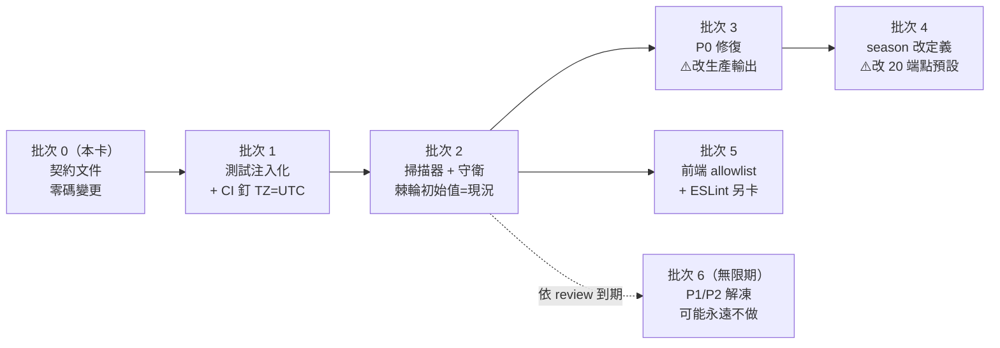

# 時間語意契約 [time semantics contract]

> **狀態**：設計定案，尚未實作。本文件由 TIME-SEMANTICS-CONTRACT1（Issue #123，T3 設計卡）交付。
> 逐題裁決見 [`docs/research/TIME-SEMANTICS-CONTRACT1/GRILLING_DECISIONS.md`](research/TIME-SEMANTICS-CONTRACT1/GRILLING_DECISIONS.md)；
> 現況盤點見 [`inventory.json`](research/TIME-SEMANTICS-CONTRACT1/inventory.json)（由指令產生，勿手改）。
>
> **本卡未修改任何 production 程式、DB、排程或既有業務行為。** 下列規則在對應遷移批次落地前不具強制力。
>
> ⚠️ **2026-08-21 起有一則現況說明，請先讀 [附錄 B](#附錄-b現況說明data-tz-boundary-succession12026-08-21)**：
> `DATA-TZ-BOUNDARY-SUCCESSION1` 以部署層收斂（連線層 ＋ 容器層一律台北）取代了批次 2／3
> 的實作路徑，§6 的一條理由因此失去前提。**批次 4／5 與 §2／§7 完全未受影響、仍然有效。**
> 既有批次表與分級表**未被改寫**。

任何會影響使用者、production 判定或測試的日期語意，都必須能引用本文件的**單一定義**，
並且例外必須是**可稽核的具名項目**——不再由呼叫點各自決定時區。

---

## 1. 為什麼需要這份契約

DB 與所有容器跑 UTC，而球季作息、`game_date`、球迷心中的「今天」全是台北曆日。
台北 00:00–07:59 這 8 小時，兩者相差一天。這個落差已經以**不同症狀**重複開卡：

- **#92 DATA-TZ-BOUNDARY1**——SQL 日期界線盤點，修掉精確等值用點。
- **#110 DATA-TZ-COMPLETION-SKEW1**——兩支完成場 helper 預設日界不同，生產讀路徑每天 8 小時給不同答案。
- **#81 UX-HOME-LIVE-STRIP1（追加裁定 A）**——首頁把**昨天**標成「今日賽事」。
- **PR #122**——與時區無關的文件卡，CI 每天固定紅 8 小時，被連坐。

前三張各自修好了自己那一塊，但**沒有一份可引用的定義**，所以第四次仍然發生。
#92 的掃描器只掃 SQL，Python 側因此從未被盤點——本卡的盤點在 Python 側找到 3 個
下界與 1 個精確等值用點，全部是 #92 當時看不見的。

---

## 2. 三個語意型別

時間只有三種語意。**過去把「DB as_of」當成第四種型別是分類錯誤**——它不是語意，
是「business date 被放在錯誤的時鐘上求值」，詳見 §3。

### 2.1 `instant`——絕對時點

某件事**發生的那一刻**。`fetched_at`、`observed_at`、`trained_at`、事件時戳、逾時計算。

- **時區**：一律 tz-aware。禁止 naive `datetime`。
- **儲存**：一律 `timestamptz`。`timestamptz` 存的是絕對時點，時區不參與比較，
  因此 **DB 端 `now()` 寫稽核欄完全合法**，不在遷移範圍內（全庫 102 個此類用點）。
- **渲染**：可以用任何時區顯示給人看，但**全域只准一種**。混用 `Z` 與 `+08:00`
  會讓字串排序與時序排序分岔。

### 2.2 `business_date`——台北曆日

人所說的「哪一天」。`game_date`、「今日賽事」、到期判定、`as_of` 界線。

- **時區**：`Asia/Taipei`，恆定 UTC+8，無日光節約。
- **型別**：`date`，不是 `datetime`。`cpbl.games.game_date` 是 `DATE`。
- **關鍵性質**：**曆日不是被壓縮的時點，它沒有時區可以加註。**
  問「2026-08-08 這一天換算成 UTC 是多少」沒有答案——它對應一個 24 小時區間，
  而區間邊界取決於用誰的曆法。因此「全部改存 UTC 再加註時區」對此型別不適用；
  那是 `instant` 的解法，不是 `business_date` 的。
- 由 `instant` 導出：`business_date = instant.astimezone(Asia/Taipei).date()`。
  導出**必須明示來源 instant**，不得取環境時鐘。

### 2.3 `season`——球季年

- **定義**：**最近一個已開打的球季**——存在完成場的最大 `year`。
- **不是**曆年。休賽期（1–3 月）曆年會指向一個尚無資料的球季，站台整批空白。
- **不是** `max(year)`：翌年賽程通常在前一年底就入庫，`max(year)` 會提早跳季。
  「已開打」的判準直接沿用完成場判準，不另立一套。
- 快取 TTL **上限一天**，否則跨季當天會漂。

---

## 3. 時鐘位置規則

> **`business_date` 的時鐘一律住在 Python。DB 不得自取 business date。**

`as_of` 因此**不是型別，是參數名**：呼叫端算好一個 `business_date` 傳進查詢。

這條規則不是風格偏好，它同時買到四件事：

- **可重現**——同一個 `as_of` 永遠得到同一個答案。`winprob_strength` 的 iteration 3
  查核 F1 正是踩到反例：查詢內嵌 `CURRENT_DATE`，欄位值隨當下全表漂移。
- **可注入**——測試不必操弄環境，直接傳日期（見 §6）。
- **可回測**——歷史重算只要換參數。
- **可稽核**——時鐘出現在呼叫點，code review 看得見。

**例外（不受此規則約束）**：`instant` 寫 `timestamptz` 欄，含欄位 `DEFAULT now()`。

**shell 契約的處理**：`scripts/refresh-cpbl-prod.sh` 以 `$(uv run python -m cpbl.completion)`
把 SQL 內插進 `psql -c`。目標形態是讓該指令輸出**已解析的日期字面值**
（`... AND game_date <= DATE '2026-08-10'`），stdout 仍是一行 SQL、shell 契約形狀不變，
但時鐘搬回 Python。

---

## 4. 允許的 API

### 4.1 Python

```python
from cpbl.timeref import now, today, season_of   # 批次 3 建立；模組名待定（§11）

now()                 # instant：tz-aware UTC
today(now())          # business_date：台北曆日，必須明示來源 instant
season_of(cur)        # season：最近一個已開打的球季（快取 TTL ≤ 1 天）
```

**禁止**（新碼一律不得出現）：

- `date.today()`、`datetime.today()`、`datetime.now()`（無 tz）、`datetime.utcnow()`
- `date.today().year` 當球季
- module-level 求值的「今天」或「本季」——它會凍結整個行程生命週期。
  `DEFAULT_SEASON = date.today().year` 被 18 個 router 當 `Query()` 預設值使用，
  FastAPI 在 import 時把它烘進路由簽名，**站台行為因此取決於容器上次重啟的時間**。

**允許**：`datetime.now(UTC)`（等價於 `now()`）、`time.time()` 用於量測經過時間或
產生版本序號（不得用於任何曆日判定）。

### 4.2 SQL

```sql
-- ✅ 正確：時鐘在 Python，日期是參數
WHERE g.game_date <= %s

-- ❌ 禁止：DB 自取 business date
WHERE g.game_date <= CURRENT_DATE
WHERE g.game_date <= (now() AT TIME ZONE 'Asia/Taipei')::date

-- ✅ 合法：instant 寫稽核欄
SET updated_at = now()
created_at timestamptz NOT NULL DEFAULT now()
```

`(now() AT TIME ZONE 'Asia/Taipei')::date`（現行 `TAIPEI_TODAY_SQL`）**日界是對的、
位置是錯的**：它不產生錯答案，但時鐘仍在 DB，因此不可注入、不可回測。列為 P2 遷移
目標而非 P0。

### 4.3 TypeScript（契約內、守衛外——見 §5）

- **「今天」一律由 API 決定**，前端不得自行 `new Date()` 推導 business date。
  API 回應已攜帶台北日（如 `/api/v1/daily` 的 `today.game_date`）。
- `new Date()` 僅允許用於 `instant`（相對時間顯示、經過時間）。
- **邊界歸屬是 server-authoritative**：這是本契約對 API↔web 邊界的明確裁決。

---

## 5. 適用範圍

| 範圍 | 契約 | 機器守衛 | 說明 |
|---|---|---|---|
| `src/cpbl/`（production、API） | 適用 | 適用 | |
| DB SQL（`migrations/`、內嵌 SQL） | 適用 | 適用 | 欄位 `DEFAULT now()` 屬 `instant`，合法 |
| 排程（`scripts/*.sh`、plist） | 適用 | 適用 | |
| `tests/` | 適用 | 適用 | 見 §6 |
| `web/`（TypeScript） | **適用** | **不適用（本批）** | 詞彙與邊界歸屬綁定；ESLint 規則另卡 |
| `scripts/*.py` | 不適用 | 不適用 | 一次性研究／稽核工具，逐筆留在 artifact 供複核 |

`web/` 是刻意的「契約內、守衛外」。**這個折衷在本專案有前科**：`completed_games_sql`
的 UTC 預設值就是以「明確擱置、排 Phase 2」的方式懸置至今。因此前端的 8 個既有用點
**逐一列進 allowlist 帶 blocker 與檢視日期**，而不是丟給一張沒有排程的後續卡。

---

## 6. 測試的時鐘政策

> **測試不得依賴環境時鐘。任何依賴「今天」的測試必須注入。**

- **CI 釘 `TZ=UTC`**（`ci.yml`）。理由不是讓測試變綠——恰恰相反，它會把
  「一天紅 8 小時」變成「永遠紅」，逼缺陷在批次 1 被修掉。**釘 UTC 的正當理由只有
  一個：CI 必須與生產同一個時區前提。**
- **禁止把 CI 設成 `Asia/Taipei`**。那會讓 CI 永遠無法重現任何 UTC 容器缺陷——
  #81 的首頁缺陷正是有人手動構造 UTC 情境才抓到的。
- **不引入 freezegun／time-machine**。專案現行慣例是手寫注入點
  （`daily._now`、`daily._today_local`、各處 `as_of` 參數），足夠且無新依賴。
- **禁止 module-level 的 `date.today()`**。`tests/test_daily_summary.py:23`
  的 `_TODAY = date.today()` 拿容器日組假資料、受測碼拿台北日，兩者在 UTC runner
  上一天重合 16 小時、分岔 8 小時——這就是 PR #122 的 15 個失敗。

---

## 7. 分級與 allowlist

嚴重度按**方向**分級，不按「在哪一層」。實測顯示層別幾乎不預測嚴重度。

- **P0｜產生錯答案，發現即修，不得進 allowlist**
  - `>= today`（下界）：UTC 落後把**昨天**算成未來。
  - `= today`（精確等值）：直接指向錯的一天。
  - 純標籤（「今日賽事」）：把昨天標成今天，無所謂保守。
  - `today().year` 當球季：跨年 8 小時給錯球季。
- **P1｜方向保守，只是遲答案。凍結不動，但禁止新增，全部進 allowlist**
  - `<= today`（上界）：UTC 落後只會晚 8 小時納入。
- **P2｜不產生錯答案，屬時鐘位置規則的遷移目標**
  - `(now() AT TIME ZONE 'Asia/Taipei')::date`：日界對、位置錯。
  - `>= today - N`：「近 N 天」窗口起點，UTC 落後只是多做工。
- **合法｜`instant` 寫 `timestamptz`**，不列入任何清單。

### 7.1 P1 凍結是一項正式容差，不是遺漏

**#110 全庫實測：改變上界日界只影響 1 場**（2026/D/119，保留賽，原訂 06-16、
續賽日 08-08，帶中止比分 5:4）。這是結構性的而非巧合——台北日 T 的
00:00–08:00，排在 T 的一般場次尚未開打（0:0 無證據，兩種日界都不納入），
唯一會被日界翻轉的就是**改期後帶著中止比分的保留賽**。

遷移 16 個上界用點要逐點驗證生產數字，其中 7 個在 ingest 鏈上會改變爬取母體。
收益是 1 場保留賽。**投報率不成立，故正式降格為有紀錄的容差。**
需求方 2026-08-10 裁決。

### 7.2 allowlist 格式

**inline 標記是唯一事實來源**，不使用集中式清單檔——集中式要記 `path:line`，
行號每次編輯都腐爛，會製造大量假失敗，而且例外在閱讀程式時看不見。

```python
# time-semantics: allow(P1-upper-bound) blocker=#53 review=2026-11-01
```

```sql
-- time-semantics: allow(P1-upper-bound) reason=refresh-chain review=2026-11-01
```

- `allow(<級別>-<類型>)`——必填。
- `blocker=`／`reason=`——擇一必填。
- `review=`——必填，ISO 曆日（`business_date`）。

### 7.3 棘輪 [ratchet]

守衛同時斷言**例外總數 ≤ 當前值**。沒有這條，allowlist 只是一張可以無限長大的
許可證。要調高數字必須明著改守衛，改動會出現在 review 裡。

`review=` 到期由掃描器**印警告但不失敗**——失敗會綁架無關的 PR。到期清單另外
輸出到會被真的看到的地方（`/api/info` 或每日排程輸出），避免重蹈
`completed_games_sql` 擱置三個月無人聞問的覆轍。

### 7.4 守衛跑在哪

**pytest 測試，不是獨立 CI 步驟。** CLAUDE.md 規定的 push 前迴圈是
`uv run ruff check` ＋ `uv run pytest`，掛在 pytest 上等於本機與 CI 同時生效、
零新增 CI 設定。（ruff 沒有自訂規則的 plugin API，該路徑排除。）

---

## 8. 現況盤點

由 `docs/research/TIME-SEMANTICS-CONTRACT1/scan_time_semantics.py` 產生，
非人工列舉。重跑：

```bash
uv run python docs/research/TIME-SEMANTICS-CONTRACT1/scan_time_semantics.py --verify
```

命中 285 筆，其中 `in_scope` 196、`tooling` 84（`scripts/*.py`）、`self_reference` 5
（`tests/test_tz_boundary.py` 3、掃描器自身 2）。`in_scope` 分佈：

- **P0 = 53**：`season_derive` 27、`business_label` 22、`business_lower` 3、`business_exact` 1
- **P1 = 16**（凍結）：`business_upper`
- **P2 = 5**：`business_db_taipei` 4、`business_lower_window` 1
- **待人工裁定 = 20**：`ts_ambient_clock` 8（`web/`）、`instant_naive` 7、`business_binding` 5
- **合法 = 102**：`instant_aware`

P0 分區：`src/cpbl/ingest` 27、`src/cpbl/models` 13、`src/cpbl/api` 5、`tests` 5、
`scripts`（`.sh`）2、`src/cpbl` 1。

`src/cpbl/ingest` 的 27 個 P0 有 22 個是 CLI 的 `year = date.today().year` 預設值
（`season_derive`），屬批次 4；不是 27 個獨立缺陷。

**artifact 必須在掃描器入樹後才產生**：`git ls-files` 只列已追蹤檔，掃描器未
`git add` 前掃不到自己，產出的 artifact 會在該檔入樹後立刻失效。本卡 R1 查核實測
命中此坑（283/3 → 285/5）。掃描器已改為機械擋——自指檔存在於工作樹卻未被追蹤時
直接中止，不再只靠 docstring 的文字警告。

**分類精確度的界線**：Python 時鐘呼叫與 SQL 字串常數都走 `ast`（註解不進 AST、
docstring 明確排除），但**方向**是啟發式，取 token 前綴找比較運算子。artifact 逐筆
記錄 `line_text`，`needs_review=true` 者必須人工裁定，不得直接採信。

---

## 9. 分批遷移



**順序是硬相依，不是偏好**：批次 1 必須在批次 2 之前，否則守衛要把測試檔的違規
一併標成例外，棘輪初始值被灌水；批次 2 必須在批次 3 之前，先凍結現況才能證明修復
真的收斂。批次 3、4、5 之間無相依。

| 批次 | 內容 | 生產影響 | 回滾單位 |
|---|---|---|---|
| 1 | 測試注入化；`ci.yml` 釘 `TZ=UTC` | 無 | revert PR |
| 2 | 掃描器＋pytest 棘輪；既有 P1/P2 標註 inline | 無 | revert PR |
| 3 | P0 修復（`business_lower`／`business_exact`／`business_label`） | **有** | **逐點一個 commit** |
| 4 | `season` 改定義；`DEFAULT_SEASON` 去 module-level | **有**（約 20 端點預設值） | **整批** |
| 5 | `web/` 8 個用點入 allowlist | 無 | revert PR |
| 6 | P1／P2 解凍 | 有 | 逐點 |

批次 3 與批次 4 **不得併同一次部署**：批次 4 的回滾單位是整批
（`helpers.py` 一個常數換成一個函式，拆不開），混在一起會讓批次 3 的逐點回滾能力失效。

**本設計沒有被 #53 卡住。** ingest 鏈上的 9 個日界用點全部是上界或「近 N 天」窗口
起點，依 §7 分級屬 P1／P2、全部凍結。P0 清單中**沒有任何一點需要動 ingest 鏈**，
`#53 G4 Phase B` 不是本設計的前置。（若改用「按層分級」，整個 ingest 就會被 #53 綁架。）

### 9.1 批次 1 已獲授權先行

需求方 2026-08-10 裁決：批次 1 拆成獨立止血卡，**不等本卡查核通過**。理由是
PR #122 的 CI 正在被連坐，且批次 1 是整份契約裡唯一有現成失敗案例可做紅→綠
證明的批次，與契約分開送查核，兩邊都更好審。

### 9.2 驗證與回滾

- **每批的驗證**：`uv run ruff check` ＋ `uv run pytest` ＋（觸及前端時）`cd web && npm test`、`npx tsc --noEmit`。
- **批次 1 的紅→綠證明**：以注入時鐘構造台北 02:00／UTC 前一日 18:00 的情境，
  修復前後各跑一次。不得以「重跑變綠」當證據——那是牆鐘碰運氣。
- **批次 3 的回歸**：每一點修復都要有一個在**任意時刻**都可重複的測試；
  禁止以「本機跑過」代替。
- **批次 4 的回滾判準**：部署後任一預設球季端點回傳空集合即回滾整批。
- **共同紅線**：任何批次都不得靠「改 CI 或容器時區」讓測試變綠（§6）。

---

## 10. 與 ai-workflow 的介面

> **邊界**：本節只描述**時間語意側**的規範——某個概念屬哪一型、由哪個時鐘決定。
> **不設計也不修改** wfcli 的狀態機、事件格式、outbox 或 templates；那是
> [ai-workflow#15](https://github.com/ruan6047/ai-workflow/issues/15)（review event marker 權威契約）
> 與 [ai-workflow#16](https://github.com/ruan6047/ai-workflow/issues/16)（可恢復任務編排）的範圍。
> 本卡對 ai-workflow repo **沒有任何寫入宣告**。

可供 #16 直接引用的規範與待決問題另立一檔：
[`docs/research/TIME-SEMANTICS-CONTRACT1/WF16_INTERFACE.md`](research/TIME-SEMANTICS-CONTRACT1/WF16_INTERFACE.md)。
摘要：

- **狀態機事件時戳** → `instant`。渲染格式須全域固定一種；混用會讓字串排序與
  時序排序分岔，而 reconcile 靠時序對帳。
- **逾時／退避** → `instant` 差值。GitHub `X-RateLimit-Reset` 是 Unix epoch，
  須轉 tz-aware UTC，禁 naive。
- **到期判定**（review by、檢視日期）→ `business_date`，台北日界。
- **idempotency key 若含日期** → 必須是 `business_date` 且明示時鐘來源，
  **不得取環境時鐘**——否則同一次重送在跨日窗內會產生兩個 key，outbox 去重失效。
- **狀態機測試** → 適用 §6 全部規則。

---

## 11. 尚未決策

以下**刻意留白**，不在本卡裁定：

1. **Python helper 模組名與函式簽章**（§4.1 的 `cpbl.timeref` 是佔位）。屬批次 3 實作卡。
2. **`season` 快取的 TTL 實際值**。契約只釘上限一天。
3. **`review=` 到期清單的輸出位置**——`/api/info` 或每日排程輸出，兩者皆可，未擇一。
4. **`web/` 的 ESLint 規則設計**。批次 5 之後的獨立卡。
5. **20 筆 `needs_review` 的逐筆裁定**（`ts_ambient_clock` 8、`instant_naive` 7、
   `business_binding` 5）。啟發式沒把握，須人工逐筆判；屬批次 2 開工時的第一件事。
6. **P1 解凍的觸發條件**。目前只有 `review=` 日期，沒有客觀的解凍門檻。

---

## 附錄：與既有文件的關係

- 本文件是**日期語意**的事實單一來源。與 `docs/AI_RUNBOOK.md`、
  `docs/reference/GLOSSARY.md` 衝突時以本文件為準並回頭修正該處。
- `src/cpbl/completion.py` 的模組註解記載了完成場判準與日界落差的完整推導，
  **仍然有效**；本文件不複述，只在 §7.1 引用其實測結論。
- #92／#110／#81 的裁決**未被推翻**：#92 的「上界保守無害」經本卡逐點複核成立，
  在 §7 升格為正式的 P1 分級判準。

---

## 附錄 B：現況說明（DATA-TZ-BOUNDARY-SUCCESSION1，2026-08-21）

> **本節只記錄，不改寫。** 上面每一張批次表、分級表與 allowlist 格式都**原封未動**，
> 因為「這份契約是否部分作廢」是需求方的另一個決定，不是本卡的。本節的用途只有一個：
> 讓下一個讀者知道**哪幾條的前提已經不在了**，不必自己再推一次。

### 發生了什麼

需求方 2026-08-21 以一個前提推翻了本契約的**實作路徑**（不是它的分類學）：
**中職不可能在其他時區比賽**——全史 1990–2026 共 28 個球場全部在台灣。既然如此，
「業務日期一律台北、瞬間值一律存 UTC `timestamptz`、只在邊界轉一次」這句話就是完整的
時區政策，不需要一套治理機制去逐點裁決。於是本契約原本要靠**批次 2／3**（掃描器 ＋
守衛 ＋ 棘輪 ＋ 逐點 P0 修復）達成的效果，改由**兩個部署層設定**一次收斂：

| 層 | 改動 | 位置 |
|---|---|---|
| 連線 | pool 每條連線 `SET TIME ZONE 'Asia/Taipei'` | `src/cpbl/db.py` 的 `SESSION_TIMEZONE`／`_configure` |
| 容器 | `ENV TZ=Asia/Taipei` | `Dockerfile`（本機 `docker-compose.yml` 同步） |

⚠️ 這是 **per-connection ＋ per-container**，**不是** server-wide `timezone`。
`prod_pg` 是主站 PersonalWebsite 與 cpbl 共用的單一 `alpha_db`，全域改動會波及主站——
`DATA-RULES-AUDIT1_REPORT.md:557`（D7）否決全域改動的那一半**仍然成立**，本卡沒有推翻它。

### 因此失去前提的條款

- **§6 的「釘 UTC 的正當理由只有一個：CI 必須與生產同一個時區前提」——前提已不成立。**
  生產現為台北、CI 仍為 UTC，兩者**刻意不同**。⚠️ **但結論保留、CI 不改**：理由換成
  「CI 永遠測比較難的那一邊」——UTC runner 上任何殘存的日界缺陷會**永遠紅**而不是
  一天紅 8 小時（`#124` 的原始論證在新架構下更有力）。§6「禁止把 CI 設成 `Asia/Taipei`」
  因此**仍然有效**，只是理由變了。**這不是漏設，是設計。**
- **批次 2（掃描器＋守衛＋棘輪）**：其價值主張是「讓每個呼叫點的日界選擇可稽核」。
  日界收斂到單一來源後，主要缺陷類別消失。禁令守衛經實測後**移出 SUCCESSION1 射程**
  （`src/` 內裸 `CURRENT_DATE` 尚有 28 處、性質不同不能共用一份 allowlist；
  `AT TIME ZONE 'UTC'` 在 `src/` 命中 0 處，禁令的那一半是空轉）。
  ⚠️ **SUCCESSION1 因此不含「防止再犯」的那一半**——它收斂了現況，沒有阻止新的日界漂移。
- **批次 3（P0 修復）**：清單中最有代表性的活體實例（`api/routers/daily.py:507` 的
  `game_date >= as_of` 下界）在容器 `TZ` 設定後自動正確，`daily.py` 一行未改。
  其餘 P0 是否仍需逐點修復，須在新前提下重新盤點。
- **§8 現況盤點的數字**：`inventory.json` 由指令產生且早於本次改動，其分佈（P0 53／P1 16）
  反映的是舊前提。⚠️ 掃描器量的是「提到日期的地方」不是「錯的地方」。

### ⚠️ 仍然有效、**不要一起丟掉**的

- **批次 4（`season` 改定義，約 20 端點）**與**批次 5（`web/` 8 個用點）**
  處理的是**球季邊界**與**前端**，那不是時區問題——本卡一點都幫不上，兩批**完全未受影響**。
  讀到「SUCCESSION1 繞過契約」時請不要把整份契約當作廢，這兩批仍是待辦。
- **§2 的三個語意型別**（`instant`／`business_date`／`season`）與 **§7 的方向分級**
  （上界保守、下界不保守、精確等值無緩衝）是**分類學**，與哪個時區被選中無關，全部仍然成立。
- **§7.1 的 P1 凍結**未解凍。SUCCESSION1 不動那 11 筆。
- **`src/cpbl/completion.py` 的模組註解**仍是完成場判準的推導來源；其中「日界落差」
  一節已就地標註哪一段是歷史前提。

### 已知未修（本卡明說不收）

- **同步閘門與 `/api/info` 的判準錯配**：`scripts/refresh-cpbl-prod.sh:386` 取的是
  舊判準 ＋ `CURRENT_DATE`，且在 `docker exec psql`——**pool 之外**的 session，不受
  `_configure` 管轄，仍是 UTC；而 `/api/info` 用新判準 ＋ 台北。兩者被拿去做**精確相等**
  比對。2026-08-21 02:5x 實測兩側皆 454、尚未分歧。修法必須讓產生的 SQL **文字自帶時區**
  （不能靠 session）。詳見 `completion.py` 的 `__main__` 註解。
- **保留賽的交互作用**：保留賽有比分且排未來日期，`<= 今天` 是唯一擋住它們的東西。
  日界改台北後，它們從台北 08:00 才被納入變成 **02:00 就被納入**（早 8 小時）。
  這是既有缺陷的**時點位移**，不是新缺陷，屬 `#113`／`#134`，本卡不修。
- **舊 helper `completed_games_sql()` 的 UTC 預設字面**未改，授權在 `#53 G4 Phase B`。
  ⚠️ 但**行為已隨 session 改變**：經 `cpbl.db.conn()` 求值時該 `CURRENT_DATE` 已是台北日。
