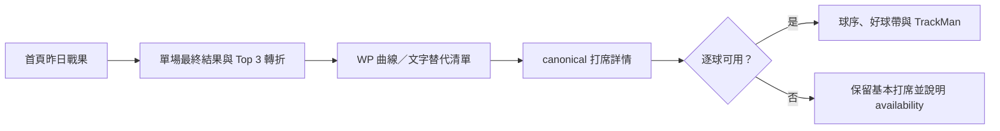

# Design Brief — INIT-GAME-RECAP

## 目標與決策

- 對應 Discovery：需求方於 2026-07-16 確認非即時、隔日刷新，但仍需 WP 曲線與逐打席脈絡；產品基線見 [`GAME_RECAP_PRODUCT_SPEC.md`](../GAME_RECAP_PRODUCT_SPEC.md) v1.2。
- 主要使用者與任務：每日追賽球迷隔日快速理解昨日結果與轉折；進階數據迷沿真實打席查看局勢、WP/WPA 與逐球資料。
- 設計者：GPT-5@Codex　需求方：ruan6047
- Design Gate：待核可；需完成 wireframe、正式交付 DOC-GAME-RECAP1 查核與需求方簽核。

## 使用流程與資訊架構

- 入口與資訊架構：`UX-GAME-HOME1` 負責昨日結果入口；`/games/[sno]` 先總覽後深入；`UX-OUTCOME-HOME` 只負責今日賽前預測模組。
- 正常流程：選昨日場次 → 確認最終結果 → 選轉折或曲線節點 → 查看當時狀態 → 按需展開逐球。
- 載入狀態：比分摘要與版面 skeleton 先顯示；逐球延遲載入，不阻塞復盤。
- 空狀態：休兵日顯示今日／下場賽程；歷史無 livelog 時保留最終比分並說明資料涵蓋期。
- 錯誤狀態：game API、WP、tracking 各自退化，不互相拖垮；提供重試或返回賽程。
- 未知狀態：顯示最近成功刷新與「狀態尚無法確認」，不推測進行中或資料不存在。
- 權限狀態：全站唯讀、無登入差異，N/A。

## 驗收與風險

- 可及性 [accessibility]：所有圖表有文字替代；節點可鍵盤選擇；選取狀態不只靠顏色；控制 44×44 px；375 px 無整頁水平捲動；尊重 `prefers-reduced-motion`。
- 可用性驗收：使用固定測試場次與腳本，受測者 5 秒內口述結果與最大轉折，2 次互動內開啟指定打席；每日球迷與進階使用者分別完成一次。
- Prototype／視覺稿：待建立，預定 `docs/design/assets/game-recap-desktop.*` 與 `game-recap-mobile.*`；在檔案存在並完成狀態矩陣前不得核可。
- 驗證方法：需求方主持計時 prototype 走查；最低邀請 1 位每日追賽球迷與 1 位進階數據使用者。若無法招募，記錄限制並由獨立 UX reviewer 執行情境走查，但不得稱為使用者研究。
- 技術限制：資料隔日人工刷新；TrackMan 非全球場；canonical PA、WP/WPA 與 STATUS API 未通過前，只可做 prototype，不得正式串接。

## Prototype 情境矩陣

| 情境 | 必須驗證的畫面與行為 |
|---|---|
| 完整完賽 | 最終比分、Top 3、WP、打席、逐球均可用 |
| 基本完成、進階待更新 | 基本打席可用；本案例另指定 `wp_availability=available` 才顯示 WP；逐球區說明 pending，不隱藏整頁 |
| 無 TrackMan 設備 | 明示 no equipment，不寫成來源錯誤 |
| WP 不支援賽制 | 保留復盤，曲線區解釋 unsupported kind |
| refresh 未跑／狀態未知 | 顯示最近 refresh 與 unknown，不顯示 LIVE |
| API 局部錯誤 | 失敗區塊可重試，其餘內容仍可讀 |
| 歷史無 livelog | 只顯示結果與 coverage 說明，不產生假打席 |

## 核可與變更

- 需求方核可：待 ruan6047 確認。
- 2026-07-16 v1.1：作者端 preflight 新增獨立 Design Brief；待 prototype 與正式查核。
- 2026-07-16 v1.2：明確要求 WP 依獨立 availability 顯示，不由基本資料狀態保證。
