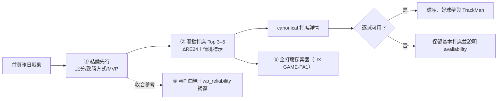

# Design Brief — INIT-GAME-RECAP

## 目標與決策

- 對應 Discovery：需求方於 2026-07-16 確認非即時、隔日刷新；產品基線見 [`GAME_RECAP_PRODUCT_SPEC.md`](../GAME_RECAP_PRODUCT_SPEC.md) v1.2。
- **v1.3 脊柱改寫（2026-07-27，需求方逐題裁定）**：WP 研究鏈三次 No-Go（VAL1 全 scope unsupported → CAL1 事後校準 No-Go → STRENGTH1 戰力先驗 No-Go，merge `198ad87`）後，WP 已定位**參考資訊**、不得作單打席歸因。復盤的敘事脊柱由「沿 WP 曲線」改為**事實優先**：canonical PA（已上線生產）＋ ΔRE24（經 REBAS 外部驗證）。WP 曲線降為收合參考區塊。
- 主要使用者與任務：每日追賽球迷隔日快速理解昨日結果與**哪幾個打席決定比賽**；進階數據迷由關鍵打席進入逐打席與逐球分析。
- 設計者：GPT-5@Codex（v1.2）／Claude Opus 5（v1.3 脊柱改寫）　需求方：ruan6047
- Design Gate：待核可；需完成 wireframe、正式交付查核與需求方簽核。

## 頁面骨架（v1.3 定案，五段式）

| 段 | 內容 | 資料來源（皆已入庫） |
|---|---|---|
| ① 結論先行 | 比分、勝敗救援投手、**致勝方式**（官方欄）、一句話摘要、**官方單場 MVP ⭐ 與 ② 的數據榜並列對照**；次要 meta 列：觀眾數／比賽時長／天氣 | games、game_detail、gamelog |
| ② 關鍵打席 Top 3–5 | **ΔRE24 排序＋情境標示**（局數／分差／壘況出局）；點擊展開逐球 | canonical PA、RE24、pitch_tracking |
| ③ 逐局攻分時間軸 | 逐局比分與得分事件 | scoreboard |
| ④ WP 曲線（收合） | 現有 `/recap-wp` 元件直接搬入，掛 `wp_reliability` 揭露；預設收合 | 既有參考級 WP |
| ⑤ 探索器入口 | 通往 `UX-GAME-PA1` 全打席探索器 | — |

### 關鍵打席的排序契約（Q1 裁定）

- **主排序＝\|ΔRE24\|**（打席前後 run expectancy 差量的絕對值），不加任何權重。
- 每筆**必附情境標示**：局數、當時分差、壘況、出局數——把「這個打席重不重要」的判讀交給讀者。
- **分差 ≥ 7 的打席降飽和呈現**（視覺降權），不剔除、不加權——垃圾時間問題用呈現層解決，不用數學加工解決。一旦加權重，數字就從「可驗證的事實」變成「我們的意見」。
- **禁止 WPA／WP 參與排序**（紅線）：WP 為參考級，三次 No-Go 守下的線就是不做單打席歸因。此契約由實作卡加測試釘住。

### 語氣（Q2 裁定）

- 敘事處（一句話摘要、關鍵打席描述）**沿用既有量化定義的球迷用語**（劇場／問天／煮粥…，觸發條件抽共用、不新增語彙）。
- 隊伍暱稱紅線維持：正式文案不用非官方暱稱。

## 使用流程與資訊架構

```mermaid
flowchart LR
  A["首頁昨日戰果"] --> B["① 結論先行<br>比分/致勝方式/MVP"]
  B --> C["② 關鍵打席 Top 3–5<br>ΔRE24＋情境標示"]
  C --> D["canonical 打席詳情"]
  D --> E{"逐球可用？"}
  E -->|是| F["球序、好球帶與 TrackMan"]
  E -->|否| G["保留基本打席並說明 availability"]
  B -.收合參考.-> H["④ WP 曲線＋wp_reliability 揭露"]
  C --> I["⑤ 全打席探索器（UX-GAME-PA1）"]
```

- 入口與資訊架構：`UX-GAME-HOME1` 負責昨日結果入口；`/games/[sno]` 先總覽後深入；`UX-OUTCOME-HOME` 只負責今日賽前預測模組。
- 正常流程：選昨日場次 → 讀結論 → 看關鍵打席 → 按需展開逐球或進探索器。
- 載入狀態：比分摘要與版面 skeleton 先顯示；逐球延遲載入，不阻塞復盤。
- 空狀態：休兵日顯示今日／下場賽程；歷史無 livelog 時保留最終比分並說明資料涵蓋期。
- 錯誤狀態：game API、RE24／PA、tracking、WP 各自退化，不互相拖垮；提供重試或返回賽程。
- 未知狀態：顯示最近成功刷新與「狀態尚無法確認」，不推測進行中或資料不存在。
- 權限狀態：全站唯讀、無登入差異，N/A。

## 資料前置（v1.3 新增）

- **`INGEST-PA-DAILY1` 是本產品的硬前置**：canonical PA build 目前不在每日 refresh 鏈（2026-07-27 實測：7/26 三場完成場 0 筆 published PA），昨天的比賽沒有 PA 就沒有 ②。排程於 TM Gate3 觀測窗（~8/7）收窗後，先於 `UX-GAME-RECAP1` 動工。
- ② 的降級語意：某場無 published PA build 時，該場 recap 顯示 ①③（不依賴 PA）＋「關鍵打席待資料就緒」，不得以 livelog 臨時湊一版 ΔRE24。

## 驗收與風險

- 可及性 [accessibility]：所有圖表有文字替代；節點可鍵盤選擇；選取狀態不只靠顏色；控制 44×44 px；375 px 無整頁水平捲動；尊重 `prefers-reduced-motion`；**降飽和的垃圾時間打席仍須通過對比度檢查**。
- 可用性驗收：使用固定測試場次與腳本，受測者 5 秒內口述結果與**最關鍵打席**，2 次互動內開啟指定打席；每日球迷與進階使用者分別完成一次。
- Prototype／視覺稿：待建立，預定 `docs/design/assets/game-recap-desktop.*` 與 `game-recap-mobile.*`；在檔案存在並完成狀態矩陣前不得核可。
- 驗證方法：需求方主持計時 prototype 走查；最低邀請 1 位每日追賽球迷與 1 位進階數據使用者。若無法招募，記錄限制並由獨立 UX reviewer 執行情境走查，但不得稱為使用者研究。
- 技術限制：TrackMan 非全球場；PA build 每日自動化（INGEST-PA-DAILY1）未落地前，只可做 prototype，不得正式串接。

## Prototype 情境矩陣

| 情境 | 必須驗證的畫面與行為 |
|---|---|
| 完整完賽 | 結論、關鍵打席、時間軸、WP（收合）、逐球均可用 |
| **無 published PA build** | ①③ 照顯；② 顯示「待資料就緒」；不以 livelog 臨時計算 |
| 一面倒比賽 | 分差 ≥7 打席降飽和但仍列出；對比度通過 |
| 無 TrackMan 設備 | 明示 no equipment，不寫成來源錯誤 |
| WP 不支援賽制 | 復盤完整；④ 區塊解釋 unsupported kind |
| refresh 未跑／狀態未知 | 顯示最近 refresh 與 unknown，不顯示 LIVE |
| API 局部錯誤 | 失敗區塊可重試，其餘內容仍可讀 |
| 歷史無 livelog | 只顯示結果與 coverage 說明，不產生假打席 |

## 核可與變更

- 需求方核可：待 ruan6047 確認（v1.3）。
- 2026-07-16 v1.1：作者端 preflight 新增獨立 Design Brief；待 prototype 與正式查核。
- 2026-07-16 v1.2：明確要求 WP 依獨立 availability 顯示，不由基本資料狀態保證。
- 2026-07-27 v1.3：**脊柱由 WP 曲線改為 ΔRE24 事實優先**（WP 鏈三次 No-Go 的證據後果）；定案五段骨架、排序契約（ΔRE24＋情境標示＋降飽和、禁 WPA 排序）、語氣（量化球迷用語）、資料前置（INGEST-PA-DAILY1）。需求方 2026-07-27 逐題裁定（Q1–Q4）。
