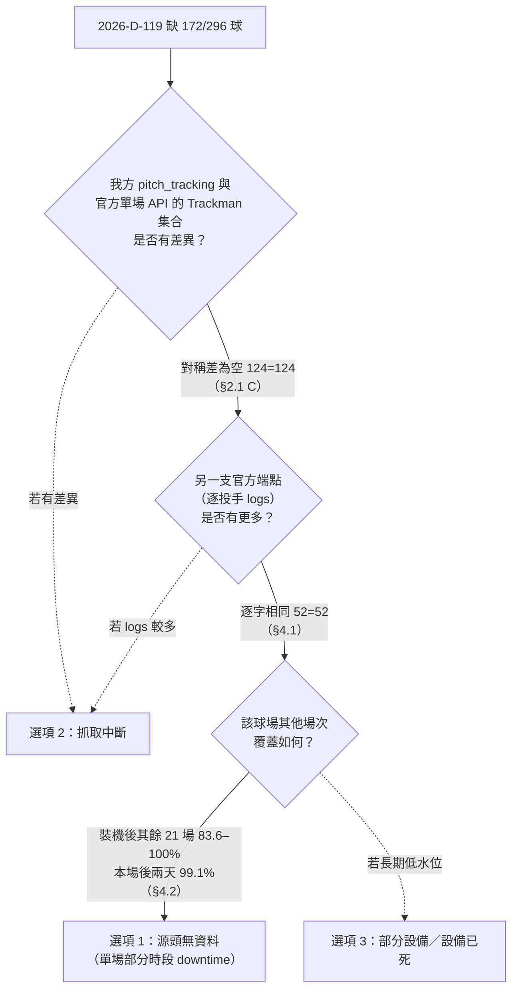

# DATA-TM-D119-EVIDENCE1 取證結果 — `2026-D-119` 逐球覆蓋缺口

> 卡片：`ruan6047/cpbl-analytics#150`（唯讀取證）　基線：`94a32774ad9a90e2c361b72c3bbf742868f50d49`
> 執行：2026-08-19（Asia/Taipei）　**本卡未寫入任何 DB、未觸發補抓**（全程只下 `SELECT`）。
> 標的：`2026-D-119`（皇鷹學院，保留賽補賽，原訂 2026-06-16 → 實打 2026-08-08），
> 逐球覆蓋 124/296 ＝ 41.9%，切換後未自癒。

---

## 0. 結論（三選一）

**選項 1：源頭無資料 → 不重爬、不補抓。**

判準：**兩支官方端點於 2026-08-19 同時回報前 4 局逐球 `Trackman` 全為 `null`**，且我方
`pitch_tracking` 與官方單場 API 的 `Trackman` 非 null 集合**對稱差為空**（124 = 124，逐列等價）。
抓取端沒有掉任何一列，補抓在源頭端沒有東西可補。

⚠️ **但它不是「大巨蛋 06-02 型」的設備已死**，卡面選項 1 的括號說明只涵蓋該子型。
本場是**單場、部分時段的 downtime**：皇鷹學院自 2026-05-09 起裝機，之後**除本場外的 21 場
覆蓋率介於 83.6%–100%**（18 場 ≥95%、21 場全部 ≥80%），本場之後兩天（`D-197`，08-11）
立刻回到 321/324 ＝ 99.1%。**球場設備活著，判定為 equipped
必須維持**；缺的是這一場前 4 局那段時間的產出。故處置是「這一場個案標記為源頭缺漏」，
**不是**把皇鷹學院移出 equipped 集合。

選項 2（源頭有而抓取中斷）與選項 3（部分設備／斗六二軍型）皆被證據排除，理由見 §4。

---

## 1. 官網呼叫紀錄（配額 ≤2，實際用 2）

| # | 時刻（request → response） | URL | status | bytes |
|---|---|---|---|---|
| 1 | `2026-08-19T11:09:29.574635+08:00` → `…11:09:29.859630+08:00` | `https://stats.cpbl.com.tw/api/proxy/v1/games/2026-D-119` | 200 | 393,305 |
| 2 | `2026-08-19T11:11:37.861227+08:00` → `…11:11:38.093937+08:00` | `https://stats.cpbl.com.tw/api/proxy/v1/players/logs?playerType=pitcher&acnt=0000002281&year=2026&kindCode=D` | 200 | 508,197 |

- 兩次皆**首次即 200**，無重試、無失敗、未進入冷卻程序。
- 兩次皆打 `stats.cpbl.com.tw`——依 `docs/CPBL_SITE_MAP.md` §1 該站**無 HiNet 挑戰**、httpx 直連。
  **`www.cpbl.com.tw` 全程未觸碰**（該站才是有反爬與節流風險的一側）。
- 兩次回應皆原樣落 scratchpad 後**離線分析**；本檔所有官方端點數字都算自這兩份 dump，
  不因反覆分析而增加呼叫。
- 未觀測到 5xx／配額限制，故本檔無 `UNKNOWN` 項目。

重現指令（⚠️ 執行下列 python 會**各再產生 1 次官網呼叫**，重現前請自行計入配額）：

```bash
cd <worktree>
uv run python - <<'PY'
import httpx, json
UA = "Mozilla/5.0 (Macintosh; Intel Mac OS X 10_15_7) AppleWebKit/537.36"
with httpx.Client(timeout=60.0, headers={"User-Agent": UA}, follow_redirects=True) as c:
    g = c.get("https://stats.cpbl.com.tw/api/proxy/v1/games/2026-D-119").json()
ll = g["Data"]["Game"]["LiveLog"]
is_pitch = lambda p: str(p.get("IsBall")) == "1" or str(p.get("IsStrike")) == "1"
print("events", len(ll), "| distinct MainEventNo", len({p["MainEventNo"] for p in ll}))
print("pitch events", len({p["MainEventNo"] for p in ll if is_pitch(p)}))
print("Trackman non-null", sum(1 for p in ll if p.get("Trackman")))
print("SkipTrackman", g["Data"]["Game"]["SkipTrackman"], "| GameStatus", g["Data"]["Game"]["GameStatus"])
PY
```

實際輸出（CALL#1 dump）：

```
events 316 | distinct MainEventNo 315
pitch events 296
Trackman non-null 124
SkipTrackman False | GameStatus FINISHED
```

> ⚠️ `IsBall` / `IsStrike` 是**字串** `"0"`／`"1"`，`bool("0")` 為 `True`——直接 `bool()` 會把
> 316 筆全判成逐球（第一版分析即踩此坑，已修正）。必須 `str(...) == "1"`。
> 另 `LiveLog` 有 316 筆但只有 315 個相異 `MainEventNo`：`0910011000` 出現兩次
> （末打席滾地出局本身 + 「比賽結束」註記，後者 `Trackman=null`），故 296 是**相異事件**數。

---

## 2. 三來源對帳（總量）

| 來源 | 取得方式 | 該場數量 |
|---|---|---|
| `cpbl.game_livelog`（我方，源自 www `/box/getlive`） | 本機 DB `SELECT` | 315 列，其中逐球（`is_ball OR is_strike`）**296** |
| 官方單場 API（stats `/v1/games/2026-D-119`） | CALL#1 | 315 個相異 `MainEventNo`，逐球 **296**，`Trackman` 非 null **124** |
| `cpbl.pitch_tracking`（我方） | 本機 DB `SELECT` | **124** 列 |

DB 側取得指令與逐字輸出：

```bash
docker exec cpbl-analytics-db-1 psql -U cpbl -d cpbl -c "
SELECT
 (SELECT count(*) FROM cpbl.game_livelog ll WHERE ll.year=2026 AND ll.kind_code='D' AND ll.game_sno=119 AND (ll.is_ball OR ll.is_strike)) AS pitches_livelog,
 (SELECT count(*) FROM cpbl.game_livelog ll WHERE ll.year=2026 AND ll.kind_code='D' AND ll.game_sno=119) AS livelog_rows_all,
 (SELECT count(*) FROM cpbl.pitch_tracking pt WHERE pt.year=2026 AND pt.kind_code='D' AND pt.game_sno=119) AS tracked;"
```

```
 pitches_livelog | livelog_rows_all | tracked
-----------------+------------------+---------
             296 |              315 |     124
```

124 / 296 ＝ **41.89%**，與卡面 41.9% 相符。

### 2.1 逐列窮舉對帳（不是只比總數）

把 CALL#1 的事件清單與 DB 兩表匯出後做集合對稱差（全程離線）：

```bash
# DB 側匯出
docker exec cpbl-analytics-db-1 psql -U cpbl -d cpbl -At -F$'\t' -c "
SELECT main_event_no, inning_seq, pitcher_acnt, pitch_cnt,
       CASE WHEN is_ball OR is_strike THEN 1 ELSE 0 END
FROM cpbl.game_livelog WHERE year=2026 AND kind_code='D' AND game_sno=119 ORDER BY main_event_no;" > db_livelog.tsv
docker exec cpbl-analytics-db-1 psql -U cpbl -d cpbl -At -F$'\t' -c "
SELECT pitcher_acnt, pitch_cnt FROM cpbl.pitch_tracking
WHERE year=2026 AND kind_code='D' AND game_sno=119 ORDER BY pitcher_acnt, pitch_cnt;" > db_pt.tsv
# 官方側由 CALL#1 dump 產生 (MainEventNo, InningSeq, PitcherAcnt, PitchCnt, is_pitch, has_trackman)
# 再逐集合比對三組對稱差
```

逐字輸出：

```
A. 事件集合：官方單場 API MainEventNo=315  DB game_livelog main_event_no=315
   API 有 DB 無 = []
   DB 有 API 無 = []

B. 逐球事件（is_ball|is_strike）：API=296  DB=296
   API 判逐球、DB 未判 = []
   DB 判逐球、API 未判 = []

C. Trackman 非 null 的 (pitcher_acnt,pitch_cnt)：API=124  DB pitch_tracking=124
   API 有 DB 無 = []
   DB 有 API 無 = []
   ⇒ 對稱差為空？ True
```

**三組對稱差全空**：連事件層級（www 來源的 livelog vs stats 來源的單場 API）都逐列一致，
逐球判定一致，`Trackman` 非 null 集合一致。**抓取端零漏損**。

---

## 3. 缺口的形狀：逐局與逐投手

### 3.1 逐局

```bash
docker exec cpbl-analytics-db-1 psql -U cpbl -d cpbl -c "
WITH ll AS (SELECT inning_seq, count(*) FILTER (WHERE is_ball OR is_strike) AS pitches
            FROM cpbl.game_livelog WHERE year=2026 AND kind_code='D' AND game_sno=119 GROUP BY 1),
     pt AS (SELECT inning_seq, count(*) AS tracked
            FROM cpbl.pitch_tracking WHERE year=2026 AND kind_code='D' AND game_sno=119 GROUP BY 1)
SELECT COALESCE(ll.inning_seq,pt.inning_seq) AS inning, COALESCE(ll.pitches,0) AS livelog_pitches,
       COALESCE(pt.tracked,0) AS tracked,
       round(100.0*COALESCE(pt.tracked,0)/NULLIF(ll.pitches,0),1) AS pct
FROM ll FULL OUTER JOIN pt USING (inning_seq) ORDER BY 1;"
```

```
 inning | livelog_pitches | tracked |  pct
--------+-----------------+---------+-------
      1 |              60 |       0 |   0.0
      2 |              54 |       0 |   0.0
      3 |              30 |       0 |   0.0
      4 |              22 |       0 |   0.0
      5 |              36 |      31 |  86.1
      6 |              22 |      22 | 100.0
      7 |              29 |      28 |  96.6
      8 |              34 |      34 | 100.0
      9 |               9 |       9 | 100.0
```

官方單場 API 側（CALL#1 dump，離線算）逐局完全同形：`1..4` 局 `Trackman` 非 null 皆 **0**，
`5..9` 局 31/22/28/34/9。

缺的 172 球 ＝ **1–4 局全滅 166 球** ＋ **5 局起零星 6 球**（明細見 §3.3）。

### 3.2 逐投手（決定性）

```bash
docker exec cpbl-analytics-db-1 psql -U cpbl -d cpbl -c "
WITH ll AS (SELECT pitcher_acnt, max(pitcher_name) AS name,
              count(*) FILTER (WHERE is_ball OR is_strike) AS ll_pitches,
              min(inning_seq) AS ll_first_inn, max(inning_seq) AS ll_last_inn
            FROM cpbl.game_livelog WHERE year=2026 AND kind_code='D' AND game_sno=119 GROUP BY 1),
     pt AS (SELECT pitcher_acnt, count(*) AS tracked, min(pitch_cnt) AS pt_min_cnt, max(pitch_cnt) AS pt_max_cnt
            FROM cpbl.pitch_tracking WHERE year=2026 AND kind_code='D' AND game_sno=119 GROUP BY 1)
SELECT COALESCE(ll.pitcher_acnt,pt.pitcher_acnt) AS acnt, ll.name, COALESCE(ll.ll_pitches,0) AS ll_pitches,
       ll.ll_first_inn, ll.ll_last_inn, COALESCE(pt.tracked,0) AS tracked, pt.pt_min_cnt, pt.pt_max_cnt
FROM ll FULL OUTER JOIN pt USING (pitcher_acnt) ORDER BY ll.ll_first_inn NULLS LAST, ll_pitches DESC;"
```

```
    acnt    |  name   | ll_pitches | ll_first_inn | ll_last_inn | tracked | pt_min_cnt | pt_max_cnt
------------+---------+------------+--------------+-------------+---------+------------+------------
 0000002281 | *廖乙忠 |        117 |            1 |           9 |      52 |         60 |        117
 0000005541 | 郭郁政  |         78 |            1 |           5 |       0 |            |
 0000007570 | 坎南    |         29 |            1 |           1 |       0 |            |
 0000006724 | 曹祐齊  |         63 |            5 |           8 |      63 |          1 |         63
 0000006920 | 陳冠豪  |          9 |            9 |           9 |       9 |          1 |          9
```

**這一列是排除「抓取中斷」的關鍵**：廖乙忠（主隊完投）投了 1–9 局共 117 球，
`pitch_tracking` 只有他的第 **60–117** 球。缺口切在**同一位投手的投球序中間**，
不是整位投手有或沒有。

我方兩條抓取路徑的粒度分別是**逐投手**（`scrape_pitches`／logs 端點）與**逐場**
（`scrape_game_pitches`／單場 API），兩者失敗的最小單位都是「一位投手」或「一整場」。
**沒有任何抓取失敗模式能產生「同一投手的第 1–59 球缺、第 60–117 球有」**。
缺口是**時間軸切齊**的，不是抓取單位切齊的。

### 3.3 切點落在第 5 局第一球

```bash
docker exec cpbl-analytics-db-1 psql -U cpbl -d cpbl -c "
SELECT main_event_no, inning_seq, visiting_home_type, pitch_cnt, hitter_name, left(content,20) AS content
FROM cpbl.game_livelog WHERE year=2026 AND kind_code='D' AND game_sno=119
  AND pitcher_acnt='0000002281' AND pitch_cnt BETWEEN 57 AND 61 ORDER BY main_event_no;"
```

```
 main_event_no | inning_seq | visiting_home_type | pitch_cnt | hitter_name |    content
---------------+------------+--------------------+-----------+-------------+----------------
 0410014000    |          4 | 1                  |        57 | 曾聖安      | 揮棒落空。
 0410015000    |          4 | 1                  |        58 | 曾聖安      | 壞球。
 0410016000    |          4 | 1                  |        59 | 曾聖安      | 壞球。 三壘跑者…
 0510001000    |          5 | 1                  |        60 | 曾聖安      | 壞球。
 0510002000    |          5 | 1                  |        61 | 曾聖安      | 擊出界外球。
```

第 59 球是第 4 局最後一球（`0410016000`），第 60 球是第 5 局第一球（`0510001000`）——
**TrackMan 產出恰好從第 5 局上半第一球開始**。

第 5 局起仍為 `null` 的 6 球（官方單場 API 逐筆，離線自 CALL#1 dump）：

```
{"MainEventNo": "0510002000", "InningSeq": 5, "PitchCnt": 61, "PitcherName": "*廖乙忠", "Content": "擊出界外球。"}
{"MainEventNo": "0510003000", "InningSeq": 5, "PitchCnt": 62, "PitcherName": "*廖乙忠", "Content": "壞球。"}
{"MainEventNo": "0510004000", "InningSeq": 5, "PitchCnt": 63, "PitcherName": "*廖乙忠", "Content": "擊出界外球。"}
{"MainEventNo": "0510005000", "InningSeq": 5, "PitchCnt": 64, "PitcherName": "*廖乙忠", "Content": "壞球。"}
{"MainEventNo": "0510007000", "InningSeq": 5, "PitchCnt": 65, "PitcherName": "*廖乙忠", "Content": "擊出中外野高飛球…"}
{"MainEventNo": "0710017000", "InningSeq": 7, "PitchCnt": 95, "PitcherName": "*廖乙忠", "Content": "擊出界外球。"}
```

第 7 筆 `0910011000`（9 局「比賽結束」註記）是 §1 提到的重複 `MainEventNo`，
其配對的實際末球已有 `Trackman`，不構成缺球。

即「開機後」（5 局起）130 球中收到 124 球 ＝ **95.4%**，與皇鷹學院其他場次的正常水位一致
（見 §4.2）；真正的異常只有**前 4 局的 166 球整段為零**。

---

## 4. 為什麼是選項 1，不是 2 或 3



### 4.1 排除選項 2（源頭有而抓取中斷）— 跨端點交叉驗證

`2026-D-180` 的凍結先例證明兩支官方端點**可能互相矛盾**（`cpbl_pitch_tracking.FROZEN_GAMES`
註解），所以「單場 API 沒有」還不足以推出「源頭沒有」。CALL#2 拿**逐投手 logs 端點**
複驗廖乙忠（他橫跨缺口兩側，是最強的探針——若他的 log 整份壞掉，不會出現 60–117 有值）：

```
logs 端點 0000002281/2026/D 全季條目 = 638，涵蓋場次數 = 17
GameSno=119 條目 = 126，其中 Trackman 非 null = 52
GameSno=119 Trackman 非 null 的 PitchCnt = [60, 66..94, 96..117]
GameSno=119 Trackman=null 的 PitchCnt = [0, 1, 2, …, 59, 61, 62, 63, 64, 65, 80, 94, 95, 105, 115, 117]
兩支官方端點對 0000002281@D-119 的 Trackman 集合相同？ True  (logs=52 / game=52)
```

（`null` 清單中 80/94/105/115/117 等重複出現的號碼是牽制／換人等非投球事件共用同一 `PitchCnt`，
不影響非 null 集合的比對。）

**兩支獨立官方端點在同一時刻對同一場給出逐字相同的 52 球集合**，前 59 球在兩邊都是 `null`。
沒有「另一支端點有而我們沒抓」的空間 → **選項 2 排除**。

補充機械證據：`refresh_log` 顯示自癒路徑當時**有在跑而且對別場有效**。

```bash
docker exec cpbl-analytics-db-1 psql -U cpbl -d cpbl -At -c "
SELECT id, refreshed_at, ok, detail->'incremental_detail'->'farm'->'pitches'
FROM cpbl.refresh_log WHERE refreshed_at >= '2026-08-08' AND refreshed_at < '2026-08-13' ORDER BY id;"
```

```
55|2026-08-08 02:57:44+00|t|{"mode":"game","games":5,"pitches":247,"lagging_games":4,"skipped_frozen":0}
56|2026-08-09 04:26:35+00|t|{"mode":"game","games":3,"pitches":124,"lagging_games":1,"skipped_frozen":0}
57|2026-08-10 02:16:56+00|f|   ← 整輪失敗（note: Page.goto ERR_NETWORK_CHANGED），未走到逐球步驟
58|2026-08-11 02:33:03+00|t|{"mode":"game","games":2,"pitches":390,"lagging_games":2,"skipped_frozen":0}
```

`_lagging_pitch_games` 的判準是「近 3 天完成場、equipped 球場、`tracked < pitches*0.85`」。
08-11 當日符合條件者只有兩場：`D-119`（124/296）與 `D-195`（斗六）。該輪 `games=2`、
`lagging_games=2`、`pitches=390`＝ **124 ＋ 266**，而 `D-195` 現值正是 266/288（92.4%）。
也就是**同一次自癒重抓，把 `D-195` 補到 92.4%，`D-119` 仍原地 124**——
自癒路徑本身沒壞，是這一場沒東西可補。

⚠️ 誠實界線：`refresh_log` 不記逐場數字，`390 = 124 + 266` 是**同餘推論**（候選集合只有兩場、
兩個數字各自唯一對得上），**不是逐場帳**；且「候選只有兩場」是用**今日**的 equipped 集合與
今日的 `tracked` 回推 08-11 當時的判定，當時的實際集合無法重建。它是佐證，不是 §4.1 主證據；
主證據是跨端點逐字比對。

### 4.2 排除選項 3（部分設備／斗六二軍型）— 球場自身的時間序列

```bash
docker exec cpbl-analytics-db-1 psql -U cpbl -d cpbl -c "
SELECT gm.game_date, gm.game_sno,
  (SELECT count(*) FROM cpbl.game_livelog ll WHERE ll.year=gm.year AND ll.kind_code=gm.kind_code AND ll.game_sno=gm.game_sno AND (ll.is_ball OR ll.is_strike)) AS pitches,
  (SELECT count(*) FROM cpbl.pitch_tracking pt WHERE pt.year=gm.year AND pt.kind_code=gm.kind_code AND pt.game_sno=gm.game_sno) AS tracked
FROM cpbl.games gm WHERE gm.year=2026 AND gm.kind_code='D' AND gm.venue='皇鷹學院'
  AND gm.home_score+gm.away_score>0 AND gm.game_date <= CURRENT_DATE ORDER BY gm.game_date, gm.game_sno;"
```

該球場 2026 年 kind D 完成場共 32 場。分段彙總（同一資料源，改用聚合避免人工判讀）：

```bash
docker exec cpbl-analytics-db-1 psql -U cpbl -d cpbl -c "
WITH cov AS (
  SELECT gm.game_date, gm.game_sno,
    (SELECT count(*) FROM cpbl.game_livelog ll WHERE ll.year=gm.year AND ll.kind_code=gm.kind_code AND ll.game_sno=gm.game_sno AND (ll.is_ball OR ll.is_strike)) AS pitches,
    (SELECT count(*) FROM cpbl.pitch_tracking pt WHERE pt.year=gm.year AND pt.kind_code=gm.kind_code AND pt.game_sno=gm.game_sno) AS tracked
  FROM cpbl.games gm WHERE gm.year=2026 AND gm.kind_code='D' AND gm.venue='皇鷹學院'
    AND gm.home_score+gm.away_score>0 AND gm.game_date <= CURRENT_DATE)
SELECT CASE WHEN game_date < '2026-05-09' THEN 'A 裝機前(<05-09)'
            WHEN game_sno=119 THEN 'C 本場 D-119'
            ELSE 'B 裝機後其餘' END AS seg,
       count(*) AS games, min(game_date) AS from_d, max(game_date) AS to_d,
       round(min(100.0*tracked/pitches),1) AS min_pct, round(max(100.0*tracked/pitches),1) AS max_pct,
       count(*) FILTER (WHERE tracked >= pitches*0.95) AS ge95,
       count(*) FILTER (WHERE tracked >= pitches*0.80) AS ge80
FROM cov GROUP BY 1 ORDER BY 1;"
```

```
       seg        | games |   from_d   |    to_d    | min_pct | max_pct | ge95 | ge80
------------------+-------+------------+------------+---------+---------+------+------
 A 裝機前(<05-09) |    10 | 2026-03-26 | 2026-05-06 |     0.0 |     0.0 |    0 |    0
 B 裝機後其餘     |    21 | 2026-05-09 | 2026-08-18 |    83.6 |   100.0 |   18 |   21
 C 本場 D-119     |     1 | 2026-08-08 | 2026-08-08 |    41.9 |    41.9 |    0 |    0
```

- 裝機前 10 場 `tracked` 全 0；`2026-05-09`（`D-65`，297/310）起開始有資料。
- 裝機後**除本場外 21 場**：最低 83.6%（`D-87`，321/384）、最高 100%，**21 場全部 ≥80%**。
- 本場後續四場（原始逐場輸出）：`08-11` 321/324、`08-12` 250/253、`08-13` 237/245、
  `08-14` 376/378、`08-18` 261/275——**本場是孤立單點，不是趨勢起點**。

球場設備目前判定為 equipped（照 `_lagging_pitch_games` 的卡面字面判準）：

```bash
docker exec cpbl-analytics-db-1 psql -U cpbl -d cpbl -c "
WITH cov AS (SELECT gm.venue, gm.game_sno, gm.game_date,
    (SELECT count(*) FROM cpbl.game_livelog ll WHERE ll.year=gm.year AND ll.kind_code=gm.kind_code AND ll.game_sno=gm.game_sno AND (ll.is_ball OR ll.is_strike)) AS pitches,
    (SELECT count(*) FROM cpbl.pitch_tracking pt WHERE pt.year=gm.year AND pt.kind_code=gm.kind_code AND pt.game_sno=gm.game_sno) AS tracked
  FROM cpbl.games gm WHERE gm.year=2026 AND gm.kind_code='D' AND gm.home_score+gm.away_score>0 AND gm.game_date <= CURRENT_DATE),
r AS (SELECT *, row_number() OVER (PARTITION BY venue ORDER BY game_date DESC, game_sno DESC) rn FROM cov)
SELECT venue, count(*) AS last10, bool_or(pitches>=50 AND tracked>=pitches*0.80) AS equipped
FROM r WHERE rn<=10 GROUP BY venue ORDER BY 1;"
```

```
  venue   | last10 | equipped
----------+--------+----------
 亞太副   |     10 | f
 嘉義市   |     10 | f
 園區     |     10 | t
 斗六     |     10 | t
 樂天桃園 |     10 | t
 澄清湖   |      3 | t
 皇鷹學院 |     10 | t
 青埔     |     10 | t
```

**皇鷹學院 equipped=t**。若這是「部分設備／設備已死」，缺口會是**持續性**且對所有場次生效
（如嘉義市、亞太副全季 0，或大巨蛋 06-02 起全零）；本場是**孤立單點**，前後場次都健康 →
**選項 3 排除**。

---

## 5. 處置建議（本卡只出建議，寫入歸 `#53` 鏈）

1. **不重爬、不補抓 `2026-D-119`。** 兩支官方端點在事件發生後第 11 天仍同時回 `null`，
   遠超 `_lagging_pitch_games` docstring 所載的「TrackMan 發布延遲 0–2 天」。重爬只會多打站。
2. **不得因本場把皇鷹學院移出 equipped 集合。** 缺口是單場 downtime，球場設備活著（§4.2）；
   移除會讓該球場真正的延遲發布失去自癒。
3. **建議把 `(2026,'D',119)` 記為「源頭缺漏」個案**，使它不再每天落入 `_lagging_pitch_games`
   的重抓集合（目前 3 天窗已過，事實上已不再重抓，故這是**帳面留痕**而非省請求）。
   ⚠️ **不建議加進 `FROZEN_GAMES`**：該清單的語意是「兩支官方端點互相矛盾、且單場 API 為較差
   來源」（見模組註解），本場兩端點**一致**，不符合核入條件；誤用會稀釋該清單的判準。
   具體用什麼機制留痕（新欄位／新表／文件清單）屬 `#53` 鏈的設計裁量，本卡不指定。
4. **對紅線 5／地板修訂的意涵**：本場是**真實**的 below-floor，不是量測單位造成的假警報，
   但成因是**源頭單場 downtime**、不是我方管線退化。新的日聚合地板若要有意義，
   需能區分「源頭 downtime」與「我方漏抓」——本檔的三來源對帳即是可機械化的區分方法
   （對稱差為空 ⇒ 我方無責）。是否納入 iteration 2 的判定器由需求方裁定。

---

## 6. 沒驗到的 / 未證實假設 / 失敗或不如預期

**沒驗到的**

1. **只用 CALL#2 複驗了 1 位投手（廖乙忠 `0000002281`）**。郭郁政（`0000005541`，1–5 局 78 球
   全缺）與坎南（`0000007570`，1 局 29 球全缺）**未經 logs 端點複驗**——他們的「源頭無資料」
   只有單場 API 一個來源。選廖乙忠是因為他橫跨缺口兩側、單一探針同時證真證偽；但嚴格說，
   「兩支端點一致」這個宣稱**只對廖乙忠成立**，其餘投手為單來源。配額 ≤2 的取捨結果。
2. **前 4 局 `Trackman` 是否曾經存在過、後來被官方撤下**，無法驗證——只能觀測「現在沒有」。
   我方 `pitch_tracking` 無寫入時間戳（表無 `created_at`／`updated_at` 欄），
   無法從庫內證明 124 列是哪一次 refresh 寫的。
3. **官方端點是否在 08-08～08-18 期間某刻曾短暫提供前 4 局**，未驗——期間無快照留存。
   §4.1 的 `refresh_log` 同餘推論只能說「08-09 與 08-11 兩輪的結果與 124 相容」。
4. **缺口的物理成因**（設備開機晚、比賽提前開打、operator 未啟動…）未驗，也非本卡射程；
   本卡只能判到「源頭端沒產出」這一層。本場是**保留賽補賽**（原訂 06-16 → 08-08）、
   `PreExeDate=2026-08-08T14:05:00`，補賽的現場作業差異是一個**未證實**的可能解釋。
5. **官方 `SkipTrackman=False`** 已觀測到，但依 `CPBL_SITE_MAP.md` §4b 該欄「false 不保證資料
   完整」，故**未**拿它當任何一步的證據。

**未證實假設**

- `_lagging_pitch_games` 於 08-09／08-11 確實把 `D-119` 納入重抓集合：由判準條件與
  `refresh_log` 的 `lagging_games` 計數**推得**，未逐場記錄可查（§4.1 已標為同餘推論）。
- 「TrackMan 發布延遲 0–2 天」出自 `run_refresh_recent._lagging_pitch_games` 的 docstring，
  本卡**沿用未複驗**。若真實延遲上限更長，第 11 天仍為 null 的證據力會下降（但兩端點一致
  這條主證據不受影響）。

**失敗或不如預期**

- 第一版離線分析把 `IsBall`/`IsStrike` 當布林 → `bool("0")==True` → 逐球事件誤算成 316（正確 296）。
  已修正並在 §1 記錄；**該錯誤只影響分母的中間輸出，未進入任何結論**（結論用的是集合對稱差）。
- 官方單場 API 的 `LiveLog` 有 1 筆重複 `MainEventNo`（`0910011000`），若用「陣列長度」當事件數
  會得到 316 而與 DB 的 315 對不上。已改用相異 `MainEventNo` 集合。
- **順帶觀測到、不屬本卡射程、未進一步查證**：`pitch_tracking` 中廖乙忠第 60 球的
  `content='壞球。'` 但 `pitch_call='InPlay'`（官方 `Trackman.Play.PitchTag` 原值）。
  官方兩個欄位自身不一致，我方只是原樣落庫。**未**追查、未開卡，僅在此留痕。

**受 5xx／配額影響項目**：無。兩次呼叫皆 200，無 `UNKNOWN` 項目。
