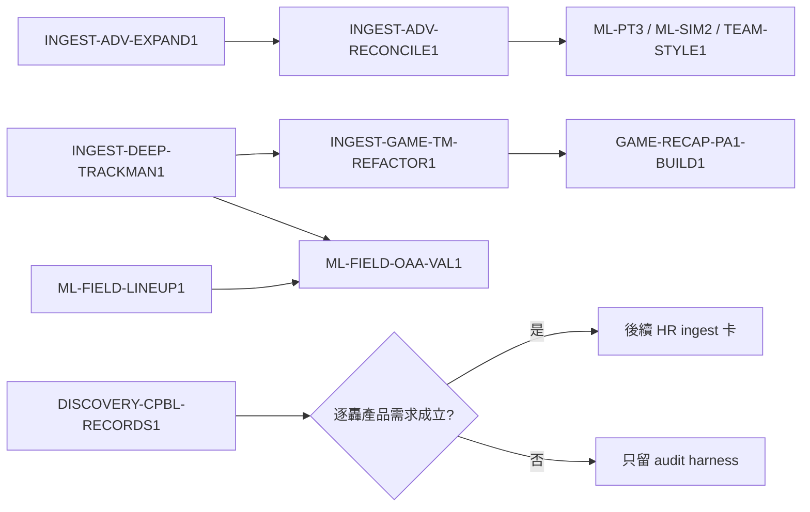

# OFFICIAL-DATA-GAP1 中職官方資料源缺口與既有項目影響評估

> 稽核日期：2026-07-22（Asia/Taipei） 
> 範圍：`www.cpbl.com.tw`、`stats.cpbl.com.tw`、現行 ingest 程式、localhost `cpbl` schema。 
> 性質：唯讀 Discovery；未修改官網資料、localhost DB 或 production。主站未另啟 Playwright
> 冷 session，以避免 HiNet 節流；主站路由沿用 2026-07-04 實抽導覽並與現行模組交叉核對。

## 1. 結論

有遺漏，且應先修資料正確性，再擴充產品資料：

1. `leaderboards/pitch-tracking` 是一位球員多個 `PitchType` 列，現行
   `cpbl_advanced._fetch_leaderboards()` 以 `acnt` 合併所有排行榜，會把前一球種覆寫。
2. `advanced_stats` 是累積 UPSERT，不具完整來源快照／失效語意；localhost 已保留舊版錯誤解析列。
3. 逐球 payload 尚未保存落地方位角、落地信心、擊球轉速與完整九個軌跡係數。
4. 進階站單場與賽程 JSON API 已足以支援 game-centric TrackMan ingest，且提供
   `SkipTrackman`；但 `false` 不能反推資料完整，僅 `true` 可作官方明確 skip 證據。
5. 新發現的 `leaderboards/summary` 提供官方聯盟進階基準，適合跨季正規化與資料 QA。
6. 主站未爬頁面中，`/stats/hr` 的逐轟事件具有新增產品價值；歷年戰績、特殊紀錄、
   生涯榜與隊史較適合作為 canonical 對帳源；MVP 頁與既有 `games.mvp_acnt` 重複。

## 2. 方法與證據界線

### 2.1 即時 API 探測

2026-07-22 以 `httpx` 對進階站公開 JSON API 做單次／低頻唯讀探測：

- `/api/proxy/v1/leaderboards/{pr-table,exit-velocity,batted-ball,pitch-tracking}`
- `/api/proxy/v1/leaderboards/summary?gameKind=A&year=2026`
- `/api/proxy/v1/games/2026-A-99`
- `/api/proxy/v1/games/schedule?kindCode=A&year=2026&month=<1..12>`
- `/api/proxy/v1/home?TeamRecordsYear=2026`

另重新掃描 `/`、`/rankings`、`/schedule`、`/players` 所引用的 30 個 `_next` JavaScript
chunks，確認目前 client 端使用的 `/v1` API literal。這是站台當刻的可觀測介面，不代表官方
承諾的永久 public contract；爬蟲仍須保留 schema drift fail-fast。

### 2.2 localhost 對帳

只讀查詢 `cpbl.advanced_stats` 與 `cpbl.pitch_tracking`，並以當刻官方 `pr-table` 的有效
`Player.Acnt` 集合比對。未對 production 查詢、寫入或清理。

## 3. 已確認的資料缺口

### 3.1 P0：球種維度遭覆寫

官方 `pitch-tracking` leaderboard 每列鍵包含：

`Player`、`Team`、`Throws`、`PitchType`、`Pitches`、`Kph`、`KphMax`、`SpinRate`、
`SpinRateMax`。

2026 A 投手回應為 280 列／140 位球員，每位最多兩列。魔爾曼（`0000007790`）實例：

| PitchType | Pitches | Kph | SpinRate |
|---|---:|---:|---:|
| breakingball | 758 | 135.9062 | 1977.5341 |
| fastball | 428 | 146.3434 | 2326.9341 |

localhost `advanced_stats.metrics` 只剩第二列的 `pitches=428`、`kph=146.3434`、
`spinRate=2326.9341`。根因是 `_fetch_leaderboards()` 以 `acnt` 為唯一 key，且只收 numeric
fields；`PitchType`／`Throws` 字串被丟棄，多列 numeric fields 依迭代順序覆寫。

**裁定**：球種資料不得再混入無維度的 `advanced_stats.metrics`。新增
`advanced_pitch_type_stats`，以 `(year, kind_code, role, acnt, pitch_type)` 為 natural key；
`Throws` 保存為 source metadata，不把 coarse `fastball|breakingball` 冒充 `pitch_type_pred_v2`。

### 3.2 P0：`advanced_stats` 缺快照與失效治理

| 2026 A | 官方當刻回應 | localhost | DB 額外列 |
|---|---:|---:|---:|
| batting | 161 個有效 acnt | 297 | 136 |
| pitching | 142 列（其中 1 列 acnt 空白） | 194 | 53 |

打者額外列多為只有五個投球 leaderboard numeric fields 的投手資料；投手額外列中有 53 列
停在 2026-06-26，部分不同 acnt 共享完全相同的 29 個 metrics，符合舊 RSC 個人頁解析將
聯盟參考物件誤寫成個人值後未失效的症狀。

**裁定**：

- 來源每次全量 fetch 先寫 staging／run manifest，驗證 schema、row count、空 ID 與重複 key。
- 成功後原子晉升 current snapshot；partial daily refresh 只更新已觀測列，不得宣稱完整快照。
- 使用 `source_run_id`／`last_seen_at` 或等價 revision，public API 只讀最後成功完整 snapshot。
- 既有污染資料不得直接 `TRUNCATE`；先備份、產出差異清單，再在 data-migration 卡依 scope 修復。

### 3.3 P1：逐球 payload 深層欄位

2026-A-99 的 `Data.Game.LiveLog` 有 342 列；具 TrackMan 的事件觀測到：

- `Hit.LandingFlat.Bearing`
- `Hit.LandingFlat.Confidence`（`High|Medium|...`）
- `Hit.Launch.HitSpinRate`
- `Pitch.Flight.PolyFit.PitchTrajectory.X[0..2]`
- `Pitch.Flight.PolyFit.PitchTrajectory.Y[0..2]`
- `Pitch.Flight.PolyFit.PitchTrajectory.Z[0..2]`

既有 `traj_accel_y/z` 是由 `Y[2]`／`Z[2]` 乘二再 round(4)，不等價於保存官方原始九係數。
`INGEST-DEEP-TRACKMAN1` 原規格只新增 X 三係數、Y/Z 各前兩係數，且漏掉
`LandingFlat.Confidence`。本次修訂為完整九係數＋落地信心；`ivb_cm/hb_cm` 公式保持不變。

### 3.4 P1：game-centric API 與 `SkipTrackman`

進階站賽程 API 的確認參數為 `kindCode`、`year`、`month`。2026 A 十二個月份去重後：

- 360 場；`FINISHED=206`、`SCHEDULED=153`、`POSTPONED=1`。
- `SkipTrackman=true` 8 場，均為亞太主場的已完成場次；其餘 352 場為 false。

`SkipTrackman` 是一個官方明確的 skip flag，但 false 只表示未標示 skip，不保證球場設備、
晚到資料或每球 mapping 完整。availability contract 應採：

| 訊號 | 可下結論 | 不可下結論 |
|---|---|---|
| `SkipTrackman=true` | 官方要求略過／不提供該場 TrackMan | — |
| `SkipTrackman=false` | 尚未觀測到官方 skip | 「一定有設備」或「資料已完整」 |

單場 endpoint 對完賽仍保留 `LiveLog[].Trackman`，可將每日近期更新從「逐投手全季 logs」改成
「每場一請求」。切換前須至少 30 場逐列等價對帳並影子運行 14 天；主站仍是比分／事件語意
canonical，直到延期、保留賽、0–0 與 game ID 全部通過。

### 3.5 P1：官方聯盟進階基準

`leaderboards/summary` 回：

- BattedBall：Bbe、GB%／FB%／LD%／PU%、方向與滾飛拆分。
- ExitVelocity：EV、LA、HardHit、Barrels、HR 距離等。
- PrTable：wOBA、BA、SLG、ISO、OBP、K%、BB%、Whiff%、Chase% 等聯盟值。
- PitchTracking：`fastball`／`breakingball` 各自的球數、均／最快球速與均／最高轉速。

用途是 normalization、quality gate 與前季 baseline；不得以 `Player=null` 假球員塞入
`advanced_stats`。新增 `advanced_league_summary`，key 至少包含
`(year, kind_code, category, pitch_type)`，原始 metrics 以 JSONB 保存以容忍官方加欄。

### 3.6 P2：主站未爬資料的價值分級

| 路由 | 內容 | 決策 |
|---|---|---|
| `/stats/hr` | 逐轟大事紀 | 唯一新增事件資料；先 Discovery endpoint、年份與穩定 key，再決定 ingest |
| `/standings/history` | 歷年戰績 | 作 opendata／teamscore reconciliation，不建立第三份 public truth |
| `/standings/special` | 連勝、單月等官方特殊紀錄 | 作自算特殊戰績 regression oracle |
| `/stats/toplist` | 生涯全量榜 | 作 season aggregation／legends coverage oracle |
| `/stats/mvp` | MVP 彙總 | 與 `games.mvp_acnt` 重複，NO-GO |
| `/teamhistory` | 球隊沿革 | 一次性校驗 `team_dim`；官方源優先於硬編／第三方 |

主站有 HiNet challenge；除 `/stats/hr` 確認有產品需求外，其餘應建 audit harness 或一次性
canonicalization，不加入每日 Playwright refresh。

## 4. 既有項目影響矩陣

| 既有項目 | 新資料帶來的改善 | 仍存在的限制 | 決策 |
|---|---|---|---|
| `INGEST-DEEP-TRACKMAN1` | 可完整保存落點、擊球 spin、3D trajectory | schema／回填屬資料紅線 | 修訂欄位；完整九係數＋confidence |
| `INGEST-GAME-TM-REFACTOR1` | 單場一請求、避免名冊異動漏投手；可保存 SkipTrackman | 即時賽中完整性未驗證 | 共用 parser；完賽先切，live 仍非目標 |
| `GAME-RECAP-PA1-BUILD1` | 單場 payload 可做 TrackMan mapping 第二來源與 revision 對帳 | canonical `pa_id` 仍不能以官方 event number 未驗證假設取代 | 僅作 source evidence，不改 PA identity contract |
| `UX-GAME-PA1` | `SkipTrackman=true` 可改善 availability 文案 | false 不足以判定 `no_equipment`；仍依 source revision／mapping | 新增資料依賴，不解除 PA/WP 前置 |
| `ML-FIELD-OAA-VAL1` | Bearing＋Distance＋HangTime＋Confidence 大幅改善外野落點模型 | 只有 2026、場地缺漏、無逐球守備員起始位置；無法做 2025↔2026 test-retest | 可做 2026 feasibility，跨年信度延後至 2027；不得先宣稱 OAA |
| `ML-FIELD-OF1` | 結果分類代理可由物理落點候選模型取代 | 若落點 coverage／confidence 不足仍需原外野空中球 baseline | 不再把 OAA 列絕對非目標；OAA NO-GO 時回退 OF baseline |
| `ML-FIELD-LINEUP1` | 落點有了仍需知道當局實際守備者 | 現無 canonical inning lineup | 正式開研究卡，先驗證換防重建與守恆 |
| `ML-PT3` | 完整 trajectory 可加入 release consistency、tunneling／movement shape 候選特徵 | 仍只有 2026；無 active spin；球種弱標籤問題不變 | 特徵研究升級，但維持 2026 季末與 whiff baseline gate |
| `ML-SIM2`／`UX-PA-SIM-MATCHUP1` | coarse pitch type leaderboard 提供 league／player prior；逐球可產 pitch mix | 官方只有 fastball／breakingball 兩類，不足以代表細分球種；模擬校準仍是紅線 | 可改善 prior/fallback，不解除遠期 NO-GO／校準門檻 |
| `TEAM-STYLE1` | 聯盟 summary 可提供年度基準，避免用 raw 值跨季比較 | summary 仍非球隊 split；需由球員／逐場按隊彙總 | 可加入 normalization，但不改研究狀態 |

## 5. 建議依賴與切片

順序理由：

1. `advanced_stats` 目前有可證實的錯誤語意，優先於新 UI／模型利用。
2. schema expand 與 data migration 分卡，遵守 expand → migrate → contract。
3. TrackMan shared parser 先涵蓋完整欄位，再切換 fetch 維度，避免兩卡各寫一套 parser。
4. OAA 先做 lineup reconstruction 與 2026 feasibility；2027 前沒有跨年信度證據。
5. 主站新爬蟲只在產品價值明確後建立，避免擴大 Playwright 維護面。

## 6. 驗證基準

- Leaderboard：每個 `(acnt,pitch_type)` 一列；魔爾曼兩列皆保存且總球數不互相覆寫。
- Snapshot：完整 run 的官方有效 acnt 與 current snapshot 集合一致；空 ID skip 有可觀測計數。
- Data repair：修復前後差異、備份、rollback、重跑冪等、API smoke test 齊全。
- TrackMan：至少 30 場 old logs vs game endpoint 的 PK 集合與 payload 欄位逐列對帳。
- Availability：`SkipTrackman=true` 與 false/missing 三態分開；false 不映射成 available。
- OAA：2026 僅作 feasibility；沒有 2027 holdout 前不得通過跨年穩定度 gate。

## 7. 文件勘誤

本次確認 `CPBL_SITE_MAP.md` 2026-07-04 盤點已落後現行程式／站台：

- 四支 leaderboard 已由 `cpbl_advanced` 抓取，不再是未爬。
- `cpbl_advanced` 主流程已從 RSC 個人頁改為 leaderboard JSON API。
- 新增 `leaderboards/summary`、`home`；schedule query 參數已確認。
- 完賽單場 TrackMan 已確認存在；「比賽進行中是否即時完整」仍是實驗假設。
