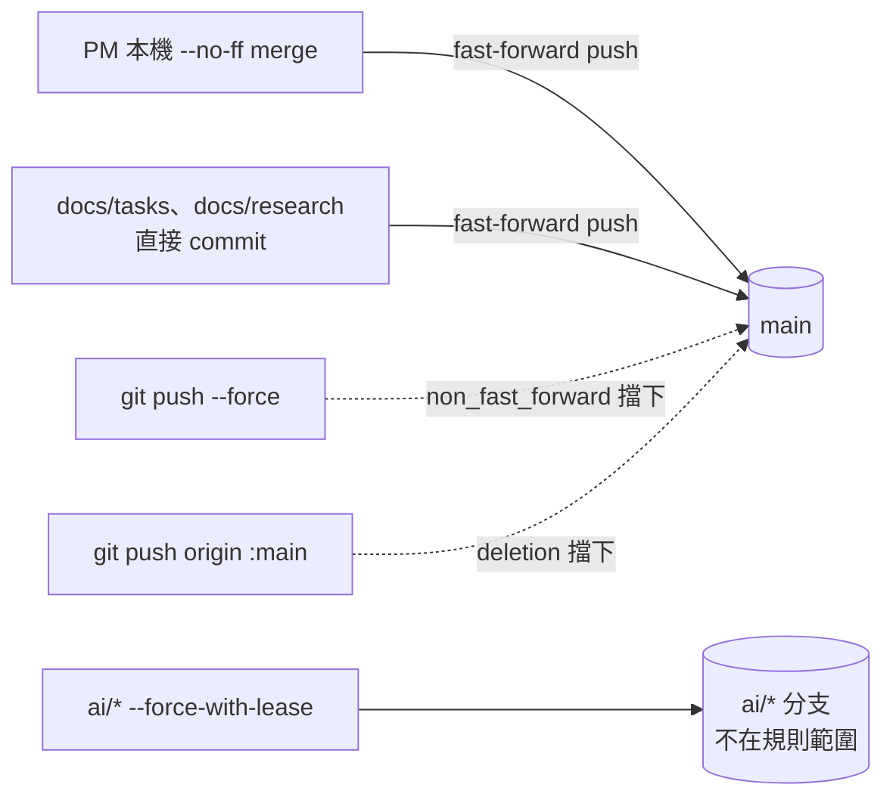
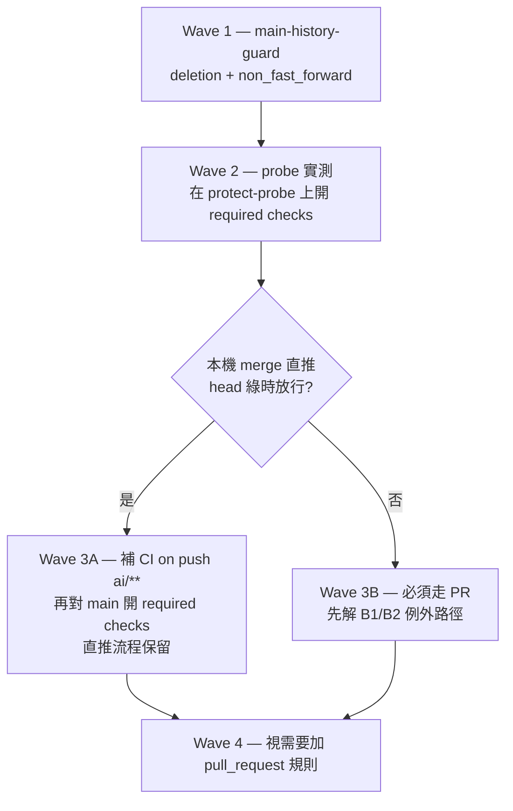

# OPS-CODE-BRANCH-PROTECT1：main 分支保護設計與驗證計畫

- 卡：`OPS-CODE-BRANCH-PROTECT1`（GitHub Issue #83，T3，`db_scope: none`）
- 撰寫：Claude Opus 5@Claude Code（執行者）　2026-08-05T15:07:30+0800
- 基線：`origin/main` @ `cf4c88e`（撰寫期間 origin/main 已推進至 `fab5e3b`，不影響本文結論）
- 分支：`ai/opus-5/OPS-CODE-BRANCH-PROTECT1`

## 0. 授權邊界（先讀）

**本卡不變更任何 GitHub 設定。** 文中所有 `gh api --method POST/PUT/DELETE` 與介面步驟
一律標記為「需求方執行」；執行者只跑 `GET`。所有「規則會怎樣」的宣稱都附兩種來源之一：

- 📖 GitHub 官方文件原文（引 `github/docs` repo 的 markdown 原始檔，非渲染頁摘要）
- 🔬 唯讀實測輸出：`gh api` GET（本 repo 或第三方公開 repo）、或本機 `git` 讀取指令

沒有這兩種背書的行為描述，一律標為 **未驗證假設**（§9），不寫進建議方案的保證。

**引用外部 repo 的規矩（R1 修正後補訂）**：任何跨 repo 的證據都必須寫**完整絕對路徑 +
釘 SHA + 把關鍵碼段摘進本文**，讓查核者不必猜檔案在哪就能複驗。踩過的坑：`git worktree add`
不帶 submodule 內容，所以本 worktree 的 `.ai-workflow/` 是**空目錄**——在 worktree 內 glob
`.ai-workflow/**` 一定全空，這是預期行為，不是查核者漏找（見 §7.2.1）。

---

## 1. 現況盤點（唯讀實測，2026-08-05）

### 1.1 repo 屬性

```
$ gh api repos/ruan6047/cpbl-analytics --jq '{visibility, owner_type: .owner.type, default_branch, ...}'
{"allow_auto_merge":false,"allow_merge_commit":true,"allow_rebase_merge":true,
 "allow_squash_merge":true,"default_branch":"main","delete_branch_on_merge":false,
 "full_name":"ruan6047/cpbl-analytics","owner_type":"User","plan":null,
 "private":false,"visibility":"public"}
```

**公開 repo + 個人帳號（非 organization）** 是後面所有能力判斷的前提，尤其決定了
bypass 名單、branch restrictions 與 metadata 規則的可用性（§3）。

### 1.2 目前保護：零

```
$ gh api repos/ruan6047/cpbl-analytics/branches/main/protection
{"message":"Branch not protected", "status":"404"}

$ gh api repos/ruan6047/cpbl-analytics/rulesets
[]

$ gh api repos/ruan6047/cpbl-analytics/rules/branches/main
[]

$ gh ruleset check main
0 rules apply to branch main in repo ruan6047/cpbl-analytics
```

**更正前身卡的一個誤讀**：`OPS-CONTROL-PLANE-PR-GUARD1` Discovery 記為「protection API 404，
疑似能力不可用」。實測顯示這個 404 的 body 是 `"Branch not protected"`——那是「沒設定」的
語意，不是「不支援」。同時 rulesets endpoint 回 `200 []`（不是 403/404），代表 rulesets
在本 repo **可用**。能力面沒有被擋，之前的結論要推翻。

本地也沒有任何 client-side 防線：`core.hooksPath` 未設、`.githooks/` 不存在、
`.git/hooks/` 只有 sample。

### 1.3 CI 現況與 check 名稱

`.github/workflows/ci.yml` 的觸發條件只有兩個：

```yaml
on:
  push:
    branches: [main]
  pull_request:
```

jobs：`api`（uv sync → ruff check → pytest -q）與 `web`（npm ci → tsc --noEmit → npm test）。

實際產生的 check run 名稱（🔬 唯讀實測）：

```
$ gh api repos/ruan6047/cpbl-analytics/commits/main/check-runs \
    --jq '.check_runs[] | {name, app_id: .app.id}'
{"app_id":15368,"name":"web"}
{"app_id":15368,"name":"api"}
```

`app_id 15368` = GitHub Actions。若日後要設 required status checks，context 就是
`api` 與 `web`，`integration_id` 填 `15368`。

**關鍵事實：`ai/*` 分支單獨 push 不會跑任何 CI。** 最近 100 次 workflow run 的分布：

| head_branch | event | 次數 |
|---|---|---|
| `main` | `push` | 92 |
| `ai/claude-sonnet-5/DEV-CI-PYTEST-SLOW1` | `pull_request` | 3 |
| `ai/claude-sonnet-5/DEV-CI-SCORELESS-DB-SKIP1` | `pull_request` | 2 |
| `ai/claude-sonnet-5/DEV-TRAILER-GUARD-PR-CHECKOUT1` | `pull_request` | 2 |
| `ai/claude-sonnet-5/DEV-STALE-GUARD-TESTS1` | `pull_request` | 1 |

零筆 `ai/* | push`。這一條直接決定 §7 的結論。

硬依賴 `DEV-TRAILER-GUARD-PR-CHECKOUT1` 已滿足：merge commit `6845224` 在 main 上，
且修正後的 PR run 轉綠（run `30918994163` conclusion `success`）。

### 1.4 現行落 main 的實際形狀

`main` 上的 merge commit 是本機 `--no-ff` 產生後直推的，不是 GitHub 上按 merge：

```
$ git rev-list --parents -n 1 18a6146
18a6146b... 3a6a2ea4... e69bb4fa...        # 雙親 → 真 merge commit
```

PR #41/#42/#85/#87 的 `mergeCommit` 都對得上 main 上「`merge: <CARD>`」格式的本機 merge
commit（GitHub 偵測到 head 已可從 base 到達，於是標記 PR 為 merged）。也就是說：
**現行流程確實是「本機 merge → 直推 main」，PR 只是留痕載體，不是 merge 通道。**

直推量體（`--first-parent` 口徑）。**量測時刻 2026-08-05T17:46:38+0800，`origin/main` = `b78def9`**：

| 期間 | main 上 first-parent commit | 其中 merge commit | 直接落 main 的 commit |
|---|---|---|---|
| 近 30 天 | 1278 | 135 | 1143（89.4%） |
| 近 7 天 | 345 | 42 | 303（87.8%） |
| 2026-08-05 當日（cutover 後，量測於 15:07） | 38 | 12 | 26 |

> ⚠️ **這組數字是滾動視窗，重測必然不同，不要當固定事實引用。** 本文初稿於同日
> 15:07（`origin/main` = `fab5e3b`）量到近 7 天 352／41／**311**；R1 查核者稍後重測得
> **303**。兩者都對——`--since=7.days` 的視窗左緣隨時鐘前移、右緣隨 main 推進，2 小時
> 39 分內就滑掉 8 筆。要複驗請重跑附錄指令並自行記錄當下的 `origin/main` SHA 與時刻；
> 結論只依賴「直推佔比穩定在 ~88–90%」這個量級，不依賴任何單一數值。

近 30 天非 merge commit 的前綴分布前幾名：`chore(control-plane)` 624、`docs` 214、
`docs(tasks)` 116、`feat(web)` 107。`chore(control-plane)` 已隨 state-plane cutover 消失，
但 cutover 當日仍有 26 筆直接落 main——`docs(tasks)`、`docs(research)`、`chore(research)`
這些 B1／B2 文件路徑並沒有跟著離開 git。

### 1.5 其它受保護標的

tag 共 2 個：`reviewed/UX-UMPIRE-SCOPE1-283d439`、`workflow-pre-wf15-20260716`。後者是
流程改版前的錨點 tag，被刪或被移動等於失去回頭參照點，目前同樣零保護。

---

## 2. 威脅模型

按「可逆性」排序，這是本卡取捨的主軸——不可逆的先擋，可逆的後談。

| # | 誤操作 | 觸發情境（本專案已發生過或高度可能） | 後果 | 可逆性 |
|---|---|---|---|---|
| T1 | `git push --force origin main`（含 `--force-with-lease`） | 多 worktree 並行、本地 main 落後、agent 在錯誤工作樹操作 | 改寫 main 歷史，他人 clone 分岔 | **不可逆**（除非有人手上剛好有舊 SHA） |
| T2 | 刪除 main | 誤打 `git push origin :main`、介面誤點 | 分支消失 | GitHub 對 default branch 另有阻擋（見 §9 未驗證項），但不應依賴 |
| T3 | 刪除／移動 tag | 清理時誤刪錨點 tag | 失去流程回溯基準 | 不可逆 |
| T4 | 直推紅 commit（lint／test 失敗） | 直推流程下 CI 在 push **之後**才跑 | main 短暫紅、下游 submodule bump 帶壞碼 | 可逆（revert） |
| T5 | 未經查核的變更直接落 main | 執行者自行 merge、跳過審核閘門 | 流程紅線失守 | 可逆但留痕已破 |
| T6 | 從錯誤分支推上 main（`git push origin HEAD:main`） | worktree 路徑紀律失守（記憶中已有前例） | main 混入未完成工作 | 可逆 |

T1–T3 是**不可逆**的，且完全不需要任何流程改變就能擋掉；T4–T6 要擋就必須改動日常流程。
本卡的建議按這條線切。

---

## 3. 平台能力事實（本 repo 可用／不可用）

判準來源：`github/docs` 的 markdown 原始檔含版本條件（``），比渲染頁準確。
本 repo 對應的文件版本是 `fpt`（Free/Pro/Team on github.com）。

### 3.1 可用

| 能力 | 依據 |
|---|---|
| Repository rulesets | 📖 `data/reusables/gated-features/repo-rules.md`：「Rulesets are available in public repositories with GitHub Free…」🔬 `GET /rulesets` 回 `200 []` |
| 傳統 branch protection | 📖 `data/reusables/gated-features/protected-branches.md`：「Protected branches are available in public repositories with GitHub Free…」 |
| ruleset 的 `deletion`／`non_fast_forward`／`creation`／`update`／`required_linear_history`／`required_signatures`／`pull_request`／`required_status_checks` | 📖 `available-rules-for-rulesets.md`，這些段落無 `ifversion` 門檻 |
| ruleset 唯讀可見性 | 📖「Anyone with read access to a repository can view the repository's rulesets.」🔬 以非 admin 身分讀到 `cli/cli`、`github/docs`、`astral-sh/uv` 的 rulesets 全文 |

### 3.2 不可用（本 repo 用不到，別規劃進去）

| 能力 | 為什麼不可用 |
|---|---|
| **Metadata restrictions**（`commit_message_pattern` 等） | 📖 `available-rules-for-rulesets.md` 該段包在 ``；`data/features/repo-rules-enterprise.yml` 的 versions 只有 `ghec` 與 `ghes: '>3.10'`。**→ trailer 契約無法搬到 push 時強制，必須留在 CI 的 `tests/test_commit_trailers.py`** |
| **Evaluate（乾跑）enforcement** | 📖 `rulesets-about-enforcement-statuses.md` 的 Evaluate 選項同樣包在 `repo-rules-enterprise`。**→ 沒有 dry-run，只能 active／disabled，所以要用 probe 分支代替乾跑（§7.3）** |
| Rule Insights | 同上 gating |
| Push rulesets（檔案大小／路徑限制） | 📖「Push rulesets are available for the GitHub Team plan in internal and private repositories」——本 repo 是 public + Free |
| 傳統 BP 的 bypass 名單 | 📖 `about-protected-branches.md`：「**Actors may only be added to bypass lists when the repository belongs to an organization.**」本 repo owner type 是 `User` |
| 傳統 BP 的 "Restrict who can push to matching branches" | 📖 同檔：「You can enable branch restrictions in public repositories owned by a GitHub Free **organization**…」 |
| Required reviewers（指定 team 審核） | 📖「This rule is not available on user-owned repositories as they do not contain teams.」 |

### 3.3 Rulesets vs 傳統 branch protection（本 repo 條件下）

決定性差異只有一條：**誰被規則管到**。

傳統 BP 對 admin 預設完全放行：
> 📖「By default, the restrictions of a branch protection rule don't apply to people with admin
> permissions to the repository… You can optionally apply the restrictions to administrators」

在單人 repo，唯一的操作者就是 admin（ruan6047），而 AI 艦隊用的也是他的憑證。所以
`enforce_admins: false` 的傳統 BP **對本卡的威脅模型完全無效**；而 `enforce_admins: true`
又因為個人 repo 沒有 bypass 名單（§3.2），變成全有全無。

Rulesets 相反，admin 不會被隱性豁免：
> 📖 `available-rules-for-rulesets.md` / Block force pushes：「If force pushes are blocked,
> organization owners or repository administrators will be unable to change or rename the
> default branch **unless they are authorized to bypass the ruleset**.」

其餘差異：

| 面向 | Rulesets | 傳統 BP |
|---|---|---|
| admin 是否受管 | 預設受管，bypass 需明列 | 預設豁免，只有 `enforce_admins` 一個總開關 |
| 唯讀可見 | 🔬 任何 read 權限都讀得到 | 📖 `PUT`／`GET` 皆需 admin（「Protecting a branch requires admin or owner permissions」） |
| 變更歷史 | `GET /rulesets/{id}/history`（🔬 非 admin 讀第三方 repo 回 404，代表需 admin；owner 對自家 repo 可用） | 無 |
| 可疊加 | 多個 ruleset 同時生效，取最嚴 | 📖「Only a single branch protection rule can apply at a time」 |
| 停用方式 | `enforcement: disabled`（設定保留、留在 history） | 只能改欄位或整條刪除 |

**結論：本 repo 一律用 rulesets，不用傳統 branch protection。** 唯讀可見性這點對本專案
特別實際——AI 執行者可以用 `gh ruleset check main` 自證守衛還在，不需要 admin token。

---

## 4. 建議方案（預設）：`main-history-guard`

**只擋不可逆操作（T1–T2），零工作流影響。**

規則：`deletion` + `non_fast_forward`，目標 `~DEFAULT_BRANCH`，**bypass 名單留空**
（卡面紅線 3：不建立常設 bypass）。



`--no-ff` merge commit 推上 main 是 **fast-forward**（main 從 A 前進到以 A 為親的 M），
不受 `non_fast_forward` 影響；一般 commit 直推同理。所以現行流程一行都不用改。

### 4.1 建立（⚠️ 需求方執行，執行者不跑）

介面路徑：`Settings → Rules → Rulesets → New ruleset → New branch ruleset`
→ Name `main-history-guard`、Enforcement **Active**、Bypass list **留空**
→ Target branches 加 `Default branch`
→ Branch protections 勾 **Restrict deletions** 與 **Block force pushes**，其餘全不勾。

等價 API（payload 形狀已用 🔬 讀第三方真實 ruleset 對照確認，見 §4.4）：

```bash
gh api --method POST repos/ruan6047/cpbl-analytics/rulesets --input - <<'JSON'
{
  "name": "main-history-guard",
  "target": "branch",
  "enforcement": "active",
  "bypass_actors": [],
  "conditions": { "ref_name": { "include": ["~DEFAULT_BRANCH"], "exclude": [] } },
  "rules": [ { "type": "deletion" }, { "type": "non_fast_forward" } ]
}
JSON
```

### 4.2 建立後的唯讀驗證（AI 可跑）

```bash
gh ruleset check main
# 期望：2 rules apply to branch main（deletion, non_fast_forward）

gh api repos/ruan6047/cpbl-analytics/rules/branches/main --jq '[.[].type] | sort'
# 期望：["deletion","non_fast_forward"]

gh ruleset check ai/opus-5/OPS-CODE-BRANCH-PROTECT1
# 期望：0 rules apply —— 證明約束 3（ai/* 不受涵蓋）成立

gh api repos/ruan6047/cpbl-analytics/rulesets --jq '.[] | {name, enforcement, bypass: .bypass_actors}'
# 期望：bypass 為空
```

### 4.3 行為證據取得（⚠️ 需求方執行；先 probe 後 main，順序不可顛倒）

**Step 1 — probe 分支取證（對 main 零風險）**

```bash
git push origin origin/main:refs/heads/protect-probe        # 建立 probe 分支
# 需求方另建 ruleset "probe-history-guard"，rules 同上，target 改
#   "conditions": { "ref_name": { "include": ["refs/heads/protect-probe"], "exclude": [] } }
git push --force origin origin/main~1:protect-probe         # 期望被拒
git push origin :protect-probe                              # 期望被拒
# 取證後刪 probe ruleset，再刪 probe 分支
```

probe 上的 force／delete 就算規則失效也只毀掉一條拋棄式分支，這是取「被拒輸出」的
安全位置。

**Step 2 — main 上的確認（可回復，但先存 SHA）**

```bash
SAVED=$(git rev-parse origin/main); echo "$SAVED"      # 先留底，這步不可略
git push --force origin origin/main~1:main             # 期望被拒
```

若規則生效 → 取得被拒輸出，main 未動。若（不預期地）成功 → main 退一格，立即
`git push origin $SAVED:main`（fast-forward，永遠允許）復原，零工作損失。

### 4.4 payload 形狀的實測背書

第三方公開 repo 的真實 ruleset（🔬 `GET`）證明欄位名與巢狀結構：

```
$ gh api repos/astral-sh/uv/rulesets/14744442
{"id":14744442,"name":"branches-main-required-checks","target":"branch",
 "source_type":"Repository","enforcement":"active",
 "conditions":{"ref_name":{"exclude":[],"include":["~DEFAULT_BRANCH"]}},
 "rules":[{"type":"required_status_checks","parameters":{
   "strict_required_status_checks_policy":false,"do_not_enforce_on_create":false,
   "required_status_checks":[{"context":"all required jobs passed","integration_id":15368}]}}],
 "current_user_can_bypass":"never", ...}
```

```
$ gh api repos/github/docs/rulesets/19633356
... "rules":[{"type":"deletion"},{"type":"non_fast_forward"},{"type":"pull_request",...
```

### 4.5 Rollback

```bash
# 方式 A（保留設定與 history，最推薦）：停用
ID=$(gh api repos/ruan6047/cpbl-analytics/rulesets --jq '.[]|select(.name=="main-history-guard")|.id')
gh api --method PUT repos/ruan6047/cpbl-analytics/rulesets/$ID -f enforcement=disabled

# 方式 B：整條刪除
gh api --method DELETE repos/ruan6047/cpbl-analytics/rulesets/$ID
```

緊急 bypass 的正解是**臨時停用（方式 A）→ 操作 → 立即重新 active**，不是加 bypass actor。
理由：`GET /rulesets/{id}/history` 會記錄每次 enforcement 變更（含時間與版本），
留痕自動產生；常設 bypass 則是靜默豁免、事後無跡可循。這正好對上卡面紅線 3。
停用與復原兩步都要在 Issue #83 留言記錄原因。

### 4.6 建議一併加上：`tag-immutability`（可選，零工作流影響）

```json
{
  "name": "tag-immutability",
  "target": "tag",
  "enforcement": "active",
  "bypass_actors": [],
  "conditions": { "ref_name": { "include": ["~ALL"], "exclude": [] } },
  "rules": [ { "type": "deletion" }, { "type": "non_fast_forward" } ]
}
```

保護 `workflow-pre-wf15-20260716` 這類流程錨點 tag（威脅 T3）。本專案沒有靠移動 tag 做
release 的流程，所以成本是零。形狀取自 📖 `github/ruleset-recipes/tag-rulesets/prevent-tag-delete.json`
（repo 層只留 `ref_name`，`repository_name` 條件是 org 層專用，要拿掉）。

---

## 5. 每項規則對現行工作流的影響評估

「現行工作流」＝ PM 本機 `--no-ff` merge 後直推 main、B1／B2 文件直接 commit main、
執行者用 `--force-with-lease` 更新 `ai/*`。

| Ruleset 規則 | 對現行工作流的影響 | 擋住的威脅 | 建議 |
|---|---|---|---|
| `deletion` | 無 | T2 | ✅ **預設採用** |
| `non_fast_forward` | 無（merge commit 直推是 fast-forward）；`ai/*` 不在 target 內故 `--force-with-lease` 不受影響 | T1 | ✅ **預設採用** |
| `creation` | 無（main 已存在） | 邊際 | ⬜ 不加，`deletion` 已涵蓋 |
| `update`（Restrict updates） | **致命**：等同鎖分支，PM 無 bypass 就完全推不上 main | T4–T6 | ❌ 排除 |
| `required_linear_history` | **致命**：📖「prevents collaborators from pushing merge commits」——`--no-ff` merge 是本專案的留痕載體（`18a6146` 實測雙親） | — | ❌ 排除 |
| `required_signatures` | **致命**：🔬 近 5 個 main commit 全部 `verified:false / reason:"unsigned"`，開啟即全面推不上去 | 不在威脅模型內 | ❌ 排除（要做得先另開卡設定 SSH 簽章） |
| `pull_request` | **打斷流程**：所有落 main 變更都要開 PR，近 7 天 311 筆直接 commit 全受影響 | T5、T6 | ⚠️ 見 §7 |
| `required_status_checks` | **打斷流程**：`ai/*` 不跑 CI（§1.3），merge commit 也沒有 check → 直推必被拒 | T4 | ⚠️ 見 §7 |
| `merge_queue` | 需 PR 流程為前提 | — | ❌ 不適用 |
| `required_deployments` | 本 repo 無 GitHub Environments | — | ❌ 不適用 |
| metadata restrictions | 平台不支援（§3.2） | 理論上 T5 | ❌ 不可用 |

---

## 6. 預設方案沒擋住什麼（誠實說明）

`main-history-guard` **不會**擋下：

- T4 直推紅 commit——CI 仍是 push 之後才跑，main 可能短暫紅
- T5 未經查核就落 main
- T6 從錯誤分支推上 main（只要是 fast-forward）

這是刻意的取捨，不是疏漏：這三者都可 revert，而擋它們的唯一機械手段（required PR
／required checks）會打斷 89% 的落 main 路徑。卡面紅線 4 明寫「不得先鎖再說把日常流程
鎖死」，所以先鎖不可逆的，可逆的走 §7 的分階段路徑。

補充性（非 remote 強制、可被繞過，僅作提醒）的可選手段，列在此供需求方判斷是否另開卡：

- **本機 `pre-push` hook**：推 main 前先跑 `ruff check` + `pytest -q`。零平台成本，但
  client-side、`--no-verify` 可繞、新 worktree 要重裝，屬於「提醒」不是「防線」。
- **紅 main 偵測**：`ci.yml` 的 main push job 失敗時自動開 Issue／通知。偵測不是預防，
  但把 T4 的暴露時間從「有人發現」縮到「CI 跑完」。

---

## 7. 工作流轉換成本：required PR 與 required status checks

> 這一節獨立成段，因為 PM 的約束 1 明確要求：預設方案不得強制 PR，若評估 required PR
> 有價值，必須把轉換成本明列。

### 7.1 required status checks 對「直推 main」的實際語意（查證結果）

先給文件原文，再給本 repo 的實測推論。

📖 `about-protected-branches.md`：
> Required status checks must have a `successful`, `skipped`, or `neutral` status **before
> collaborators can make changes to a protected branch**.

📖 `available-rules-for-rulesets.md`：
> Required status checks ensure that all required CI tests are passing **before collaborators
> can make changes to a branch** or tag targeted by your ruleset.

📖 `troubleshooting-required-status-checks.md`：
> If required status checks have not passed, **pushing to a protected branch** returns an error
> similar to this.
> ```
> remote: error: GH006: Protected branch update failed for refs/heads/main.
> remote: error: Required status check "ci-build" is failing
> ```

📖 同檔另有一條**例外**：
> Pull requests that are up-to-date and pass required status checks can be merged locally and
> pushed to the protected branch. You can do this without running status checks on the merge
> commit itself.

📖 旁證（required workflows 規則段）：
> Applying this rule will block direct pushes because the ruleset workflows run as part of the
> pull request and merge queue experience.

**結論 A（有文件背書）**：required status checks 確實作用於直推，不是只管 PR merge。被推的
commit 若沒有通過的 required check，push 被拒。

**結論 B（本 repo 特有，🔬 實測）**：文件給的那條例外在本 repo **走不通**，因為它預設
「head commit 上已經有跑過的 check」。而 `ci.yml` 只在 `push:main` 與 `pull_request` 觸發，
`ai/*` 分支單獨 push 零 workflow run（§1.3 的 100 筆統計）。所以：

```
ai/* 分支無 PR → 分支 head 無 check → 本機 merge 出的 M 無 check → push main 被拒
```

**開啟 required status checks 而不同時改流程 = 直推路徑完全死鎖。**

**未驗證的一點**（§9 會再列）：若補上 CI 在 `ai/**` push 也跑，讓分支 head 轉綠，
「本機 merge 出的 M 直推 main」是否被放行——文件只描述了「PR 的 head 綠 → 本機 merge →
推得上去」，沒描述「無 PR 但 head 綠」。這條**不能靠推論當結論**，要用 §7.3 的 probe 實測。

### 7.2 轉換成本量化

若採 required PR + required checks，受影響的是：

| 項目 | 現況 | 轉換後 | 成本 |
|---|---|---|---|
| 落 main 的 commit 量 | 近 7 天 303 筆直接 commit（87.8%，量測條件見 §1.4 註記） | 全部要開 PR | 每筆多一次 branch + PR + 等 CI（api job 含 `uv sync`、web job 含 `npm ci`，非秒級） |
| B1 記錄文件（`docs/tasks`、Issue 留痕伴生檔） | canonical §0 明列「直接 commit；免審，不部署」 | 必須走 PR | **與 canonical §0 直接衝突**，要改 canonical 或給 B1 例外路徑 |
| B2 權威文件小改 | canonical §0「小改可直接 commit」 | 必須走 PR | 同上 |
| `wfcli snapshot` 產出 | `--out-dir` 寫檔後由人 commit（證據鏈見 §7.2.1，**外部 repo**） | 需要 PR 或自動化 PR | 需設計自動化路徑 |
| PM merge 動作 | 本機 `--no-ff` + push | 改按 GitHub merge，或維持本機 merge 但需 head 綠 | merge commit 訊息格式（`merge: <CARD> (...)`）與 `Reviewed-by` trailer 需重新對齊；GitHub 端 merge 的訊息不可自由控制 |
| trailer 守衛 | 只驗 `本地 main..HEAD`，明確排除 main 上的 Coordinator commit | PR 路徑下守衛驗的是分支 commit（原本設計意圖），且 synthetic merge 已被 `DEV-TRAILER-GUARD-PR-CHECKOUT1` 排除 | **無新增成本**；反而是 PR 路徑讓守衛更貼近設計 |
| `ai/*` 的 `--force-with-lease` | 自由 | 不受影響（ruleset 只 target 預設分支） | 無 |

### 7.2.1 `wfcli snapshot` 證據鏈（外部 repo，釘 SHA）

> **R1 查核 BRPROT1-R1-1 修正**：初稿只寫「🔬 `snapshot_cmd.py` 不含 git 寫入」，卻沒說
> 那個檔在哪個 repo。它**不在 cpbl-analytics 內**——`git worktree add` 不會帶出 submodule
> 內容，本 worktree 的 `.ai-workflow/` 是空目錄（`ls` 只有 `.`／`..`），查核者 glob 全空
> 是正確結果，不是他漏找。以下把來源、SHA 與關鍵碼段全部搬進本文，使宣稱在文件內自足。

**來源定位**

| 項目 | 值 |
|---|---|
| repo | `ruan6047/ai-workflow`（`git@github.com:ruan6047/ai-workflow.git`） |
| 本機獨立 clone | `/Users/ruanruan/Dev/ai-workflow`，`HEAD` = `8d47336303ee3a7c7eb546eeb70d108b5791f030`（工作區乾淨） |
| cpbl-analytics `origin/main` 釘住的 submodule 指標 | `4bd4f2cfdc941d56d9a163ae50e1b8916ba6e23f`（`git ls-tree origin/main .ai-workflow`） |
| 檔案 | `cli/src/wf_cli/commands/snapshot_cmd.py` |
| **blob hash（兩個 SHA 皆同）** | `abb7cd7859327be52d68dedd6988e0a28e301368` |

blob hash 在 `4bd4f2c`（repo 實際消費的版本）與 `8d47336`（dev clone HEAD）**位元組相同**，
所以本結論不受「查核者手上是哪一版」影響：

```bash
git -C ~/Dev/ai-workflow rev-parse 4bd4f2c...:cli/src/wf_cli/commands/snapshot_cmd.py
git -C ~/Dev/ai-workflow rev-parse 8d47336...:cli/src/wf_cli/commands/snapshot_cmd.py
# 兩行皆輸出 abb7cd7859327be52d68dedd6988e0a28e301368
```

**關鍵碼段**（`snapshot_cmd.run()`，出口只有 `write_text`）：

```python
    out_dir = Path(args.out_dir)
    out_dir.mkdir(parents=True, exist_ok=True)
    json_path = out_dir / "snapshot.json"
    md_path = out_dir / "SNAPSHOT.md"
    json_path.write_text(json_str, encoding="utf-8")
    md_path.write_text(md_str, encoding="utf-8")

    print(f"[snapshot] {len(rows)} 張卡 → {json_path}, {md_path}")
    return 0
```

**呼叫鏈全域檢查**（`snapshot_cmd` → `config`／`card`／`gh`／`project`／`snapshot`）：

```bash
# 兩個 SHA 都測，五個模組全部 0
for sha in 4bd4f2c... 8d47336...; do
  for f in commands/snapshot_cmd.py snapshot.py project.py card.py config.py; do
    git -C ~/Dev/ai-workflow show "$sha:cli/src/wf_cli/$f" | grep -cE '^\s*(import|from)\s+subprocess'
  done
done
# → 全部輸出 0
```

唯一 import `subprocess` 的是 `gh.py`，而它跑的 binary 是 `gh` 不是 `git`：

```python
@dataclass
class GhRunner:
    binary: str = "gh"

    def execute(self, args: Sequence[str], input: str | None = None) -> str:
        proc = subprocess.run(
            [self.binary, *args],
            ...
```

**因此，精確的宣稱是**：`wfcli snapshot` 的行為是「以 `gh` 讀 GitHub Project → 渲染 →
`write_text` 落檔到 `--out-dir`」，呼叫鏈上**沒有任何 `git` 子行程，也沒有 commit／push**。
（注意措辭：它**會** shell out，只是 shell out 的對象是 `gh`。寫成「完全不呼叫外部程式」是錯的。）

**校準結論的效力範圍** ⚠️

這是**外部工具依賴**：`wfcli` 住在 ai-workflow repo，**其行為變更不受 cpbl-analytics 的
任何 ruleset 或 CI 守衛管轄**。所以本結論不是「已證成、永久成立」，而是
**「於 `ai-workflow@4bd4f2c`／`@8d47336`（blob `abb7cd7`）驗證成立」**。若日後 wfcli 加入
自動 commit／push，§10 的驗收③就不再自動滿足，必須重驗。建議把「submodule 指標 bump 時
重跑本節檢查」列入 ai-workflow 升級的例行項。

還有一條 canonical 內部張力值得需求方一併裁決：canonical §2.2 寫
「A 類 repo 必開 branch protection／required checks；`git push origin HEAD:main` 是違規」，
而 §0 又寫 B1／B2 小改「直接 commit」。這兩條在同一個 repo 上不可能同時成立——除非
「branch protection」被理解成不含 required PR 的那一種（也就是本文的預設方案）。
建議把這條張力回寫 canonical，而不是讓兩邊各自被引用。

### 7.3 過渡方案（分階段，每階段有退出條件）



- **Wave 1（本卡建議立即做）**：§4 的 `main-history-guard`（+ 可選 `tag-immutability`）。
  退出條件：`gh ruleset check main` 顯示 2 條規則、probe 取得被拒輸出、日常直推不受影響。
- **Wave 2（本卡建議一併做，因為它是唯一的乾跑替代品）**：因為 fpt 沒有 Evaluate 模式
  （§3.2），用 `protect-probe` 分支 + 一條 probe ruleset 帶 `required_status_checks`
  （context `api`／`web`，`integration_id` 15368）實測兩件事：
  1. 無 check 的 commit 直推 probe → 是否被拒（預期：被拒，驗證結論 A）
  2. 對 probe 開 PR、CI 轉綠後，(a) GitHub 端 merge、(b) 本機 merge 後直推 probe，
     兩條路各自是否放行（回答 §7.1 的未驗證點）
  這一步零風險、可完全回收，且是後續決策的唯一事實依據。
- **Wave 3／4**：依 Wave 2 結果分岔，另開卡。**本卡不做**。

---

## 8. 備選方案與取捨

| 方案 | 擋住 | 工作流影響 | 判定 |
|---|---|---|---|
| **A. `main-history-guard` ruleset（建議）** | T1 T2 | 零 | ✅ 採用 |
| B. 傳統 BP + `enforce_admins:false` | 實質為零（唯一操作者是 admin） | 零 | ❌ 假防線，比不設更危險（給人「有保護」的錯覺） |
| C. 傳統 BP + `enforce_admins:true` | 同 A | 零～致命（取決於勾了什麼），且無 bypass 名單、無 history、需 admin 才讀得到 | ❌ 全面劣於 A |
| D. ruleset 加 `update`（Lock branch） | T1–T6 全部 | 致命，main 完全推不動 | ❌ |
| E. A + `required_status_checks` 一次到位 | T1 T2 T4 | 直推死鎖（§7.1 結論 B） | ❌ 未經 Wave 2 實測不得採用 |
| F. A + `pull_request` 一次到位 | T1 T2 T5 T6 | 311 筆/7 天全部改道，且撞 canonical §0 | ❌ 要先解 B1／B2 例外路徑 |
| G. 只做本機 pre-push hook | T4（部分） | 低 | ❌ 不是 remote 防線，`--no-verify` 可繞；可作 A 的補充 |
| H. 什麼都不做 | — | — | ❌ 現況等於 T1 隨時可發生且不可逆 |

---

## 9. 待驗證假設與非目標

**待驗證假設（不得當結論引用）**

1. 「head commit 已綠但無 PR，本機 merge 出的 commit 能否直推有 required checks 的分支」——
   文件只覆蓋「有 PR」的情形。→ Wave 2 probe 實測。
2. 「GitHub 是否無論如何都拒絕刪除 default branch」——直覺上是（`receive.denyDeleteCurrent`
   語意），但未找到 fpt 文件明文，也未實測。→ 不依賴此假設，仍加 `deletion` 規則。
3. 「個人 repo 的 ruleset bypass 清單能否加 Repository admin」——📖
   `rulesets-bypass-step.md` 列出「Repository admins, organization owners, and enterprise
   owners」且未標 org-only，但無個人 repo 的實測。→ 本方案 bypass 留空，用不到；僅在
   將來需要時才須驗證。
4. `required_status_checks` 的 `strict_required_status_checks_policy`（要求分支 up-to-date）
   在直推情境的語意未驗。→ Wave 2 一併測，Wave 1 用不到。
5. `GET /rulesets/{id}/history` 對本 repo owner 是否可用——🔬 以非 admin 讀第三方 repo 回
   404（代表需 admin），owner 對自家 repo 應可用但未實測（本 repo 目前無 ruleset）。
   → Wave 1 建立後第一次驗證即可確認。
6. 「`wfcli snapshot` 不 commit／push」在**未來**版本仍成立——§7.2.1 只驗到
   `ai-workflow@4bd4f2c`／`@8d47336`。wfcli 在外部 repo，不受本 repo 任何守衛管轄。
   → 每次 bump `.ai-workflow` submodule 指標時重跑 §7.2.1 的檢查；驗收③的效力隨之更新。

**非目標**

- 不重演 `OPS-CONTROL-PLANE-PR-GUARD1` 的 lifecycle 契約改造（control-plane 已離開 git）。
- 不在本卡建立常設 bypass actor。
- 不改 `.github/workflows/ci.yml`（Wave 3A 才可能需要，屆時另開卡）。
- 不處理主站 PersonalWebsite 的 submodule 指標流程。
- 不導入 commit 簽章。

---

## 10. 卡面驗收條件的衝突（需求方裁決）

Issue #83 的三條驗收與 PM 給的約束 1（預設方案不得強制 PR）**不相容**，必須先裁決：

| 卡面驗收 | 與預設方案的關係 |
|---|---|
| ① direct push main 被拒的實際輸出 | **部分可達**。預設方案下，「直推改寫歷史／刪除」被拒可取得實際輸出（§4.3）；但「一般 fast-forward 直推被拒」需要 required PR／checks，與約束 1 衝突。建議改寫為「**破壞性**直推被拒的實際輸出」。 |
| ② 含紅 required check 的 PR 無法 merge、綠色後可 merge 各一 | **本卡不可達**。需要 `required_status_checks` 生效於 main。建議降級為 Wave 2 的 probe 分支證據（同樣是紅／綠各一，但在 `protect-probe` 上取得），main 上的版本移到 Wave 3。 |
| ③ snapshot／B1 落 main 路徑設計文件化並實跑一次 | **預設方案下自動滿足，但效力有邊界**：`wfcli snapshot --out-dir` 產檔後由 PM 直接 commit + fast-forward push main，路徑完全不變。成因與完整證據鏈見 §7.2.1——結論限定為**「於 `ai-workflow@4bd4f2c`／`@8d47336`（blob `abb7cd7`）驗證成立」**，不是永久性質；wfcli 屬外部 repo，不受本 repo 守衛管轄。若未來走 Wave 3B（強制 PR），或 wfcli 加入自動 commit／push，此路徑須重新設計並重驗。 |

**建議裁決**：把①改寫為破壞性直推、②移到 Wave 2 的 probe 分支、③維持原樣。若需求方
堅持①②照原文，那等於選了方案 F/E，必須先接受 §7.2 的轉換成本並先解 B1／B2 例外路徑，
本卡範圍要重切。

---

## 附錄：本文所有唯讀查證指令

```bash
# repo 屬性與現況
gh api repos/ruan6047/cpbl-analytics --jq '{visibility, owner_type: .owner.type, default_branch}'
gh api repos/ruan6047/cpbl-analytics/branches/main/protection      # 404 Branch not protected
gh api repos/ruan6047/cpbl-analytics/rulesets                       # []
gh api repos/ruan6047/cpbl-analytics/rules/branches/main            # []
gh ruleset check main

# CI check 名稱與觸發面
gh api repos/ruan6047/cpbl-analytics/commits/main/check-runs --jq '.check_runs[]|{name, app_id: .app.id}'
gh api "repos/ruan6047/cpbl-analytics/actions/runs?per_page=100" \
  --jq '[.workflow_runs[]|{branch:.head_branch,event}]|group_by(.branch+"|"+.event)|map({key:(.[0].branch+" | "+.[0].event),n:length})|.[]'

# 直推量體（滾動視窗，重測必不同——請一併記錄當下時刻與 origin/main SHA，見 §1.4 註記）
date "+%Y-%m-%dT%H:%M:%S%z"; git rev-parse --short origin/main
git rev-list --count --first-parent --since=7.days origin/main
git rev-list --count --first-parent --merges --since=7.days origin/main

# wfcli snapshot 證據鏈（⚠️ 外部 repo，不在 cpbl worktree 內；worktree 的 .ai-workflow 是空目錄）
git -C ~/Dev/ai-workflow rev-parse HEAD
git -C /Users/ruanruan/Dev/cpbl-analytics ls-tree origin/main .ai-workflow   # submodule 指標
git -C ~/Dev/ai-workflow rev-parse 4bd4f2cfdc941d56d9a163ae50e1b8916ba6e23f:cli/src/wf_cli/commands/snapshot_cmd.py
git -C ~/Dev/ai-workflow rev-parse 8d47336303ee3a7c7eb546eeb70d108b5791f030:cli/src/wf_cli/commands/snapshot_cmd.py
git -C ~/Dev/ai-workflow show 4bd4f2cfdc941d56d9a163ae50e1b8916ba6e23f:cli/src/wf_cli/commands/snapshot_cmd.py

# 平台文件原文（github/docs 原始 markdown，含 ifversion 條件）
gh api repos/github/docs/contents/data/reusables/gated-features/repo-rules.md --jq .content | base64 -d
gh api repos/github/docs/contents/data/features/repo-rules-enterprise.yml --jq .content | base64 -d
gh api repos/github/docs/contents/content/repositories/configuring-branches-and-merges-in-your-repository/managing-rulesets/available-rules-for-rulesets.md --jq .content | base64 -d
gh api repos/github/docs/contents/content/pull-requests/how-tos/merge-and-close-pull-requests/troubleshooting-required-status-checks.md --jq .content | base64 -d

# 真實 ruleset payload 形狀（第三方公開 repo，證明唯讀可見性）
gh api repos/astral-sh/uv/rulesets/14744442
gh api repos/github/docs/rulesets/19633356
```
