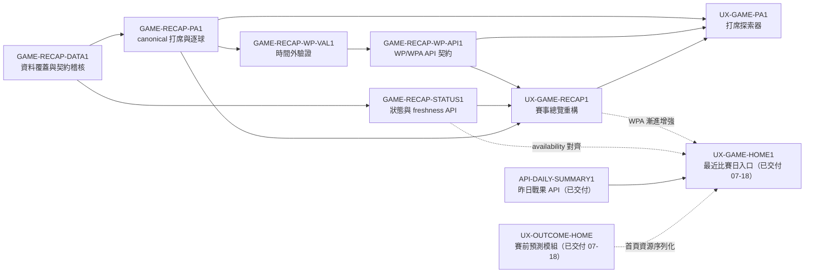

# INIT-GAME-RECAP 隔日賽事脈絡與逐打席復盤

- 需求方：ruan6047　owner：ruan6047（Design Gate）
- Discovery：需求方於 2026-07-16 對話確認問題與能力邊界　Design：[`GAME_RECAP_DESIGN_BRIEF.md`](../design/GAME_RECAP_DESIGN_BRIEF.md)（既有 Gate 仍依 DOC-GAME-RECAP1）＋[`PRODUCT_UX_BLUEPRINT.md`](../PRODUCT_UX_BLUEPRINT.md) v0.2 呈現基線　spec 基線：v1.3
- 目標：讓每日追賽球迷能從隔日結果快速理解比賽轉折，並讓進階數據迷沿 WP 曲線進入可靠的逐打席與逐球分析
- 非目標：即時轉播、即時通知、ML-SIM2 全場模擬、把 WPA 當球員能力評分
- 里程碑：資料稽核核可 → WP/PA canonical 契約通過紅線查核 → 賽事頁 Design Gate → 首頁入口整併決策 → 生產驗證

## 依賴與子卡

- `GAME-RECAP-DATA1`：核實逐打席、逐球、刷新時間與各賽制覆蓋，決定物化或 request-time 契約。
- `GAME-RECAP-PA1`：建立不會誤配的 `pa_id` 與逐球對應，定義缺資料退化。
- `GAME-RECAP-WP-VAL1`：沿用既有 WP 模型，先完成時間外驗證與支援邊界 Go/No-Go。
- `GAME-RECAP-WP-API1`：只消費 PA1 canonical 打席，提供 WP/WPA public contract。
- `GAME-RECAP-STATUS1`：實作賽事狀態、資料可用性與來源 freshness API。
- `UX-GAME-RECAP1`：重整現有賽事頁為結論先行的賽後復盤。
- `UX-GAME-PA1`：用 canonical `pa_id` 串接曲線、轉折、事件與逐球詳情。
- `UX-GAME-HOME1`：負責最近比賽日、下一批賽事、復盤入口與 freshness；首頁 v1 不依賴 WP/WPA。**已交付並部署（merge `99b38a6`，07-18）。**
- `UX-OUTCOME-HOME`：只交付 PregameCard、fixture 與文案紅線；與 `UX-GAME-HOME1` 共用首頁資源，序列化已完成。**已交付並部署（merge `fdee7297`，07-18）。**
- `API-DAILY-SUMMARY1`：昨日戰果／今日賽程 API，供 `UX-GAME-HOME1` 首頁入口消費（不依賴 WPA）。**已交付（archive）。**

## Checkpoints

### Checkpoint 1：Discovery／資料可行性

- `GAME-RECAP-DATA1` 報告經需求方確認。
- 明確決定支援賽季、賽制、TrackMan 缺漏與資料狀態來源。
- canonical `pa_id` 與物化策略有可實作結論，否則 Initiative 回到 Discovery。

### Checkpoint 2：統計與資料正確性

- `GAME-RECAP-PA1`、`GAME-RECAP-WP-VAL1`、`GAME-RECAP-WP-API1`、`GAME-RECAP-STATUS1` 均通過適用的獨立查核。
- 邊界案例、逐年覆蓋、校準、事件／逐球對帳都有可重跑證據。
- API 契約凍結後才可開始正式 UI 實作。

### Checkpoint 3：使用者流程

- 需求方核可賽事頁 prototype／實作走查。
- 375 px、鍵盤、資料缺漏與進階數據晚到情境全部通過。
- `UX-GAME-HOME1` 與 `UX-OUTCOME-HOME` 的 owner／元件契約及合併順序已依產品藍圖 v0.2 凍結。

## 基線變更紀錄

- 2026-07-16 v1 by GPT-5@Codex → 依需求方確認建立；待 Coordinator 註冊與 Design Gate 核可。
- 2026-07-16 v1.1 by GPT-5@Codex → 作者端 preflight 重整 owner、依賴與缺漏子卡；非正式查核紀錄。
- 2026-07-16 v1.2 by GPT-5@Codex → 作者端 preflight 分散 STATUS／PA／WP availability owner；待需求方正式交付 DOC-GAME-RECAP1。
- 2026-07-16 Coordinator register → Initiative 與 9 張子卡已寫入 lifecycle event／Ledger；Design Gate 仍待核可，未派工。
- 2026-07-17 v1.2＋PRODUCT_UX v0.2 by ruan6047 → 核可全站呈現與首頁責任；GAME_RECAP 自身 DOC／資料紅線 Gate 仍按原卡執行。
- 2026-07-19 v1.3 by Claude（DOC-GAME-RECAP1 查核修正，ruan6047 核可）→ 同步現況：ML-SIM1 已對帳、首頁入口鏈（UX-GAME-HOME1／UX-OUTCOME-HOME／API-DAILY-SUMMARY1）已交付；依賴圖以 ` ` 修正 mermaid 換行並補 API-DAILY-SUMMARY1 節點。資料紅線主鏈與子卡範圍不變。

## 決策與風險

- 2026-07-16：採隔日復盤定位，不新增即時基礎設施。
- 2026-07-16：現有 WP、關鍵轉折與逐打席能力視為 baseline，任務只補可靠性與產品整合。
- 風險：現行逐球近似鍵可能誤配；在 `GAME-RECAP-PA1` 通過前，UI 不得宣稱逐球屬於精確打席。
- 2026-07-19 解除：ML-SIM1 已完成跨模型家族複查、合併與 production 驗證且 Ledger 已對帳；`UX-GAME-HOME1`、`UX-OUTCOME-HOME` 與 `API-DAILY-SUMMARY1` 已交付部署（07-18）。首頁賽前區的對帳前置已消除，首頁 v1 入口鏈已完成。
