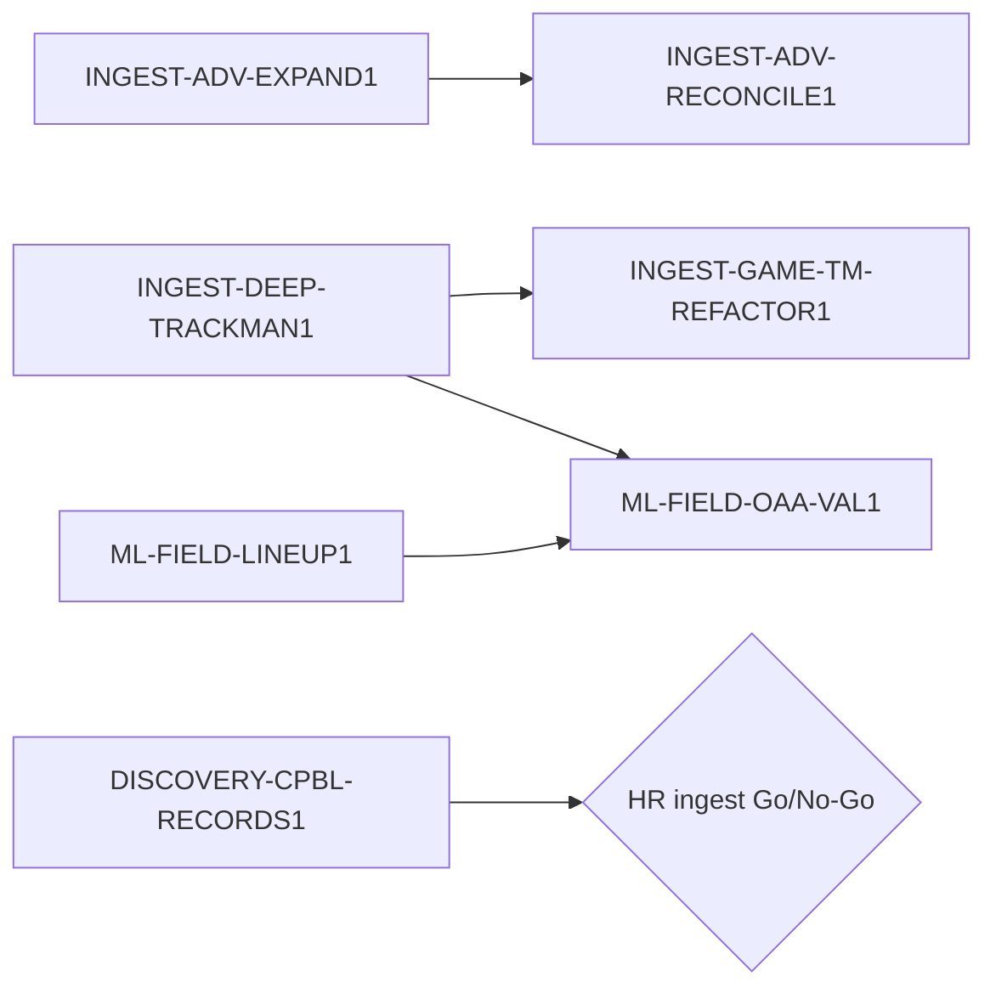

# INIT-OFFICIAL-DATA1 官方資料契約完整性與低維護 ingest

- 需求方：ruan6047　owner：待指派
- Discovery：[`../research/OFFICIAL_DATA_GAP1_RESULTS.md`](../research/OFFICIAL_DATA_GAP1_RESULTS.md)（ruan6047 2026-07-22 指示記錄並開卡）　Design：N/A（純技術資料管線；任何使用者可見產品另過 Design Gate）　spec 基線：v1
- 目標：修正進階排行榜維度／快照污染，完整保存官方逐球物理欄位，並以單場 JSON API 降低主站反爬依賴。
- 非目標：不把官方 API 當永久穩定契約、不在資料修復完成前新增模型宣稱、不為低價值重複頁面擴大每日 Playwright。
- 里程碑：P0 advanced contract 修復 → TrackMan parser／game-centric shadow → downstream ML feasibility 重驗。

## 依賴與子卡

- `INGEST-ADV-EXPAND1`：新增球種、聯盟 summary 與 snapshot provenance 的 additive schema。
- `INGEST-ADV-RECONCILE1`：修正覆寫、建立完整快照晉升並修復既有污染資料。
- `INGEST-DEEP-TRACKMAN1`：完整九係數、落地信心、方位角與擊球 spin。
- `INGEST-GAME-TM-REFACTOR1`：共用 parser 後改為每場一請求；影子對帳再切換。
- `ML-FIELD-LINEUP1`：守備陣容重建可行性與 canonical contract 研究。
- `ML-FIELD-OAA-VAL1`：僅在資料與 lineup 前置通過後做 2026 feasibility；跨年 gate 延至 2027。
- `DISCOVERY-CPBL-RECORDS1`：決定全壘打大事紀與其他主站紀錄頁的產品／QA 邊界。

## 基線變更紀錄

- 2026-07-22 v1 by GPT-5@Codex → 依官網、現行程式與 localhost 唯讀對帳建立；需求方指示記錄並開卡。

## 決策與風險

- 2026-07-22 資料正確性優先：先修 pitch-type overwrite 與 stale snapshot，再讓模型／UI 消費新欄位。
- 2026-07-22 `SkipTrackman=true` 只作單向官方 skip 證據；false 不代表 available／complete。
- 2026-07-22 schema 與 data migration 分卡；皆為 T4，需跨模型家族或人工查核、rehearsal、backup、rollback 與需求方 sign-off。
