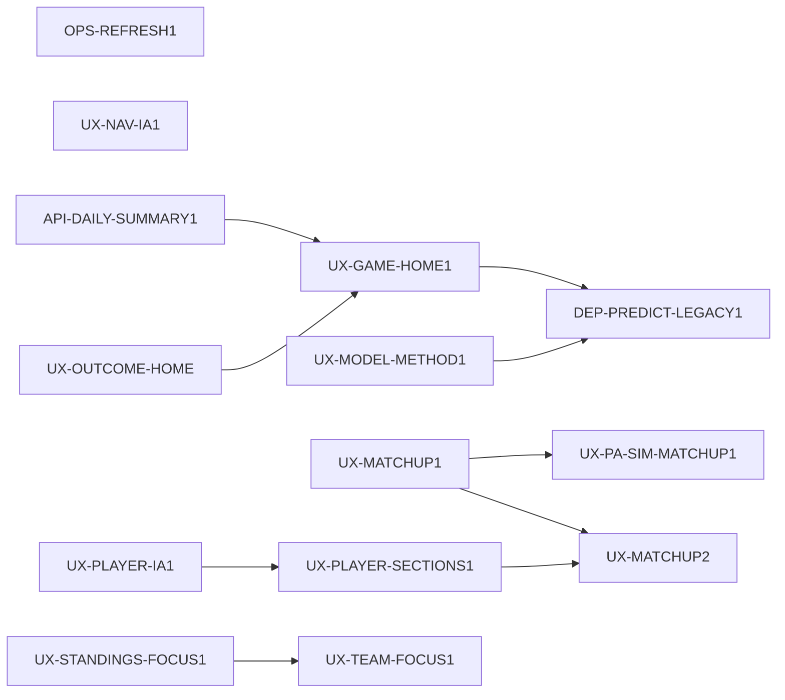

# INIT-PRODUCT-UX 全站產品與 UI/UX 收斂

- 需求方：ruan6047　owner：待指派
- Discovery：[`PRODUCT_UX_BLUEPRINT.md`](../PRODUCT_UX_BLUEPRINT.md) §1–§3　Design：同文件 §4–§8（2026-07-17 需求方查核通過）　spec 基線：v0.2
- 目標：把 CPBL Analytics 收斂為最近比賽日、下一批賽事與可逐層深入的非即時分析產品，同時維持歷史查詢零退化
- 非目標：即時轉播、國際賽、未通過閘門的 ML、為尚無資料的編輯內容預做空殼 UI
- 里程碑：刷新與 IA 基礎 → 每日入口與舊預測替換 → 球員／對戰 → 戰績／球隊 → 邊界收斂

## 依賴與子卡

- 第一波：`OPS-REFRESH1`、`UX-NAV-IA1`、`API-DAILY-SUMMARY1`、`UX-OUTCOME-HOME` 可在資源不衝突時平行。
- 第二波：`UX-GAME-HOME1`、`UX-MODEL-METHOD1`；替代入口穩定後才做 `DEP-PREDICT-LEGACY1`。
- 第三波：`UX-MATCHUP1` 與 `UX-PLAYER-IA1`／`UX-RANKINGS1` 平行；其後分流至 PA 模擬與球員頁整合。
- 第四波：戰績、球隊與裁判邊界；`DATA-EDITORIAL1` 不阻塞核心流程，可獨立排入 backlog。
- `INIT-GAME-RECAP` 維持獨立紅線 Initiative；本 Initiative 只共享首頁、導航與呈現基線，不吸收其 PA／WP 資料契約。

## Checkpoints

- 基礎：白天刷新可觀測、方案 B 導覽可用、歷史入口零退化。
- 每日入口：首頁聚合請求不超過 3，賽前卡只有點機率＋1 主訊號，舊 `/predict` 已有替代路徑。
- 深度流程：Matchups 無洞察仍成立、球員頁內容分層完成、所有模型 badge 可進方法頁。

## 基線變更紀錄

- 2026-07-17 v0.2 by GPT-5@Codex＋Fable-5 → 需求方 ruan6047 查核定案並授權開卡；條件式 UI 維持未註冊。

## 決策與風險

- `UX-MORE-NAV1` 合併進 `UX-NAV-IA1`，避免兩卡同時修改 header／nav。
- `UX-PA-SIM-GAME1` 等 `GAME-RECAP-PA1` 完成後才另卡；`UX-VENUE-FOCUS1`、應援文化 UI、季後賽模板與 `ML-PROJ-GATE1` 仍受條件閘門約束，現在不註冊。
- 全站共享 `web/src/app/layout.tsx`、header 與首頁資源必須序列化；卡片不得以自行重構繞過 owner 邊界。
