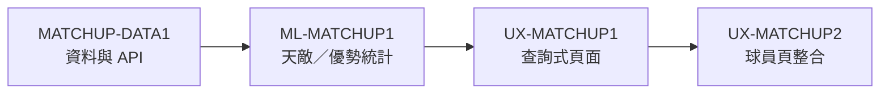

# 投打對決重新規劃

## Goal

把 `/matchups` 從「一次列出全部對戰資料」改成「先選定球員與對手，再呈現少量可判讀資訊」的查詢工具；完成後將同一套查詢能力收進球員個人頁。

## 目前問題（已由程式與 API 核對）

- 頁面先載入整季 roster，使用原生 `<select>`，沒有球員搜尋或對手搜尋。
- `player_matchups` 目前只用 `player_id + kind_code` 查詢，沒有把 `year`、對手球隊或對手球員作為篩選條件；同一組對戰可能跨年度回傳多列。
- 表格一次顯示 14 個欄位，使用者必須先理解大量計數與 rate stat 才能找到重點。
- API 的 `batter_pitcher_matchups` 表本身有 `year`，但現有 endpoint 未使用它；「生涯」與「本季」的資料範圍在 UI 上也沒有清楚分開。
- `/api/v1/matchups?hitter&pitcher` 已能支援單組對戰詳細資料，可作為點選對手後的第二層視圖。

## 目標使用流程

1. 選擇視角：`打者對投手` 或 `投手對打者`。
2. 搜尋並選定主角球員；預設使用當季例行賽。
3. 選擇查詢模式：`對某隊` 或 `對某人`。
4. 對某隊：列出該隊對手，預設依 PA／BF 排序，只顯示關鍵摘要。
   同時提供「對戰劣勢／對戰優勢」候選，讓使用者先看到最值得注意的對位。
5. 對某人：直接顯示單組對決卡，提供「看完整資料」展開。
6. 需要比較時才展開進階欄位，不在首屏攤開全部資料。

## 頁面資訊架構

### 首屏：查詢列

- 球員角色切換：打者／投手。
- 球員搜尋：輸入姓名、隊伍；不再把完整 roster 塞進下拉選單。
- 資料範圍：本季／生涯／指定年度。
- 賽事類型：例行賽／季後賽／總冠軍。
- 對手模式：對某隊／對某人。
- 對手欄位依模式切換，避免同時暴露所有選項。

### 查詢結果摘要

主角與對手條件下，只先顯示：

- 樣本量：PA（打者）或 BF／面對打席（投手）。
- 核心結果：AVG／OPS（打者）或被打 AVG／OPS、K%（投手）。單組對戰資料沒有出局數與自責分，不使用 ERA／WHIP。
- 一句資料可信度提示：樣本量過小時標示「樣本有限」，不製造排名感。
- 結果數與最後更新年度。

### 對某隊結果

- 最上方先放「隊伍對戰洞察」，再放完整對手清單：
  - `天敵候選／對戰劣勢`：對主角造成顯著負面結果的 1–3 位對手。
  - `優勢對位`：主角對戰成績顯著優於自身基準的 1–3 位對手。
- 打者視角：天敵候選＝壓制該打者的投手；優勢對位＝該打者打得特別好的投手。
- 投手視角：天敵候選＝對該投手打得特別好的打者；優勢對位＝該投手壓制效果特別好的打者。
- 洞察卡只顯示姓名、隊伍、PA／BF、核心結果、相對基準差與樣本可信度；點擊才進單組詳情。
- 使用緊湊清單或卡片，不使用 14 欄寬表格作為預設。
- 預設欄位：對手姓名、PA／BF、核心 rate、安打／被安打、HR／被轟、三振。
- 支援排序：樣本量、核心表現、最近年度。
- 對手球員點擊後切換至單組對決詳情。
- 進階資料（BB、HBP、球種／揮空等）放在展開區或側欄。

### 「天敵／優勢」統計定義

- 不直接用 AVG／OPS 極值排序；小樣本 1 安打或 1 次三振不應成為結論。
- 以主角在相同年度範圍、賽事類型下的整體表現作 baseline，衡量單一對手相對差異：
  - 打者主指標候選：OPS 或 wOBA 差；輔助顯示 K%、BB%、HR。
  - 投手主指標採對手打擊 OPS／wOBA 的反向差；輔助顯示 K%、BB%、被 HR。
- 跨年度彙總必須先加總原始計數再重算 rate，禁止直接平均年度 AVG／OPS。
- 使用經驗貝氏收縮 [empirical Bayes shrinkage] 或等價的 regularized estimate，將低 PA／BF 對戰拉回主角 baseline；prior strength 由歷史資料估計，不靠人工拍門檻。
- 排名同時考慮效果量與可信度；樣本不足時不顯示「天敵」，只顯示一般對戰紀錄。
- UI 採「天敵候選／對戰劣勢」而非斷言式「天敵」，並明示 PA／BF 與資料期間。這是描述性統計，不代表因果或未來預測。
- 演算法採對稱測試：角色翻轉後，同一組打者×投手不得同時被雙方標成優勢；年度、季後賽與生涯範圍不得混用。

### 對某人結果

- 以「打者 × 投手」對決卡呈現 A／C／E 分段資料。
- 首屏只放 PA／AB、AVG、OBP、SLG、OPS、三振。
- 點擊「進階」後才顯示揮棒、揮空、好壞球與擊球方向等欄位。
- 清楚標示資料是逐年彙總，不等同逐打席事件流。

## API／資料工作

- 擴充 roster 搜尋 endpoint：支援 `role`、`season`、`q`，回傳有限筆候選，避免前端一次載入完整名單。
- 擴充球員對戰 endpoint：支援 `season`／年度範圍、`opponent_team`、`opponent_id`、`limit`、排序欄位；所有 SQL 維持參數化與白名單排序。
- 新增隊伍對戰洞察輸出：`disadvantages`、`advantages`、`baseline`、`sample_note`，由 API 統一計算，前端不得自行重做統計判定。
- 洞察運算以原始計數欄位聚合後重算 rate；若採經驗貝氏收縮，參數與版本需可重現並以測試 fixture 固定。
- 明確區分「本季」與「生涯」查詢，不讓同一對手跨年度資料在 UI 中悄悄重複。
- 確認對手隊伍名稱的歷史 mapping；不要用當季隊名直接推論歷年隊名。
- 保留既有單組 endpoint，必要時補上指定 `year`／`kind_code`，供詳情卡使用。
- 新 endpoint／query contract 同步更新 route snapshot 與 API 測試。

## 移至球員個人頁

- 新增 `PlayerMatchupsSection`，沿用 `/matchups` 的查詢結果與單組詳情元件。
- 個人頁預設主角就是當前球員，不再出現主角選擇器。
- 先顯示「對各隊摘要」與最近／樣本最大的對手，點擊後展開對手球員。
- `/matchups` 保留作為跨球員探索入口，連結帶入 `player_id`、`role`、`opponent_team` 或 `opponent_id`。
- API 與展示元件分離，避免個人頁再次複製一套查詢邏輯。

## 實作順序

- [ ] 先補資料範圍與歷史隊伍 mapping 的規格，確認 `year` 是查詢維度而非只供排序。
- [ ] 建立 roster／對手搜尋 API 與測試。
- [ ] 擴充 player matchups API 的篩選、排序、limit 與單組詳情 contract。
- [ ] 以歷史對戰分布估計 shrinkage prior，定義「天敵候選／優勢對位」門檻並做敏感度檢查。
- [ ] 重做 `/matchups`：查詢列 → 摘要 → 對隊清單／單組對決卡 → 進階展開。
- [ ] 將結果元件抽成可重用模組，接入球員個人頁。
- [ ] 執行 `ruff`、`pytest`、`tsc`、`build:check`，並以真實球員抽查跨年、轉隊、低樣本與無資料狀態。

## 任務卡切割

本功能拆成 4 張卡，不另開傘卡；每張卡均可在單一工作分支完成並獨立查核。

| 卡ID | 邊界 | 紅線 | 依賴 |
|---|---|---|---|
| `MATCHUP-DATA1` | 修正本季／生涯／指定年度聚合、歷史隊伍 mapping、球員搜尋、隊伍／對手篩選與 API contract | 🔴 資料正確性 | 無 |
| `ML-MATCHUP1` | 定義 baseline、經驗貝氏收縮、效果量／可信度與天敵候選／優勢對位輸出；完成敏感度與對稱性測試 | 🔴 統計正確性 | MATCHUP-DATA1 |
| `UX-MATCHUP1` | 重製 `/matchups` 查詢流程、隊伍洞察、單組詳情與進階展開 | ⚪ 一般 UI | MATCHUP-DATA1、ML-MATCHUP1 |
| `UX-MATCHUP2` | 抽共用元件、接入球員個人頁、支援 deep-link；保留 `/matchups` 跨球員入口 | ⚪ 一般 UI | UX-MATCHUP1 |

拆卡理由：資料聚合與統計洞察需要跨家族／人審，不能讓一般 UI 查核代替；個人頁整合則等獨立頁互動穩定後再接，避免同時改兩個大型頁面。

## Done When

- 使用者可在數秒內完成「某球員對某隊」或「某球員對某人」查詢。
- 首屏不再顯示完整寬表；進階指標需主動展開。
- 本季／生涯／指定年度資料範圍可被辨識且結果不重複。
- 對手球員可直接進入單組對決詳情與個人頁。
- 選定隊伍後，能立即看到最多 3 位天敵候選與 3 位優勢對位；樣本不足時誠實退化，不硬產生排行。
- 洞察卡必須顯示樣本、資料期間、相對 baseline 與「描述性、非預測」說明。
- 同一套資料查詢能力可嵌入球員個人頁，不複製 API／商業邏輯。
