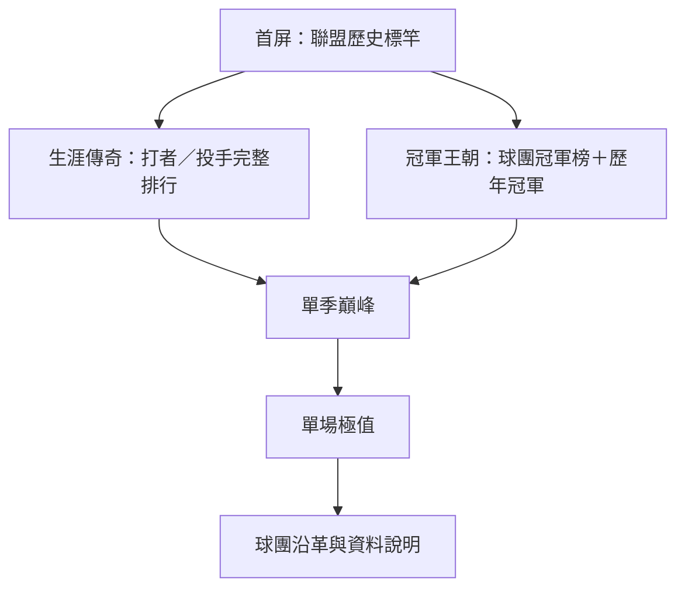

# 紀錄室重新規劃

日期：2026-07-14

## 目標

把 `/records` 從「依資料類型堆疊表格」改為「依歷史重要性導覽」。使用者進入首屏後，應能立即回答：

1. 誰是中職生涯全壘打紀錄保持人？
2. 哪個球團累積最多總冠軍？
3. 我可以去哪裡查看完整生涯、單季與單場排行榜？

## 已確認的現況

- 現行順序是「比賽紀錄 → 單季之最 → 生涯排行 → 歷代球隊」，最重要的生涯紀錄落在第三區。
- 生涯打擊與投球資料涵蓋 1990–2025，共 36 季；現有生涯全壘打前五名資料可用。
- `/api/v1/records` 只回傳球員生涯／單季／單場資料，沒有球團總冠軍排行。
- `championship_members` 只涵蓋 33 季，缺 1992、1994、1995；目前不可直接宣稱為完整歷史總冠軍榜。
- 「歷代球隊」API 有勝敗與沿革，但沒有經驗證的總冠軍次數。

## 網路案例與採用原則

| 官方案例 | 可借鏡設計 | 本專案採用方式 |
|---|---|---|
| [MLB All-Time Leaders](https://www.mlb.com/stats/home-runs/all-time-totals) | 先選時間範圍、聯盟、球隊、守位，再以可排序完整排行榜呈現 | 生涯／單季先分層，再提供打者／投手、項目與現役篩選；主表一次只突出一個統計項目 |
| [NBA All-Time Leaders](https://www.nba.com/stats/alltime-leaders?SeasonType=Regular+Season) | 將 All-Time Leaders 設為獨立入口，提供統計類別與現役球員條件 | 首頁只顯示代表性紀錄與 Top 5，完整排行由類別切換，不把所有項目攤成一張長表 |
| [NBA Most Championships](https://www.nba.com/news/most-championships-nba-history) | 用「冠軍次數＋奪冠年份」敘述球團歷史地位 | 冠軍榜同時顯示累積次數、奪冠年份與球團沿革，不只顯示單一數字 |
| [NHL All-Time Standings](https://records.nhl.com/standings/all-time-standings) | 將現存與歷史球團放在同一套長期累積脈絡中 | 以 franchise 為累積單位，歷史隊名只作沿革，避免更名後冠軍被拆散或重複計算 |

設計原則：

- 用視覺焦點與序列位置效應 [serial position effect] 把「聯盟標竿」放在第一屏。
- 用漸進揭露 [progressive disclosure] 先給答案，再讓使用者進完整排行。
- 紀錄室不是資料總表；每一區只回答一個明確問題。
- 不採平均分配注意力的卡片牆。首屏必須有主次，生涯全壘打與球團冠軍是兩個最大焦點。

## 建議資訊架構



### P0：首屏「聯盟歷史標竿」

- 左側主焦點：生涯全壘打第一名，顯示球員、305 HR、現役／退役、第二名差距與「查看完整全壘打榜」。
- 右側主焦點：最多總冠軍球團，顯示冠軍數、奪冠年份、最近一次冠軍與「查看冠軍史」。
- 次要標竿只保留 4 項：生涯安打、生涯勝投、生涯三振、生涯救援。
- 首屏不出現單場最大分差等趣味紀錄。

### P1：生涯傳奇

- 第一層切換：`打者`／`投手`。
- 第二層切換：打者 `HR / H / RBI / SB`；投手 `W / SO / SV`。
- 預設打開 `打者 → HR`，呈現 Top 10；每列顯示名次、球員、累積值、現役狀態。
- 可切換「全部／現役」，現役球員加上「距離上一名」而不是另外開一張表。
- 桌面使用排行表，手機改為單欄排名列，避免橫向塞滿多項統計。

### P1：冠軍王朝

- 球團累積冠軍排行：名次、franchise、冠軍數、奪冠年份、最近冠軍。
- 下方提供歷年冠軍時間軸，作為總數的稽核入口。
- 更名／轉賣依既有 franchise mapping 合併，並在展開內容列出各年代名稱。
- 已解散球團保留排行資格，以「現存／已解散」標記，不從歷史榜移除。

### P2：單季巔峰

- 保留現有 7 項，但從表格改為類別切換後的紀錄保持人＋Top 5。
- 打擊率等 rate stat 必須顯示資格門檻與資料涵蓋說明。
- 同值紀錄不可只回傳一人；API 與 UI 都要支援並列保持人。

### P3：單場極值與球團沿革

- 單場最大分差、最多得分、雙方總分移到頁面下半部，定位為「極端比賽」。
- 預設顯示摘要，展開後才顯示日期、對戰組合與比分。
- 「歷代球隊」縮為球團沿革入口；完整勝敗與年代資料留在球隊頁，不在紀錄室重複承擔主表角色。

## 資料與 API 規劃

### 1. 建立可稽核的冠軍事實表

新增 canonical dataset [權威資料集]，建議欄位：

```text
championships(
  year,
  champion_team_code,
  runner_up_team_code,
  franchise_code,
  source_url,
  verification_status,
  verified_at
)
```

- 先補齊 1992、1994、1995，再公開累積排行。
- 來源必須逐年可追溯；不可繼續只靠缺年的 `games(kind_code='C')` 推導完整總數。
- `championship_members` 改由這張表決定冠軍隊，再補成員，避免球團冠軍與個人冠軍出現兩套答案。
- migration 必須冪等，歷史隊碼到 franchise 的映射需有測試案例。

### 2. 擴充而不破壞既有 API

保留 `/api/v1/records` 既有欄位，新增：

```text
featured
championships.team_leaders
championships.by_year
coverage
```

`coverage` 至少回傳 `from_year`、`through_year`、`complete`、`missing_years`、`as_of`。前端只有在 `complete=true` 時使用「歷史最多」等完整性文案。

生涯與單季排行另支援：

```text
GET /api/v1/records/leaders?scope=career&role=batting&stat=hr&active=all&limit=10
```

- `scope / role / stat` 使用 allowlist，不接受任意 SQL 欄位。
- 排名需定義同值規則；建議 competition ranking [競賽排名]，例如 `1, 2, 2, 4`。
- 生涯資料沿用 1990–2025 season-level 表；2026 未結束前不混入生涯歷史總數，或必須明確標示「含進行中球季」。

## 執行拆分建議

這不是一張卡能安全完成，建議拆三張：

1. `RECORD-DATA1`（紅線）：補齊並驗證 1990–2025 冠軍事實表、franchise 映射、coverage 與回歸測試。
2. `RECORD-API1`：擴充紀錄 API、同值排名、分類查詢與相容性測試。
3. `UX-RECORD1`：依新資訊架構重做 `/records`，完成響應式與瀏覽器驗收。

依賴：`RECORD-DATA1 → RECORD-API1 → UX-RECORD1`。

## 實作步驟與驗收

1. 逐年核對冠軍來源，補齊缺年並建立 franchise mapping 測試。
2. 新增 championship migration／ingest，確認重跑結果冪等。
3. 擴充 records API 與型別，保留舊 response keys。
4. 補 API 測試：完整年份、缺年降級、同值排名、現役篩選、非法 stat。
5. 建立首屏標竿、生涯排行、冠軍王朝三個可重用元件。
6. 重排單季、單場、球團沿革，完成桌機／手機版。
7. 執行 `uv run ruff check`、`uv run pytest`、`npm run build:check`。
8. 瀏覽器驗收 `/records`：桌機、手機、鍵盤操作、空資料與 API 降級狀態。

完成條件：

- 首屏不捲動即可看到生涯全壘打紀錄與最多冠軍球團。
- 5 秒測試能正確回答「全壘打王是誰、最多冠軍是哪隊」。
- 任一生涯項目最多兩次互動可到完整 Top 10。
- 冠軍榜涵蓋 1990–2025 全 36 季，且每季皆有來源與 franchise 映射。
- API 在冠軍資料不完整時不輸出誤導性的「歷史最多」結論。
- 既有 `/api/v1/records` 消費端不因 response 擴充而破壞。

## 本輪不做

- 不直接修改 `/records` 頁面。
- 不把趣味紀錄、獎項、季後賽紀錄一次全部擴充進首頁。
- 不在冠軍缺年尚未補齊前顯示暫定總冠軍排行榜。
